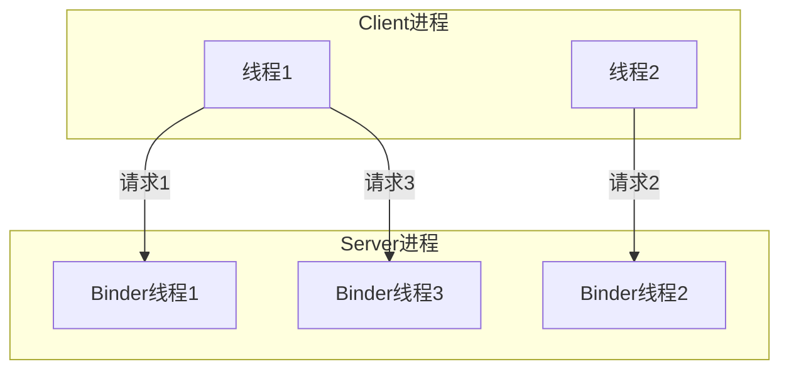
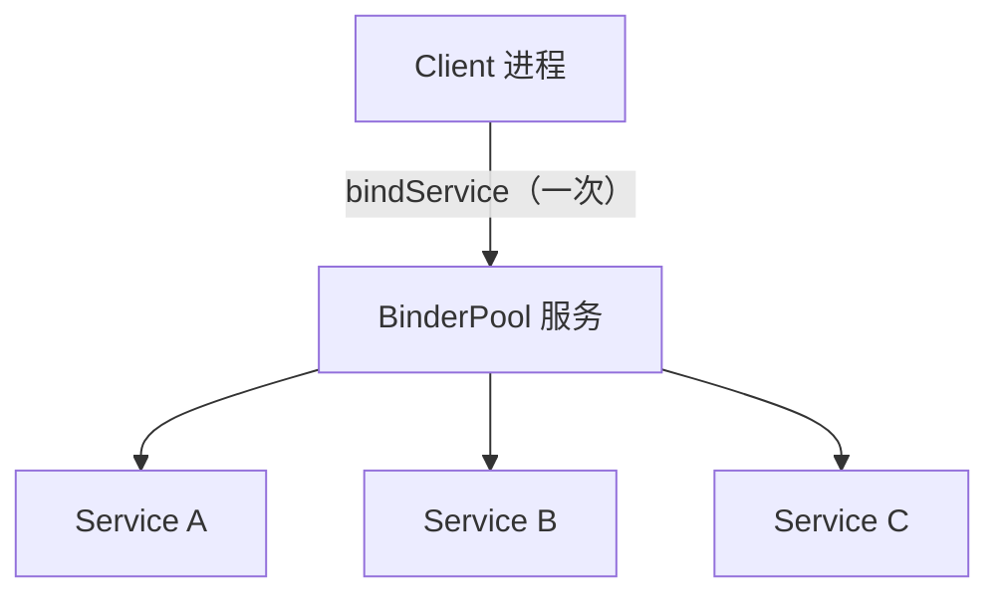

# Binder 连接池与多线程并发

> 系列：Framework-Source-Note · binder
> 难度：⭐⭐⭐⭐ 深入
> 更新：2026-08-27
> 前置知识：《Binder 机制总览》《一次 Binder 通信的完整流程》

---

## 一、一个被忽略的问题

前面讲了 Binder 单次通信的流程，但实际系统里是**海量并发**的：

- 多个 App 同时调用 AMS
- 一个 App 同时发起多个 Binder 请求
- Server 要同时服务几十个 Client

Binder 是怎么处理并发的？答案藏在「连接池」和「线程池」里。

## 二、Binder 线程池

每个使用 Binder 的进程，都维护一个 **Binder 线程池**。



**关键点**：
1. 主线程默认不参与 Binder 响应（避免阻塞 UI）。
2. Server 端用多个线程并发处理不同请求。
3. 线程数可通过 `BINDER_SET_MAX_THREADS` 设置上限。

## 三、Binder 线程的默认上限

```java
// 进程初始化时设置最大 Binder 线程数
ProcessState::self()->setThreadPoolMaxThreadCount(15);
```

**理解**：一个进程默认最多 15 个 Binder 线程。并发请求超过这个数，会排队等待。

## 四、连接池（Binder Pool）模式

这是「一个 Server 提供多个服务」的经典设计。为什么需要它？

**问题**：每新增一个服务，就要 bindService 一次，开销大、连接多。

**方案**：用一个「连接池」，只 bind 一次，但能取到所有服务。



### 连接池的实现

```java
public class BinderPool {
    private static final int BINDER_SERVICE_A = 1;
    private static final int BINDER_SERVICE_B = 2;

    private Context context;
    private IBinderPool binderPool;

    // 查询具体服务的 Binder
    public IBinder queryBinder(int binderCode) {
        return binderPool.queryBinder(binderCode);
    }

    public static class BinderPoolImpl extends IBinderPool.Stub {
        @Override
        public IBinder queryBinder(int binderCode) {
            switch (binderCode) {
                case BINDER_SERVICE_A: return new ServiceAImpl();
                case BINDER_SERVICE_B: return new ServiceBImpl();
            }
            return null;
        }
    }
}
```

**核心理解**：连接池本质是一个「路由」——Client 只连一次，之后通过 `queryBinder(code)` 拿到具体服务的 Binder 引用。

## 五、Binder 的线程安全问题

这是最容易踩坑的地方。

### 1. 同一 Server 方法可能被并发调用

```java
public class ServiceAImpl extends IServiceA.Stub {
    private int count = 0;

    @Override
    public void increment() {
        // ❌ 非线程安全！多个 Binder 线程并发调用会出错
        count++;
    }
}
```

**修复**：加锁或使用原子类。

```java
public class ServiceAImpl extends IServiceA.Stub {
    private final AtomicInteger count = new AtomicInteger(0);

    @Override
    public void increment() {
        count.incrementAndGet();  // 线程安全
    }
}
```

### 2. 同一个 Binder 对象，方法可能并发执行

Server 端收到多个请求，会用**不同线程**处理。如果业务方法操作共享资源，必须保证线程安全。

## 六、oneway 与并发的关系

`oneway` 修饰的 AIDL 方法，Client 调用后**不等待返回**，Server 端异步执行：

```java
// IServiceA.aidl
oneway void fireAndForget();
```

- **同步方法**：Client 阻塞等 Server 返回。
- **oneway 方法**：Client 立即返回，Server 异步执行。

**oneway 的注意**：多个 oneway 请求也是并发的，且无法感知执行结果。

## 七、并发场景的最佳实践

| 场景 | 建议 |
|------|------|
| 共享可变状态 | 用 synchronized / Atomic / ConcurrentHashMap |
| 只读数据 | 无需加锁，但注意可见性（volatile） |
| 多服务 | 用连接池统一管理 |
| 高并发请求 | 控制线程池大小，避免线程爆炸 |
| 需要顺序保证 | 用 oneway 前想清楚，oneway 不保证顺序 |

## 八、总结

| 要点 | 结论 |
|------|------|
| Binder 线程池 | 每进程默认最多约 15 个线程 |
| 连接池模式 | 一次 bind，查询多个服务 |
| 线程安全 | Server 方法可能并发，需加锁 |
| oneway | 异步不等待，无结果返回 |

---

**下一篇预告**：《AIDL 深入：in/out/inout 与 Parcelable》

> 配套仓库：[Framework-Source-Note](https://github.com/jason5200/Framework-Source-Note)
