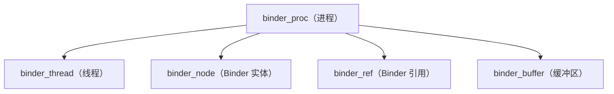
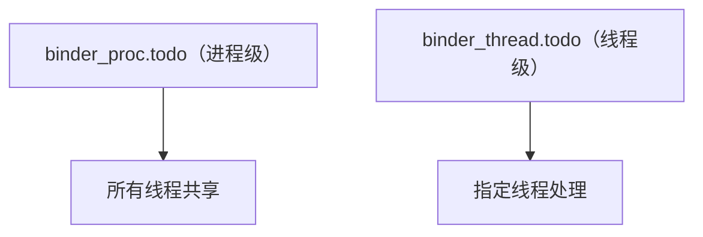
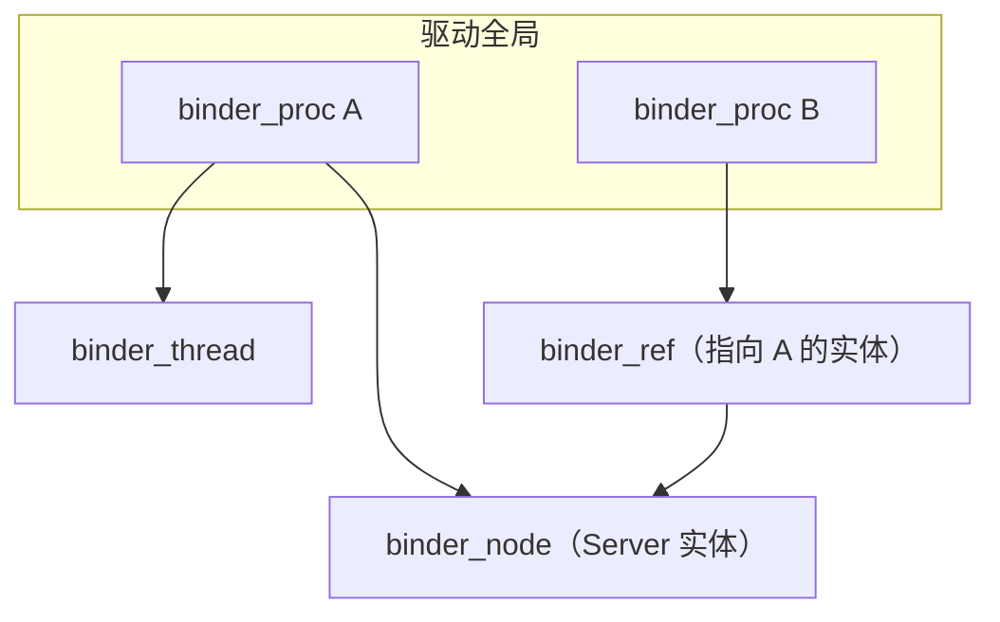

# Binder 驱动 binder_proc 与 binder_thread 结构源码

> 系列：Framework-Source-Note · binder
> 难度：⭐⭐⭐⭐⭐ 深入
> 更新：2026-08-27
> 前置知识：《Binder 驱动 binder_transaction 的完整源码》

---

## 一、本文目标

Binder 驱动用一系列结构体管理进程、线程、节点。这一篇深入最核心的两个结构体：`binder_proc`（进程）和 `binder_thread`（线程），看驱动怎么组织这些对象。

## 二、驱动管理的核心对象



## 三、binder_proc 结构体

```c
struct binder_proc {
    struct hlist_node proc_node;   // 全局进程链表的节点
    struct rb_root threads;         // 线程红黑树（按 pid）
    struct rb_root nodes;           // Binder 实体红黑树
    struct rb_root refs_by_desc;    // 引用（按 handle 编号）
    struct rb_root refs_by_node;    // 引用（按实体）
    int pid;                        // 进程 PID
    struct vm_area_struct *vma;     // mmap 的内存区域
    struct list_head todo;          // 待处理事务队列
    struct binder_buffer *buffer;   // mmap 缓冲区
    size_t user_buffer_offset;      // 用户空间偏移
    struct list_head buffers;       // 缓冲区链表
    int max_threads;                // 最大线程数
    int requested_threads;          // 已请求的线程数
    // ...
};
```

**关键理解**：
- `threads`/`nodes`/`refs` 都是**红黑树**（rb_root），用于高效查找。
- `todo` 是待处理事务队列。
- `buffer` 是 mmap 缓冲区，`user_buffer_offset` 记录用户空间映射。

## 四、binder_thread 结构体

```c
struct binder_thread {
    struct binder_proc *proc;       // 所属进程
    struct rb_node rb_node;         // 红黑树节点
    int pid;                        // 线程 PID
    int looper;                     // 线程状态（如 BINDER_LOOPER_STATE_REGISTERED）
    struct binder_transaction *transaction_stack;  // 事务栈
    struct list_head todo;          // 该线程待处理事务
    bool is_dead;                   // 是否已死亡
    struct task_struct *task;       // 对应的内核任务
    // ...
};
```

**关键理解**：
- `transaction_stack` 是**事务栈**，用于处理嵌套事务（如 Binder 调用中再调 Binder）。
- `todo` 是线程级别的待处理队列（进程级也有 todo）。

## 五、进程的 todo 和线程的 todo

Binder 有两级待处理队列：



**关键理解**：
- 普通请求进**进程级 todo**，任何空闲线程都能处理。
- 回复（reply）进**线程级 todo**，只有原发起线程能处理。

## 六、红黑树的作用

为什么用红黑树？为了高效查找：

```c
// 根据 pid 查找线程（红黑树查找 O(log n)）
struct binder_thread *binder_get_thread(struct binder_proc *proc) {
    struct rb_node *node = proc->threads.rb_node;
    while (node) {
        struct binder_thread *thread = rb_entry(node, struct binder_thread, rb_node);
        if (current->pid < thread->pid) node = node->rb_left;
        else if (current->pid > thread->pid) node = node->rb_right;
        else return thread;
    }
    return NULL;
}
```

## 七、进程的创建与销毁

```c
// 打开 /dev/binder 时创建 binder_proc
static int binder_open(struct inode *nodp, struct file *filp) {
    struct binder_proc *proc;
    proc = kzalloc(sizeof(*proc), GFP_KERNEL);
    // 初始化红黑树、链表
    filp->private_data = proc;
    // 加入全局进程链表
    hlist_add_head(&proc->proc_node, &binder_procs);
    return 0;
}
```

## 八、对象关系全景



## 九、总结

| 要点 | 结论 |
|------|------|
| binder_proc | 进程：线程/节点/引用/缓冲区 |
| binder_thread | 线程：事务栈、状态 |
| 两级 todo | 进程级 + 线程级 |
| 红黑树 | 高效查找 |

---

**下一篇预告**：《端侧推理性能优化的完整实践》

> 配套仓库：[Framework-Source-Note](https://github.com/jason5200/Framework-Source-Note)
