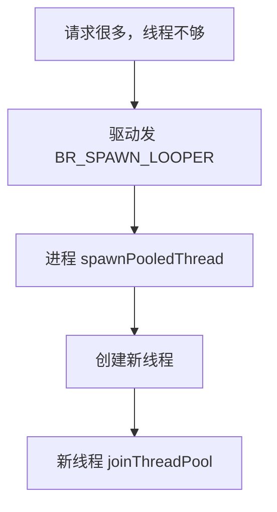
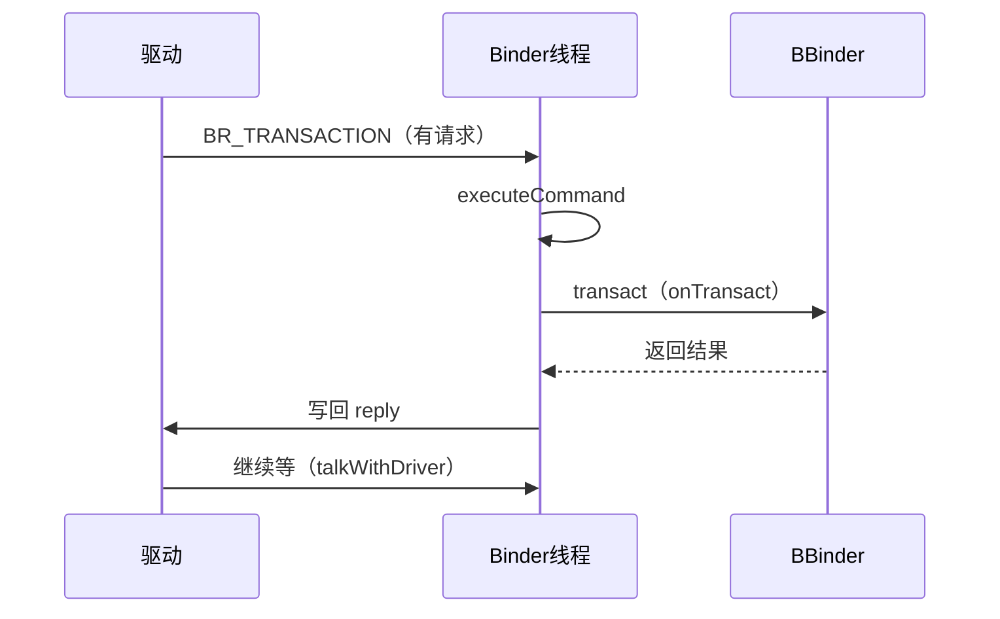

# Binder 线程池的完整源码

> 系列：Framework-Source-Note · binder
> 难度：⭐⭐⭐⭐⭐ 深入
> 更新：2026-08-27
> 前置知识：《Binder 连接池与多线程并发》

---

## 一、本文目标

上一篇《Binder 连接池》讲了线程池的概念，这一篇深入到 **native 层**，看 Binder 线程池到底怎么创建、怎么调度线程处理并发请求。

## 二、Binder 线程池的创建

每个使用 Binder 的进程，通过 `ProcessState` 初始化线程池：

```cpp
// ProcessState.cpp
ProcessState::ProcessState(const char *driver)
    : mDriverName(String8(driver))
    , mDriverFD(open_driver(driver))  // 打开 /dev/binder
{
    if (mDriverFD >= 0) {
        // mmap 内存映射
        mVMStart = mmap(0, BINDER_VM_SIZE, ...);
    }
}
```

```cpp
// 启动线程池
void ProcessState::startThreadPool() {
    // 启动一个主线程来跑线程池
    spawnPooledThread(true);
}

void ProcessState::spawnPooledThread(bool isMain) {
    // 创建线程，线程函数是 talkWithDriver
    pthread_create(&thread, ..., _threadLoop, this);
}
```

## 三、线程循环：talkWithDriver

每个 Binder 线程的核心循环是 `talkWithDriver`：

```cpp
// IPCThreadState.cpp
int IPCThreadState::talkWithDriver(bool doReceive) {
    binder_write_read bwr;

    // 1. 填充要写入的数据（要发给对端的数据）
    bwr.write_size = mOut.dataSize();
    bwr.write_buffer = (uintptr_t)mOut.data();

    // 2. 填充要读取的缓冲区（接收对端数据）
    bwr.read_size = mIn.dataCapacity();
    bwr.read_buffer = (uintptr_t)mIn.data();

    // 3. ★ 发起 ioctl，阻塞等待
    ioctl(mProcess->mDriverFD, BINDER_WRITE_READ, &bwr);

    // 4. 处理读取到的数据
    if (bwr.read_consumed > 0) {
        mIn.setDataSize(bwr.read_consumed);
        executeCommand(mIn);  // 执行命令（调用 onTransact）
    }
}
```

**核心理解**：每个 Binder 线程都在 `talkWithDriver` 里循环，通过 ioctl 与驱动交互，处理跨进程请求。

## 四、线程循环的完整结构

```cpp
// IPCThreadState::joinThreadPool
void IPCThreadState::joinThreadPool(bool isMain) {
    // 注册为 Binder 线程
    mOut.writeInt32(isMain ? BC_ENTER_LOOPER : BC_REGISTER_LOOPER);

    do {
        // 循环：talkWithDriver → executeCommand
        result = talkWithDriver();  // 阻塞等请求
        if (result >= NO_ERROR) {
            executeCommand(cmd);    // 执行（调 onTransact）
        }
    } while (result != -ECONNREFUSED);
}
```

## 五、命令分发：executeCommand

```cpp
status_t IPCThreadState::executeCommand(int32_t cmd) {
    switch (cmd) {
        case BR_TRANSACTION: {
            // 收到跨进程调用
            binder_transaction_data tr;
            mIn.read(&tr, sizeof(tr));

            // 调用 BBinder 的 onTransact
            BBinder* obj = (BBinder*)tr.cookie;
            status_t error = obj->transact(tr.code, buffer, &reply, tr.flags);

            // 把回复写回驱动
            sendReply(reply);
            break;
        }
        case BR_SPAWN_LOOPER: {
            // 驱动要求创建更多线程
            mProcess->spawnPooledThread(false);
            break;
        }
    }
}
```

**关键理解**：`BR_TRANSACTION` 是核心命令——收到跨进程调用，调用目标 BBinder 的 `transact`（最终到 Java 的 onTransact）。

## 六、线程数量的动态管理

驱动会通知进程「线程不够了」，进程动态创建：



```cpp
// 驱动侧：判断是否需要更多线程
if (proc->requested_threads < proc->max_threads) {
    proc->requested_threads++;
    // 发送 BR_SPAWN_LOOPER 命令
    put_user(BR_SPAWN_LOOPER, ...);
}
```

## 七、默认线程数上限

```cpp
// ProcessState.cpp
#define DEFAULT_MAX_BINDER_THREADS 15

// 设置最大线程数
status_t ProcessState::setThreadPoolMaxThreadCount(size_t maxThreads) {
    // 写入驱动
    ioctl(mDriverFD, BINDER_SET_MAX_THREADS, &maxThreads);
}
```

## 八、完整的线程池工作流程



## 九、总结

| 要点 | 结论 |
|------|------|
| 线程创建 | spawnPooledThread |
| 核心循环 | talkWithDriver + executeCommand |
| 命令分发 | BR_TRANSACTION → onTransact |
| 动态扩缩 | BR_SPAWN_LOOPER |
| 默认上限 | 15 线程 |

---

**下一篇预告**：《llama.cpp 的 RoPE 位置编码实现》

> 配套仓库：[Framework-Source-Note](https://github.com/jason5200/Framework-Source-Note)
