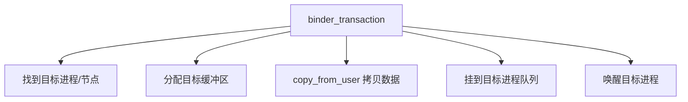
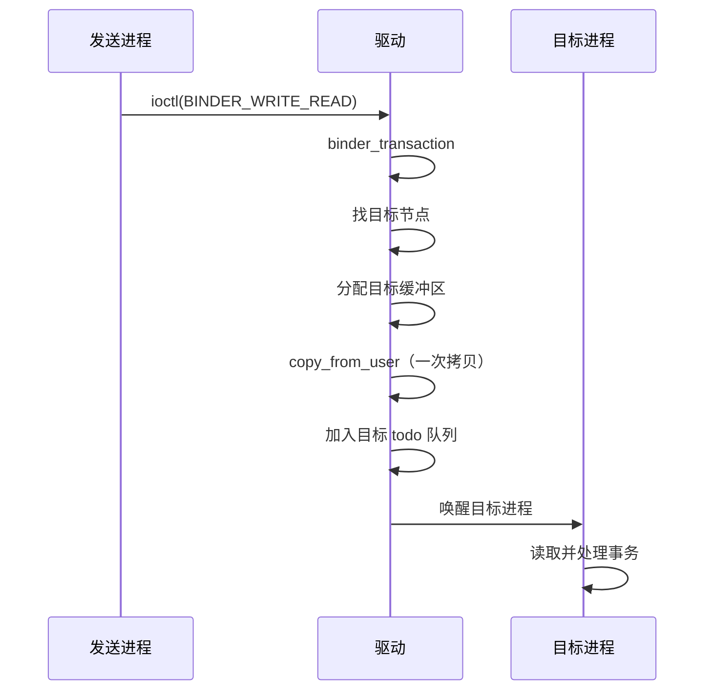

# Binder 驱动 binder_transaction 的完整源码

> 系列：Framework-Source-Note · binder
> 难度：⭐⭐⭐⭐⭐ 深入
> 更新：2026-08-27
> 前置知识：《Binder mmap 一次拷贝的完整源码》《Binder 驱动层深入》

---

## 一、本文目标

`binder_transaction` 是 Binder 驱动的**核心函数**——所有跨进程调用最终都走到这里。这一篇深入到它的完整源码，看一次事务的全过程。

## 二、binder_transaction 的职责



## 三、函数签名与入口

```c
static void binder_transaction(struct binder_proc *proc,
                               struct binder_thread *thread,
                               struct binder_transaction_data *tr, int reply)
{
    struct binder_transaction *t;
    struct binder_work *tcomplete;
    struct binder_proc *target_proc;
    struct binder_thread *target_thread = NULL;
    struct binder_node *target_node = NULL;
    // ...
}
```

## 四、第一步：找到目标

```c
if (reply) {
    // 这是回复，找原始事务的目标
    target_thread = binder_get_txn_from_and_acq_inner(in_reply_to);
    target_proc = target_thread->proc;
} else {
    // 这是新请求，根据 handle 找目标节点
    if (tr->target.handle) {
        struct binder_ref *ref;
        ref = binder_get_ref_olocked(proc, tr->target.handle);
        target_node = ref->node;
    } else {
        target_node = binder_context_mgr_node;  // ServiceManager
    }
    target_proc = target_node->proc;
}
```

## 五、第二步：分配目标缓冲区

```c
// 在目标进程的 mmap 区域分配缓冲区
t->buffer = binder_alloc_buf(target_proc, tr->data_size, tr->offsets_size, ...);

// 记录缓冲区信息
t->buffer->allow_user_free = 0;
t->buffer->transaction = t;
```

**关键理解**：缓冲区从**目标进程**的 mmap 区域分配，这就是「一次拷贝」的基础。

## 六、第三步：拷贝数据（唯一一次拷贝）

```c
// 从发送方用户空间 copy 到目标进程的内核缓冲区
if (copy_from_user(t->buffer->data, tr->data.ptr.buffer, tr->data_size)) {
    binder_free_buf(target_proc, t->buffer);
    goto err_copy_data_failed;
}

// 拷贝 offsets（Binder 对象偏移）
if (copy_from_user(t->buffer->offsets, tr->data.ptr.offsets, tr->offsets_size)) {
    goto err_copy_data_failed;
}
```

## 七、第四步：挂到目标进程队列

```c
// 把事务加入目标线程的待处理队列
if (target_thread) {
    // 指定了目标线程（回复场景）
    binder_enqueue_thread_work(target_thread, &t->work);
} else {
    // 未指定线程，加入目标进程的 todo 队列
    binder_enqueue_work(target_proc, &t->work);
}
```

## 八、第五步：唤醒目标

```c
// 唤醒目标进程，让它处理这个事务
if (target_thread) {
    if (target_thread->looper & BINDER_LOOPER_STATE_NEED_RETURN) {
        binder_wakeup_poll_threads(target_proc);
    }
} else {
    // 唤醒目标进程的一个 binder 线程
    if (!(target_proc->...)) {
        binder_wakeup_poll_threads(target_proc);
    }
}
```

## 九、完整的时序



## 十、总结

| 要点 | 结论 |
|------|------|
| 找目标 | 按 handle / ServiceManager |
| 分配缓冲 | 目标进程 mmap 区域 |
| 一次拷贝 | copy_from_user |
| 唤醒 | 加入队列 + wakeup |

---

**下一篇预告**：《llama.cpp 采样算法的完整源码》

> 配套仓库：[Framework-Source-Note](https://github.com/jason5200/Framework-Source-Note)
