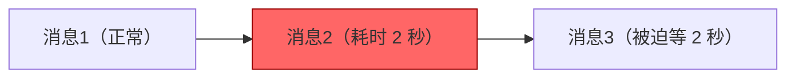
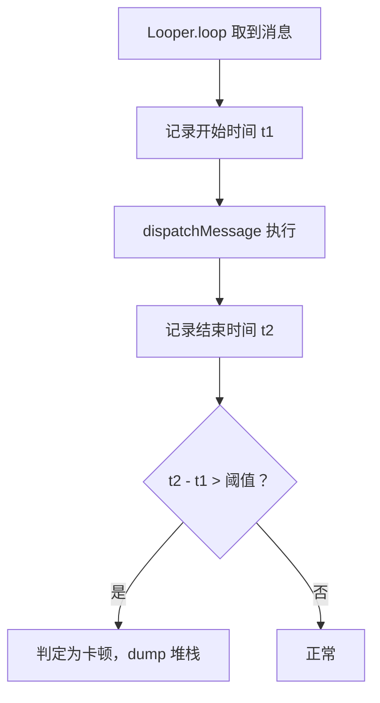

# 主线程卡顿检测与 BlockCanary 原理

> 系列：Framework-Source-Note · handler
> 难度：⭐⭐⭐⭐ 深入
> 更新：2026-08-27
> 前置知识：《Handler 消息机制》《Looper 的退出》

---

## 一、什么是「卡顿」

主线程的 Looper 是个消息循环，每个消息（触摸、绘制、业务）都排队执行。如果某个消息**执行时间过长**（比如超过 16.6ms 一帧），后面的消息就迟迟得不到处理，用户就感觉「卡了」。



**卡顿的本质**：主线程某条消息耗时过长，阻塞了队列。

## 二、BlockCanary 的核心思想

BlockCanary 是著名的卡顿检测库，它的原理非常巧妙：

**在每条消息开始和结束时打点，计算耗时。**



## 三、实现原理：Printer 钩子

Looper 提供了一个 `setMessageLogging(Printer)` 方法，会在消息处理前后打印日志：

```java
// Looper.loop() 源码
public static void loop() {
    for (;;) {
        Message msg = queue.next();
        if (msg == null) return;

        if (logging != null) {
            logging.println(">>>>> Dispatching to " + msg.target + ...);
        }
        msg.target.dispatchMessage(msg);
        if (logging != null) {
            logging.println("<<<<< Finished to " + msg.target + ...);
        }
    }
}
```

**关键发现**：`>>>>>` 是消息开始，`<<<<<` 是消息结束。两者之间的时间差，就是这条消息的执行耗时！

## 四、BlockCanary 的实现

```java
// 核心：通过 Printer 监听消息耗时
Looper.getMainLooper().setMessageLogging(new Printer() {
    private long startTime;

    @Override
    public void println(String x) {
        if (x.startsWith(">>>>> Dispatching")) {
            startTime = System.currentTimeMillis();  // 记录开始
        } else if (x.startsWith("<<<<< Finished")) {
            long cost = System.currentTimeMillis() - startTime;  // 计算耗时
            if (cost > THRESHOLD) {  // 超过阈值
                // 卡顿了，dump 主线程堆栈
                dumpStack();
            }
        }
    }
});
```

**核心理解**：BlockCanary 没有改动系统，只是利用了 Looper 自带的日志钩子，巧妙地把「日志」变成了「性能监控」。

## 五、卡顿后 dump 堆栈

判定卡顿后，要**抓主线程的堆栈**，才能知道「卡在哪」：

```java
private void dumpStack() {
    // 拿到主线程
    Thread mainThread = Looper.getMainLooper().getThread();
    // 获取堆栈
    StackTraceElement[] stack = mainThread.getStackTrace();
    // 输出或上报
    for (StackTraceElement e : stack) {
        Log.e("BlockCanary", e.toString());
    }
}
```

**原理**：卡顿时，主线程正在执行耗时操作，此时 dump 堆栈，就能看到「卡在哪个方法」。

## 六、常见的卡顿原因

| 原因 | 说明 |
|------|------|
| 主线程 IO | 文件读写、数据库查询 |
| 主线程网络 | 网络请求 |
| 大对象分配 | 频繁 GC |
| 复杂布局 | measure/layout 耗时 |
| 锁竞争 | synchronized 等锁 |

## 七、BlockCanary 的局限性

1. **只能检测，不能定位到具体行**：堆栈只能到方法级别。
2. **阈值敏感**：设太大会漏报，太小会误报。
3. **只能检测主线程**：子线程卡顿不管。

## 八、总结

| 要点 | 结论 |
|------|------|
| 卡顿本质 | 主线程消息耗时过长 |
| BlockCanary 原理 | Printer 钩子 + 耗时计算 |
| 核心 API | Looper.setMessageLogging |
| 检测后 | dump 主线程堆栈 |
| 局限 | 方法级定位、只测主线程 |

---

**下一篇预告**：《Activity 启动模式与任务栈》

> 配套仓库：[Framework-Source-Note](https://github.com/jason5200/Framework-Source-Note)
