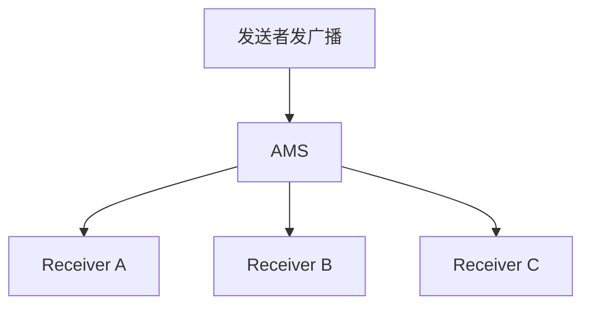

# BroadcastReceiver 的动态注册与分发

> 系列：Framework-Source-Note · component
> 难度：⭐⭐⭐ 进阶
> 更新：2026-08-27
> 前置知识：《AMS 启动流程解析》《Handler 消息机制》

---

## 一、广播是什么

广播是 Android 的「事件总线」机制：系统或应用发出事件，所有感兴趣的接收者都能收到。



**典型场景**：电量变化、网络切换、开机完成、应用自定义事件。

## 二、两种注册方式

| 方式 | 注册时机 | 生命周期 |
|------|----------|----------|
| 静态注册 | AndroidManifest.xml | 常驻（可接收开机广播） |
| 动态注册 | 代码 registerReceiver | 随组件销毁 |

### 1. 静态注册

```xml
<receiver android:name=".MyReceiver">
    <intent-filter>
        <action android:name="android.intent.action.BOOT_COMPLETED" />
    </intent-filter>
</receiver>
```

### 2. 动态注册

```java
IntentFilter filter = new IntentFilter("com.example.MY_ACTION");
registerReceiver(receiver, filter);

// 记得反注册！
unregisterReceiver(receiver);
```

**关键**：动态注册必须**成对反注册**，否则内存泄漏。

## 三、广播的发送与接收

### 发送广播

```java
// 普通广播
sendBroadcast(intent);

// 有序广播（可拦截、可修改）
sendOrderedBroadcast(intent, null);

// 本地广播（仅进程内）
LocalBroadcastManager.getInstance(this).sendBroadcast(intent);
```

### 接收广播

```java
public class MyReceiver extends BroadcastReceiver {
    @Override
    public void onReceive(Context context, Intent intent) {
        String action = intent.getAction();
        // 处理广播
    }
}
```

## 四、有序广播 vs 普通广播

| 类型 | 特点 |
|------|------|
| 普通广播 | 无序，所有接收者同时收到 |
| 有序广播 | 按优先级依次接收，可拦截、可修改结果 |


```xml
<!-- 设置优先级 -->
<intent-filter android:priority="100">
```

## 五、本地广播 LocalBroadcastManager

本地广播只在进程内传递，更安全、更高效：

```java
// 注册
LocalBroadcastManager.getInstance(this).registerReceiver(receiver, filter);
// 发送
LocalBroadcastManager.getInstance(this).sendBroadcast(intent);
```

**优点**：不跨进程，无 Binder 开销，不受外部干扰。

> 注意：LocalBroadcastManager 在新版 AndroidX 中已标记废弃，推荐用 LiveData / Flow 替代。

## 六、onReceive 的线程

**关键**：onReceive 运行在**主线程**，不能做耗时操作！

```java
@Override
public void onReceive(Context context, Intent intent) {
    // ❌ 不能在这里做耗时操作
    // ✅ 应该启动 Service 或开线程处理
}
```

如需耗时操作，用 goAsync() 或启动 Service。

## 七、常见坑

| 坑 | 说明 |
|----|------|
| 动态注册忘记反注册 | 内存泄漏 |
| onReceive 做耗时操作 | 阻塞主线程，ANR |
| 静态注册收不到某些广播 | 高版本限制 |
| 广播泛滥 | 优先用本地广播/事件总线 |

## 八、总结

| 要点 | 结论 |
|------|------|
| 广播机制 | 事件总线，AMS 分发 |
| 注册方式 | 静态 / 动态 |
| 有序 vs 普通 | 有序可拦截 |
| onReceive 线程 | 主线程，不能耗时 |

---

**下一篇预告**：《ContentProvider 的原理与使用》

> 配套仓库：[Framework-Source-Note](https://github.com/jason5200/Framework-Source-Note)
