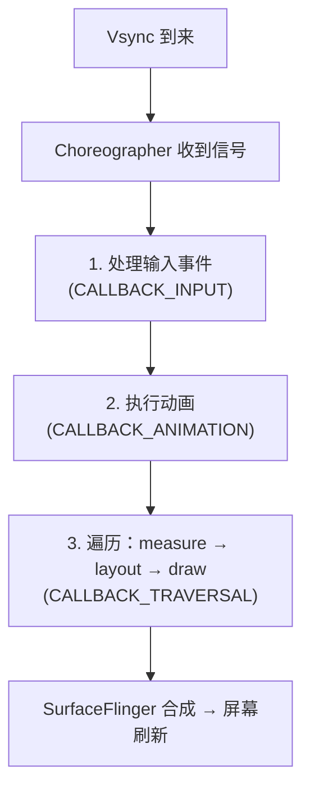
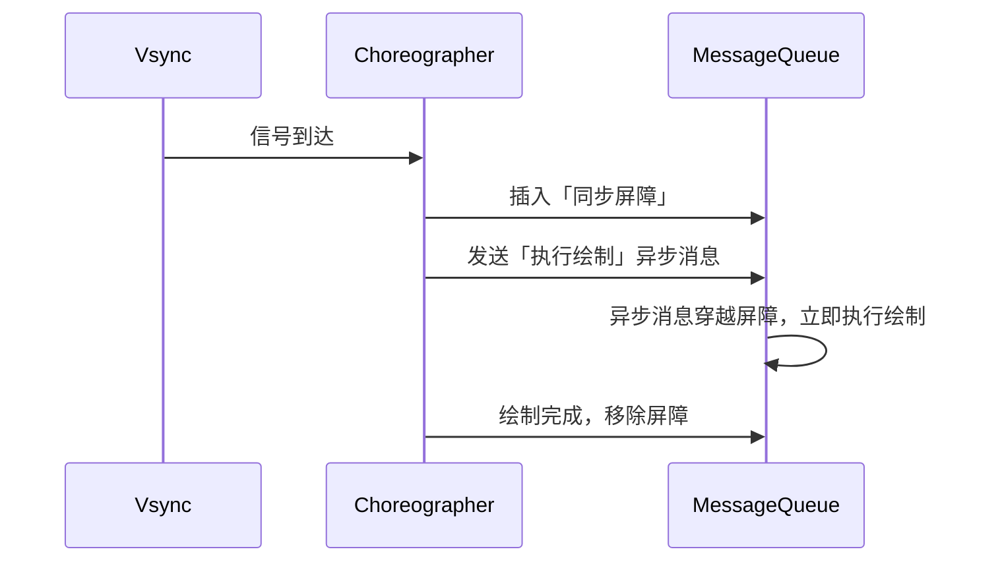
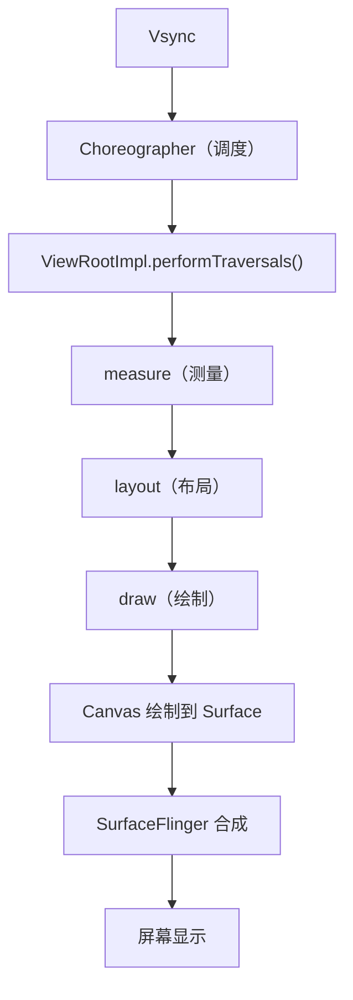

# Choreographer 与渲染机制

> 系列：Framework-Source-Note · ams-wms
> 难度：⭐⭐⭐⭐ 深入
> 更新：2026-08-24
> 前置知识：《同步屏障与异步消息》《WMS 窗口管理解析》

---

## 一、Choreographer 是什么

**Choreographer（编舞者）** 是 Android 渲染机制的核心调度器，负责**协调 UI 绘制与屏幕刷新同步**。

名字很形象：它像舞蹈编导一样，让「App 绘制」和「屏幕刷新」这两个节奏统一起来，避免画面撕裂或卡顿。

## 二、为什么要同步：Vsync 信号

屏幕刷新是有固定节奏的（60Hz 屏每 16.6ms 刷新一次）。如果 App 的绘制**不和这个节奏同步**，就会出问题：

- 画到一半屏幕刷新了 → **画面撕裂**
- 错过这一帧 → **掉帧、卡顿**

**Vsync 信号**就是屏幕每次刷新的「节拍器」。Choreographer 的工作就是**监听 Vsync，在正确的时间点触发 App 绘制**。

## 三、Choreographer 的三大回调

Choreographer 按优先级管理三类回调：

| 回调 | 用途 | 时机 |
|------|------|------|
| `CALLBACK_INPUT` | 输入事件处理 | 最早 |
| `CALLBACK_ANIMATION` | 动画更新 | 其次 |
| `CALLBACK_TRAVERSAL` | 布局 + 绘制 | 最后 |

每一帧的典型流程：



## 四、与同步屏障的关系

上一篇文章讲了同步屏障，这里把它们串起来：



**完整逻辑**：为了保证绘制任务不被普通消息（如网络回调、Handler 消息）阻塞，Choreographer 在每帧开始时插入同步屏障，让绘制这条**异步消息**优先执行。

## 五、一次绘制的完整链路

把前面几篇的知识串起来，一次 View 绘制的完整流程：



**关键理解**：这一整条链路，都必须在**一帧（16.6ms）内**完成。任何一步超时，就会掉帧。

## 六、如何用 Choreographer 做性能监控

Choreographer 也是性能监控的利器，可以监听每一帧的执行时间：

```kotlin
// 监听帧回调，计算掉帧
Choreographer.getInstance().postFrameCallback(object : Choreographer.FrameCallback {
    private var lastFrameTime = 0L
    override fun doFrame(frameTimeNanos: Long) {
        if (lastFrameTime != 0L) {
            val diff = (frameTimeNanos - lastFrameTime) / 1_000_000  // ms
            if (diff > 16.6) {
                Log.w(TAG, "掉帧：${diff}ms")
            }
        }
        lastFrameTime = frameTimeNanos
        Choreographer.getInstance().postFrameCallback(this)  // 继续监听
    }
})
```

> 原理：正常每帧约 16.6ms，如果某帧间隔远大于此值，说明发生了掉帧。这是很多性能监控库（如 BlockCanary）的基础。

## 七、常见掉帧原因

| 原因 | 说明 |
|------|------|
| 主线程耗时操作 | 网络/IO/大计算在主线程 |
| 布局层级过深 | measure/layout 耗时 |
| 过度绘制 | 同一像素多次绘制 |
| 频繁 GC | 内存抖动导致卡顿 |
| 大图加载 | 图片解码在主线程 |

## 八、总结

| 要点 | 结论 |
|------|------|
| Choreographer 是什么 | 渲染调度器，同步绘制与 Vsync |
| 三大回调 | INPUT / ANIMATION / TRAVERSAL |
| 与同步屏障 | 插入屏障让绘制异步消息优先执行 |
| 绘制链路 | Vsync → Choreographer → performTraversals → SurfaceFlinger |
| 性能监控 | postFrameCallback 计算掉帧 |

---

**下一篇预告**：《Binder 驱动层深入》

> 配套仓库：[Framework-Source-Note](https://github.com/jason5200/Framework-Source-Note)
