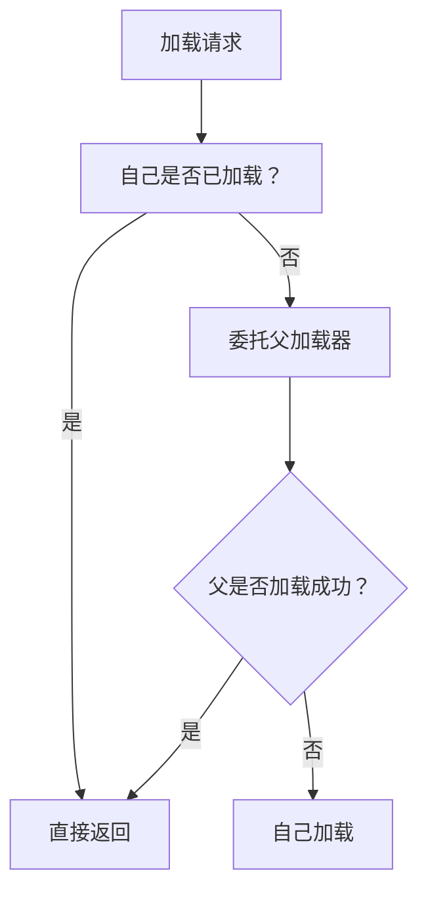
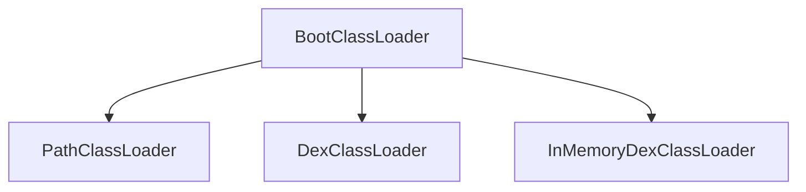
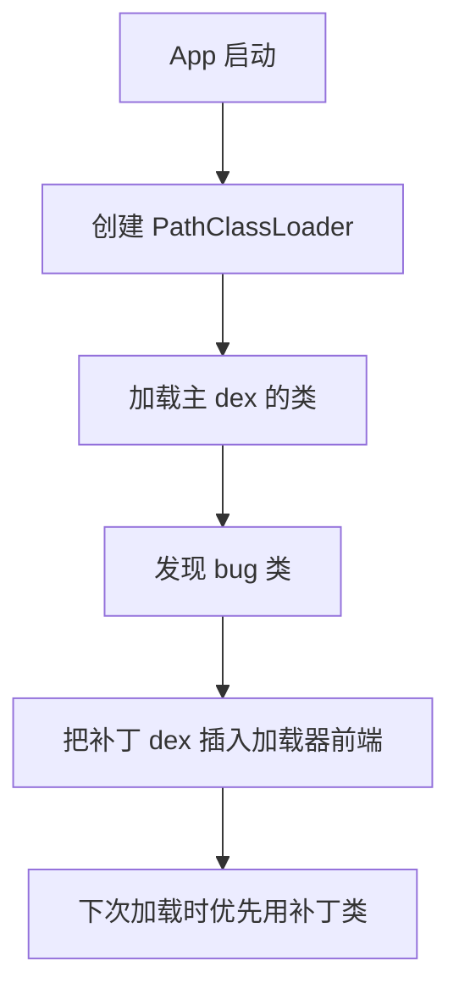

# 类加载机制：ClassLoader 与双亲委派

> 系列：Framework-Source-Note · classloader
> 难度：⭐⭐⭐⭐ 深入
> 更新：2026-08-26
> 前置知识：Java 基础、Android 系统启动

---

## 一、类加载器是什么

Java/Android 的类不是一次性全部加载进内存的，而是**用到时才加载**。负责这件事的就是 **ClassLoader（类加载器）**。

```java
Class<?> clazz = classLoader.loadClass("com.example.MyClass");
```

**核心理解**：ClassLoader 负责把字节码（.class / .dex）从磁盘加载到内存，生成 `Class` 对象。

## 二、双亲委派模型

这是类加载的核心机制，也是面试高频考点。



**一句话**：收到加载请求，先问父加载器能不能加载，父不行才自己来。

### 双亲委派的代码实现

```java
protected Class<?> loadClass(String name, boolean resolve) throws ClassNotFoundException {
    synchronized (getClassLoadingLock(name)) {
        // 1. 先检查是否已加载
        Class<?> c = findLoadedClass(name);
        if (c == null) {
            try {
                // 2. 委托父加载器
                if (parent != null) {
                    c = parent.loadClass(name, false);
                } else {
                    c = findBootstrapClassOrNull(name);
                }
            } catch (ClassNotFoundException e) {
                // 父加载不了，往下走
            }
            if (c == null) {
                // 3. 自己加载
                c = findClass(name);
            }
        }
        return c;
    }
}
```

## 三、为什么需要双亲委派

两个核心原因：

1. **避免类的重复加载**：父加载器加载过的类，子加载器不再加载，保证 JVM 中同一个类只存在一份。
2. **安全性**：核心类（如 `java.lang.String`）只能由顶层加载器加载，防止被恶意篡改。

**经典例子**：如果有人定义了一个自定义的 `java.lang.String` 类，双亲委派会先让 Bootstrap ClassLoader 加载，加载到的是 JDK 官方的 String，自定义的那个永远不会被加载，从而保护了核心类。

## 四、Android 的类加载器

Android 用的是自己的类加载体系（不是标准 JDK）：



| 加载器 | 作用 | 说明 |
|--------|------|------|
| `BootClassLoader` | 加载系统类 | Android 版的 Bootstrap |
| `PathClassLoader` | 加载已安装 APK | 只能加载 APK 内 classes.dex |
| `DexClassLoader` | 加载外部 dex/jar | 可加载指定路径的 dex |
| `InMemoryDexClassLoader` | 加载内存中的 dex | 用于热修复等场景 |

**关键区别**：
- `PathClassLoader`：只能加载已安装应用的 dex。
- `DexClassLoader`：可以从任意路径（SD 卡、私有目录）加载 dex。

## 五、热修复的原理

类加载机制是「热修复」和「插件化」的基础：



**核心思路**：Android 加载类时，会按 dex 数组顺序查找。把「补丁 dex」插到数组前面，就能让补丁类**优先**被加载，覆盖掉有 bug 的类。

## 六、热修复的实现关键

```java
// 核心：往 ClassLoader 的 dexElements 数组前面插入补丁 dex
public static void installPatch(Context context, File patchDex) {
    // 1. 拿到当前应用的 PathClassLoader
    ClassLoader classLoader = context.getClassLoader();

    // 2. 通过反射拿到 dexElements 数组
    Object[] oldElements = getDexElements(classLoader);

    // 3. 把补丁 dex 转成 Element，插到数组前面
    Object[] newElements = combine(patchDex, oldElements);

    // 4. 写回
    setDexElements(classLoader, newElements);
}
```

> 这就是 Tinker、Sophix 等热修复框架的底层原理。

## 七、常见问题

| 问题 | 答案 |
|------|------|
| 双亲委派的「父」是谁 | 不是继承关系，是加载器的 parent 字段 |
| Android 和 JDK 的类加载器一样吗 | 不一样，Android 是 BootClassLoader + DexClassLoader 体系 |
| PathClassLoader 和 DexClassLoader 区别 | 前者只加载已安装 APK，后者可加载任意路径 dex |
| 热修复原理 | 补丁 dex 插到加载器数组前面 |

## 八、总结

| 要点 | 结论 |
|------|------|
| 类加载器 | 负责把字节码加载成 Class 对象 |
| 双亲委派 | 先父后子，避免重复加载 + 安全 |
| Android 加载器 | BootClassLoader / PathClassLoader / DexClassLoader |
| 热修复 | 补丁 dex 插到数组前面 |

---

**下一篇预告**：《车载 Android 实战：CarAudioService 音频管理》

> 配套仓库：[Framework-Source-Note](https://github.com/jason5200/Framework-Source-Note)
