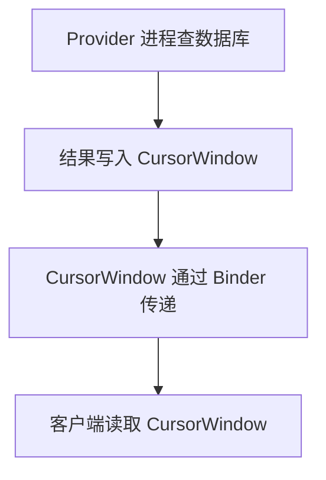
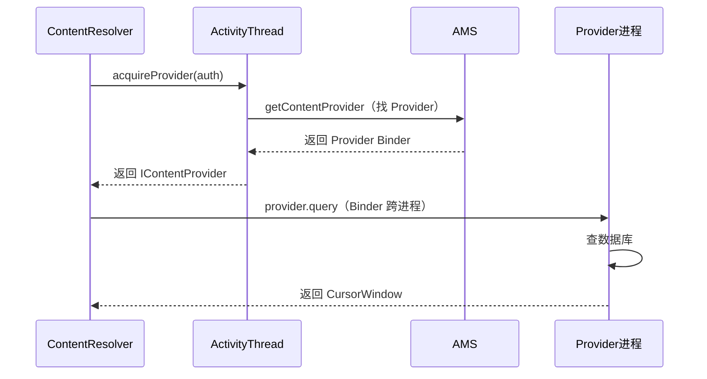

# ContentProvider 跨进程的完整源码

> 系列：Framework-Source-Note · component
> 难度：⭐⭐⭐⭐⭐ 深入
> 更新：2026-08-27
> 前置知识：《ContentProvider 的原理与使用》

---

## 一、本文目标

上一篇《ContentProvider 的原理与使用》讲了概念，这一篇深入到**跨进程调用的完整源码链**：从 `ContentResolver.query` 到 Provider 的 `query`，中间发生了什么。

## 二、跨进程的入口：ContentResolver

```java
// ContentResolver.java
public final Cursor query(Uri uri, ...) {
    // 1. 获取 Provider 的代理（IContentProvider）
    IContentProvider provider = acquireProvider(uri);

    // 2. 跨进程调用
    Cursor qCursor = provider.query(uri, projection, ...);

    return qCursor;
}
```

**关键理解**：`acquireProvider` 拿到的是 `IContentProvider` 的 Binder 代理，后续调用都走 Binder 跨进程。

## 三、acquireProvider：找到 Provider

```java
protected IContentProvider acquireProvider(Context c, String auth) {
    // 1. 先查本地缓存
    IContentProvider provider = mProviderMap.get(auth);
    if (provider != null) return provider;

    // 2. 向 ActivityThread 请求获取 Provider
    provider = ActivityThread.currentActivityThread()
        .acquireProvider(c, auth, ...);
    return provider;
}
```

## 四、ActivityThread 获取 Provider

```java
// ActivityThread.java
public IContentProvider acquireProvider(Context c, String auth, ...) {
    // 1. 查已有 Provider
    ContentProviderHolder holder = installProvider(c, ...);

    // 2. 如果本地没有，向 AMS 请求
    if (holder.provider == null) {
        holder = ActivityManagerNative.getDefault()
            .getContentProvider(auth, ...);  // 跨进程找 AMS
    }
    return holder.provider;
}
```

## 五、AMS 定位 Provider 所在进程

AMS 根据 authority 找到 Provider 在哪个进程，并返回它的 Binder：

```java
// ActivityManagerService.java
public ContentProviderHolder getContentProvider(String name, ...) {
    // 1. 根据 authority 找 ProviderInfo
    ProviderInfo info = ...;  // 从 PackageManager 查

    // 2. 找到 Provider 所在的进程
    ProcessRecord proc = getProcessRecordLocked(info.processName, ...);

    // 3. 返回 Provider 的 Binder
    return provider.holder;
}
```

## 六、Provider 进程侧的注册

Provider 所在进程，启动时通过 `installProvider` 注册：

```java
// ActivityThread.java
private ContentProviderHolder installProvider(Context context, ...) {
    ContentProvider localProvider = new MyProvider();  // 实例化
    localProvider.onCreate();  // 初始化

    // 注册到 PackageManager 的 Provider 列表
    // 返回 holder，含 Provider 的 Binder
    ContentProviderHolder holder = new ContentProviderHolder(provider);
    return holder;
}
```

## 七、Cursor 的跨进程传递

query 返回的 Cursor，跨进程传递有特殊处理：

```java
// 返回的 Cursor 实际是 CursorWindow
// CursorWindow 是共享内存，通过 Binder 传递引用
```



**关键理解**：Cursor 不是「把数据序列化传过来」，而是「共享一块 CursorWindow 内存」，客户端直接从这块内存读。这避免了大量数据序列化。

## 八、完整的跨进程链路



## 九、总结

| 要点 | 结论 |
|------|------|
| 入口 | ContentResolver.query |
| 定位 | AMS 按 authority 找 Provider |
| 调用 | IContentProvider Binder |
| 返回 | CursorWindow 共享内存 |

---

**下一篇预告**：《模型量化误差的完整分析》

> 配套仓库：[Framework-Source-Note](https://github.com/jason5200/Framework-Source-Note)
