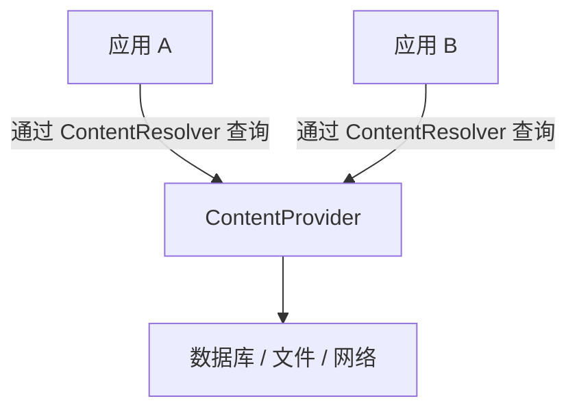
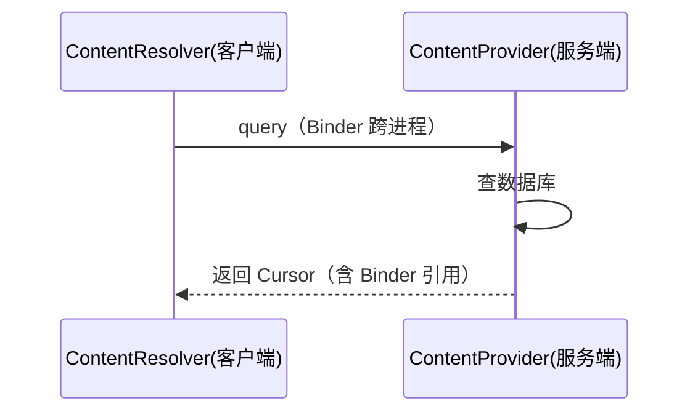

# ContentProvider 的原理与使用

> 系列：Framework-Source-Note · component
> 难度：⭐⭐⭐⭐ 深入
> 更新：2026-08-27
> 前置知识：《Binder 连接池》《Service 的绑定机制》

---

## 一、ContentProvider 是什么

ContentProvider 是 Android 四大组件之一，用于**跨应用共享数据**。



**典型场景**：读取系统联系人、相册、短信。

## 二、核心角色

| 角色 | 作用 |
|------|------|
| `ContentProvider` | 数据提供方（服务端） |
| `ContentResolver` | 数据访问方（客户端） |
| `Uri` | 数据的统一标识 |

**关键理解**：客户端不直接操作 Provider，而是通过 `ContentResolver` 发起请求，底层走 Binder 跨进程。

## 三、定义一个 ContentProvider

```java
public class MyProvider extends ContentProvider {
    @Override
    public boolean onCreate() {
        // 初始化数据库
        return true;
    }

    @Override
    public Cursor query(Uri uri, String[] projection, String selection,
                        String[] selectionArgs, String sortOrder) {
        // 查询
        return db.query(...);
    }

    @Override
    public Uri insert(Uri uri, ContentValues values) {
        // 插入
        return uri;
    }

    @Override
    public int update(Uri uri, ContentValues values, String selection,
                      String[] selectionArgs) {
        // 更新
        return count;
    }

    @Override
    public int delete(Uri uri, String selection, String[] selectionArgs) {
        // 删除
        return count;
    }

    @Override
    public String getType(Uri uri) {
        // 返回 MIME 类型
        return "vnd.android.cursor.dir/...";
    }
}
```

## 四、注册 Provider

```xml
<provider
    android:name=".MyProvider"
    android:authorities="com.example.provider"
    android:exported="false" />
```

**authorities** 是 Provider 的唯一标识，Uri 里的 authority 部分要与之对应。

## 五、客户端访问

```java
ContentResolver resolver = getContentResolver();

// 查询
Cursor cursor = resolver.query(
    Uri.parse("content://com.example.provider/users"),
    null, null, null, null);

// 插入
ContentValues values = new ContentValues();
values.put("name", "Jason");
resolver.insert(Uri.parse("content://com.example.provider/users"), values);
```

## 六、Uri 的结构

```
content://com.example.provider/users/1
   │            │                │  │
  协议        authority         路径 ID
```

- `content://`：固定协议
- `authority`：Provider 标识
- `path`：数据表/类型
- `id`：具体记录

## 七、ContentProvider 的跨进程原理

ContentProvider 的底层是 Binder：



**注意**：返回的 Cursor 实际是一个 `CursorWindow`，通过 Binder 传递，有大小限制（通常 1MB~2MB）。

## 八、常见坑

| 坑 | 说明 |
|----|------|
| authority 不匹配 | Uri 无法解析 |
| exported 设置错误 | 安全风险或访问失败 |
| Cursor 忘关闭 | 资源泄漏 |
| 大结果集 | CursorWindow 超限 |

## 九、总结

| 要点 | 结论 |
|------|------|
| ContentProvider | 跨应用共享数据 |
| 客户端访问 | ContentResolver + Uri |
| 底层 | Binder 跨进程 |
| 注意 | authority、exported、Cursor 关闭 |

---

**下一篇预告**：《Window 与 WindowManager 体系》

> 配套仓库：[Framework-Source-Note](https://github.com/jason5200/Framework-Source-Note)
