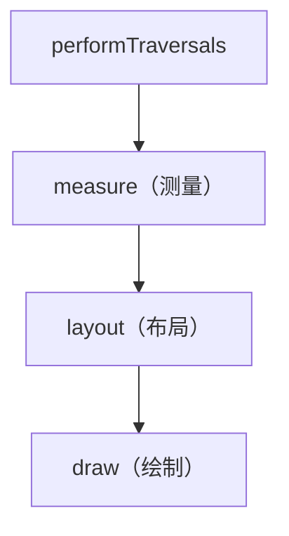
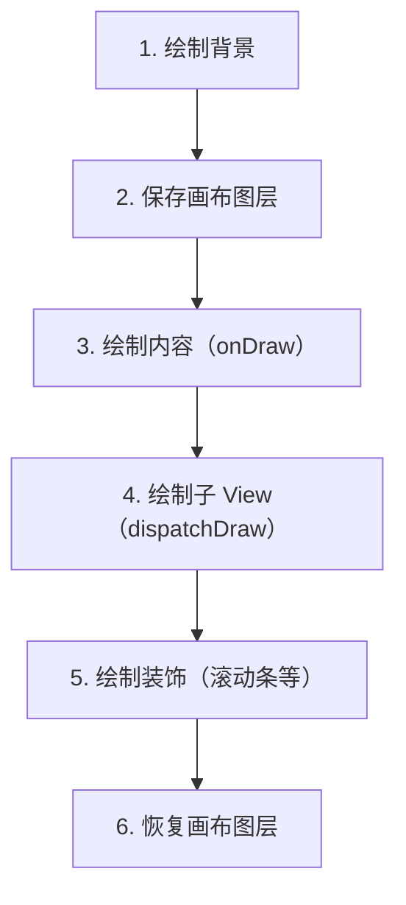

# View 绘制流程：measure / layout / draw

> 系列：Framework-Source-Note · view
> 难度：⭐⭐⭐⭐ 深入
> 更新：2026-08-26
> 前置知识：《Choreographer 与渲染机制》《事件分发机制》

---

## 一、从 Vsync 到绘制

上一篇《Choreographer 与渲染机制》讲过，一次 View 绘制由 Vsync 驱动，最终走到 `ViewRootImpl.performTraversals()`。而绘制的核心，就是这三大流程：



**一句话记忆**：先量尺寸（measure），再定位置（layout），最后画出来（draw）。

## 二、measure：测量尺寸

### 1. MeasureSpec 是什么

测量不是随便量的，父 View 会给子 View 一个「约束」，这就是 **MeasureSpec**——一个 32 位 int，高 2 位是模式，低 30 位是尺寸。

| 模式 | 含义 | 对应布局参数 |
|------|------|-------------|
| `EXACTLY` | 精确尺寸 | `match_parent` 或固定值 |
| `AT_MOST` | 最大不超过 | `wrap_content` |
| `UNSPECIFIED` | 无限制 | 少见（如 ScrollView） |

### 2. measure 的核心流程

```java
// View.measure()
public final void measure(int widthMeasureSpec, int heightMeasureSpec) {
    onMeasure(widthMeasureSpec, heightMeasureSpec);
}

// View 的默认实现
protected void onMeasure(int widthMeasureSpec, int heightMeasureSpec) {
    setMeasuredDimension(
        getDefaultSize(getSuggestedMinimumWidth(), widthMeasureSpec),
        getDefaultSize(getSuggestedMinimumHeight(), heightMeasureSpec)
    );
}
```

**关键点**：
- `measure` 是 final 的，不能重写；子类重写 `onMeasure`。
- `onMeasure` 结束后必须调用 `setMeasuredDimension` 保存结果。
- ViewGroup 的 `onMeasure` 还要负责**遍历测量所有子 View**。

### 3. 一个 ViewGroup 如何测量子 View

```java
// ViewGroup.measureChild
protected void measureChild(View child, int parentWidthSpec, int parentHeightSpec) {
    final LayoutParams lp = child.getLayoutParams();
    // 结合父的约束 + 子自己的 LayoutParams，算出子的 MeasureSpec
    final int childWidthSpec = getChildMeasureSpec(
        parentWidthSpec, padding, lp.width);
    final int childHeightSpec = getChildMeasureSpec(
        parentHeightSpec, padding, lp.height);
    child.measure(childWidthSpec, childHeightSpec);
}
```

## 三、layout：确定位置

measure 确定了尺寸，layout 确定**位置**（左上右下四个坐标）。

```java
// View.layout()
public void layout(int l, int t, int r, int b) {
    setFrame(l, t, r, b);  // 设置自己的四个坐标
    onLayout(changed, l, t, r, b);  // 子类确定子 View 位置
}
```

**注意**：View 的 `onLayout` 是空实现，只有 ViewGroup 才需要重写它来摆放子 View。

```java
// 自定义 ViewGroup 的 onLayout 示例
@Override
protected void onLayout(boolean changed, int l, int t, int r, int b) {
    int childLeft = 0;
    for (int i = 0; i < getChildCount(); i++) {
        View child = getChildAt(i);
        int childWidth = child.getMeasuredWidth();
        int childHeight = child.getMeasuredHeight();
        child.layout(childLeft, 0, childLeft + childWidth, childHeight);
        childLeft += childWidth;
    }
}
```

## 四、draw：绘制内容

draw 的流程有固定的六步：



```java
public void draw(Canvas canvas) {
    drawBackground(canvas);          // 1. 背景
    onDraw(canvas);                  // 3. 自己内容（ViewGroup 默认空）
    dispatchDraw(canvas);            // 4. 子 View（View 默认空）
    onDrawForeground(canvas);        // 5. 前景
}
```

**关键区别**：
- `View` 重写 `onDraw` 画自己的内容。
- `ViewGroup` 通常不重写 `onDraw`（默认空），而是通过 `dispatchDraw` 让子 View 绘制。

## 五、自定义 View 的三个入口

| 需求 | 重写方法 |
|------|----------|
| 自定义尺寸计算 | `onMeasure` |
| 自定义子 View 摆放 | `onLayout`（仅 ViewGroup） |
| 自定义绘制内容 | `onDraw` |

一个完整的自定义 View：

```java
class CircleView extends View {
    @Override
    protected void onMeasure(int widthMeasureSpec, int heightMeasureSpec) {
        int size = 200;  // 默认 200px
        setMeasuredDimension(size, size);
    }

    @Override
    protected void onDraw(Canvas canvas) {
        Paint paint = new Paint();
        paint.setColor(Color.RED);
        canvas.drawCircle(100, 100, 100, paint);
    }
}
```

## 六、requestLayout 与 invalidate

这两个方法常被混淆：

| 方法 | 触发流程 | 用途 |
|------|----------|------|
| `requestLayout` | measure → layout → draw | 尺寸/位置变化 |
| `invalidate` | 仅 draw | 内容变化（重绘） |

**关键理解**：改尺寸用 `requestLayout`，只想重新画用 `invalidate`（更省）。

## 七、常见性能优化

1. **减少布局层级**：用 ConstraintLayout 替代多层嵌套。
2. **避免过度绘制**：移除多余背景、用 `canvas.clipRect` 裁剪。
3. **ViewStub 延迟加载**：非首屏 View 延迟 inflate。
4. **merge 标签**：减少一层布局。

## 八、总结

| 阶段 | 方法 | 作用 |
|------|------|------|
| measure | onMeasure | 测量尺寸（受 MeasureSpec 约束） |
| layout | onLayout | 确定位置（仅 ViewGroup） |
| draw | onDraw | 绘制内容 |

**一句话记忆**：**measure 定大小，layout 定位置，draw 画出来。**

---

**下一篇预告**：《消息队列与 IdleHandler》

> 配套仓库：[Framework-Source-Note](https://github.com/jason5200/Framework-Source-Note)
