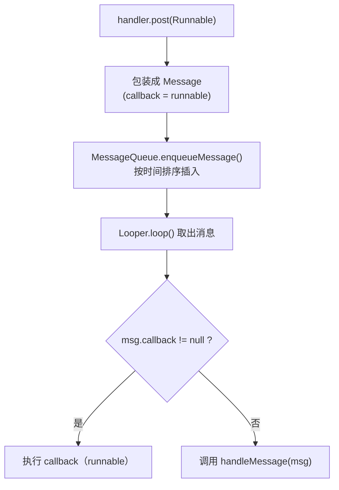

# Handler 消息机制：从 Looper 到 MessageQueue

> 系列：Framework-Source-Note · handler
> 难度：⭐⭐⭐ 进阶
> 更新：2026-08-18
> 前置知识：Binder 基础、线程基础

---

## 一、为什么需要 Handler

Android 有一个铁律：**UI 只能在主线程更新**。但网络请求、数据库读写、耗时计算必须在子线程做。这两件事之间有矛盾：

- 子线程完成了耗时任务，**怎么通知主线程更新 UI？**
- 主线程想让子线程做点事，**怎么把任务"派发"过去？**

Handler 就是解决这个「线程间通信」的核心工具。

## 二、四大核心角色

| 角色 | 作用 | 类比 |
|------|------|------|
| **Handler** | 发送和处理消息 | 快递员 |
| **Message** | 一条消息（带数据 + 目标） | 包裹 |
| **MessageQueue** | 消息队列（按时间排序） | 快递仓库 |
| **Looper** | 循环从队列取消息并分发 | 仓库管理员 |

**关键理解**：一个线程对应**一个 Looper** 和**一个 MessageQueue**，但可以有**多个 Handler**（都往同一个队列投递消息）。

```
线程
 ├── Looper（循环）
 ├── MessageQueue（队列）
 └── Handler A / Handler B / Handler C（投递 + 处理）
```

## 三、主线程的消息循环

主线程（ActivityThread）启动时，会执行类似这样的逻辑：

```java
// 主线程入口
Looper.prepareMainLooper();   // 1. 准备主线程 Looper
// ... 创建 Handler、初始化 UI ...
Looper.loop();                // 2. 进入消息循环（永不返回）
```

`Looper.loop()` 的核心是一个死循环：

```java
public static void loop() {
    final Looper me = myLooper();
    final MessageQueue queue = me.mQueue;
    for (;;) {                      // 无限循环
        Message msg = queue.next(); // 从队列取消息（可能阻塞）
        if (msg == null) return;
        msg.target.dispatchMessage(msg);  // 分发给目标 Handler
        msg.recycle();              // 回收消息
    }
}
```

**核心理解**：主线程之所以能一直响应点击、刷新 UI，就是因为它**一直在跑这个循环**。所谓「主线程卡顿」，就是这个循环被某个耗时任务阻塞了。

## 四、发送消息的完整流程

以 `handler.post(runnable)` 为例：

```java
// 1. post 一个 Runnable
handler.post {
    textView.text = "更新 UI"   // 在 Handler 所在线程执行
}
```

内部流程：



## 五、Handler 如何实现线程切换

这是 Handler 最巧妙的地方：

```java
// 在主线程创建 handler
val handler = Handler(Looper.getMainLooper())

// 在子线程中发送消息
Thread {
    // 耗时操作...
    val result = doNetworkRequest()
    // 切回主线程更新 UI
    handler.post {
        textView.text = result
    }
}.start()
```

**原理**：
- `handler` 关联的是**主线程的 Looper**。
- 无论在哪个线程调用 `handler.post()`，消息都进**主线程的 MessageQueue**。
- 主线程的 `Looper.loop()` 取出消息后，在**主线程**执行 `runnable`。

所以「切线程」的本质是：**消息投递到目标线程的队列，由目标线程的 Looper 去执行。**

## 六、Message 的复用机制

Message 频繁创建会引发 GC。所以 Android 用**对象池**复用：

```java
Message msg = Message.obtain();  // 优先从池中取，池空才 new
// ... 使用 ...
msg.recycle();                   // 用完归还池中
```

**最佳实践**：
- 用 `Message.obtain()` 而非 `new Message()`
- 用 `handler.obtainMessage()` 更佳（自动绑定 handler）
- 尽量用 `sendMessageDelayed` 的复用路径，避免手动 new

## 七、延迟消息与时间排序

`MessageQueue` 里的消息是**按触发时间排序**的单链表（不是先进先出）：

```java
handler.postDelayed({ ... }, 3000)  // 3 秒后执行
```

`enqueueMessage` 时，会根据 `msg.when` 找到正确位置插入。`next()` 取消息时，如果队首消息还没到时间，会**阻塞等待**，直到时间到或被新消息唤醒。

## 八、内存泄漏问题（经典面试题）

```java
class MyActivity : Activity() {
    // ❌ 匿名内部类持有 Activity 引用，延迟消息未执行完会导致 Activity 无法回收
    private val handler = Handler {
        textView.text = "更新"
        true
    }
}
```

**解决**：
1. 用**静态内部类 + 弱引用**。
2. 在 `onDestroy` 里 `handler.removeCallbacksAndMessages(null)`。

## 九、总结

| 要点 | 结论 |
|------|------|
| Handler 解决什么 | 线程间通信 + 切线程更新 UI |
| 四角色 | Handler / Message / MessageQueue / Looper |
| 一线程一 Looper | Looper 循环驱动消息分发 |
| 切线程本质 | 消息投到目标线程队列 |
| 性能 | Message 用对象池复用 |
| 陷阱 | 延迟消息导致内存泄漏 |

---

**下一篇预告**：《同步屏障与异步消息》

> 配套仓库：[Framework-Source-Note](https://github.com/jason5200/Framework-Source-Note)
