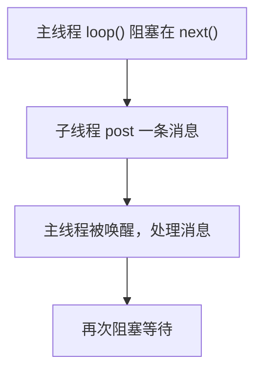
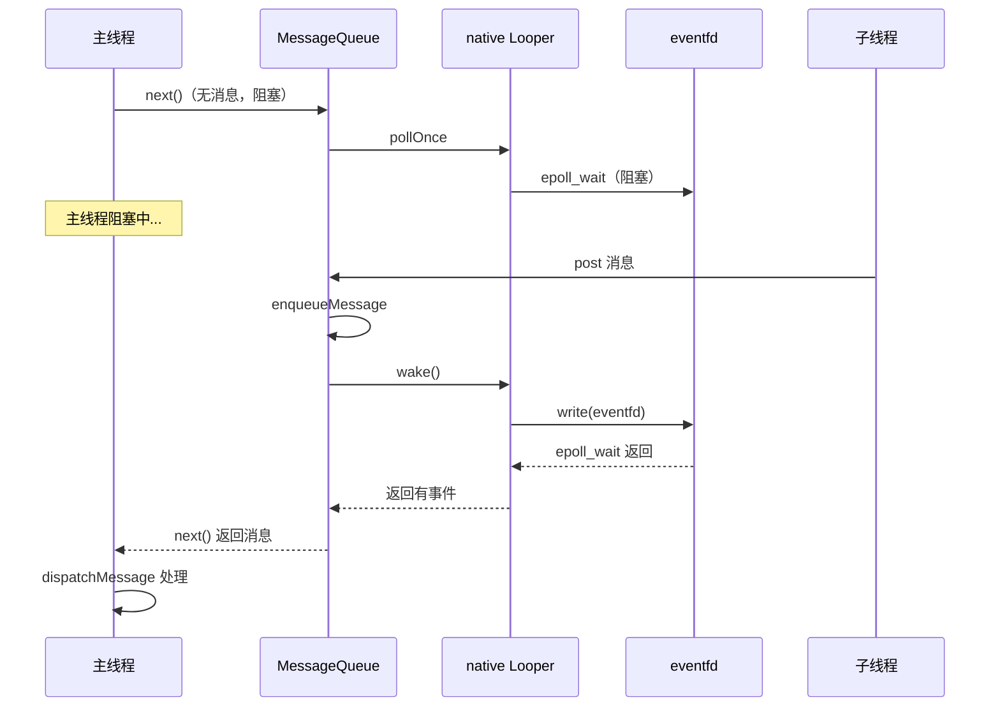

# Handler native 层唤醒机制

> 系列：Framework-Source-Note · handler
> 难度：⭐⭐⭐⭐⭐ 深入
> 更新：2026-08-27
> 前置知识：《Handler 消息机制》《Looper 的退出》

---

## 一、本文要回答的问题

Java 层的 Handler 大家都熟，但有一个关键问题被忽略了：

**主线程的 `Looper.loop()` 在 `queue.next()` 里阻塞等待消息时，是怎么被「唤醒」的？**



答案在 **native 层的 epoll + eventfd** 机制。

## 二、MessageQueue 的 native 层

MessageQueue 的构造会初始化 native 层：

```java
// MessageQueue.java
MessageQueue(boolean quitAllowed) {
    mQuitAllowed = quitAllowed;
    mPtr = nativeInit();  // 初始化 native 层
}
```

```cpp
// android_os_MessageQueue.cpp
static jlong android_os_MessageQueue_nativeInit(JNIEnv* env, jclass clazz) {
    NativeMessageQueue* nativeMessageQueue = new NativeMessageQueue();
    // 返回 native 对象指针
    return reinterpret_cast<jlong>(nativeMessageQueue);
}
```

## 三、NativeMessageQueue 的初始化

```cpp
NativeMessageQueue::NativeMessageQueue() {
    mLooper = Looper::getForThread();
    if (mLooper == NULL) {
        mLooper = new Looper(false);  // 创建 native Looper
        Looper::setForThread(mLooper);
    }
}
```

## 四、native Looper 的核心：epoll + eventfd

native Looper 内部用了 **epoll**（Linux 的 IO 多路复用）和一个 **eventfd**（事件通知）：

```cpp
Looper::Looper(bool allowNonCallbacks) {
    // 1. 创建 eventfd（用于唤醒）
    mWakeEventFd = eventfd(0, EFD_NONBLOCK | EFD_CLOEXEC);

    // 2. 创建 epoll 实例
    mEpollFd = epoll_create(EPOLL_SIZE_HINT);

    // 3. 把 eventfd 加入 epoll 监听
    struct epoll_event eventItem;
    eventItem.events = EPOLLIN;
    eventItem.data.fd = mWakeEventFd;
    epoll_ctl(mEpollFd, EPOLL_CTL_ADD, mWakeEventFd, &eventItem);
}
```

## 五、阻塞等待：epoll_wait

`queue.next()` 没有消息时，会进入 native 的阻塞等待：

```cpp
// NativeMessageQueue::pollOnce
int Looper::pollOnce(int timeoutMillis, ...) {
    // ...
    struct epoll_event eventItems[EPOLL_MAX_EVENTS];
    // ★ 阻塞在这里，等待事件
    int eventCount = epoll_wait(mEpollFd, eventItems, EPOLL_MAX_EVENTS, timeoutMillis);

    // 有事件了，处理
    for (int i = 0; i < eventCount; i++) {
        if (eventItems[i].data.fd == mWakeEventFd) {
            // 是唤醒事件，读取 eventfd 清空它
            awoken();
        }
    }
}
```

**关键理解**：主线程阻塞在 `epoll_wait`，等待 eventfd 被写入。

## 六、唤醒：write eventfd

当子线程 post 消息时，最终会调用 `wake()`：

```cpp
// NativeMessageQueue::wake
void NativeMessageQueue::wake() {
    mLooper->wake();
}

void Looper::wake() {
    uint64_t inc = 1;
    // ★ 往 eventfd 写入，唤醒 epoll_wait
    ssize_t nWrite = write(mWakeEventFd, &inc, sizeof(uint64_t));
}
```

**核心理解**：往 eventfd 写一个值，epoll_wait 立刻返回，主线程就被唤醒了。

## 七、完整的唤醒链路



## 八、为什么用 epoll + eventfd

| 技术 | 作用 |
|------|------|
| epoll | 高效等待多个事件（还能监听输入、传感器等 fd） |
| eventfd | 轻量的进程内事件通知 |

**关键理解**：epoll 不只用于消息唤醒，还能统一监听输入事件（触摸）、传感器事件等，这是 Android 消息循环的通用机制。

## 九、总结

| 要点 | 结论 |
|------|------|
| 阻塞 | epoll_wait 等待事件 |
| 唤醒 | write eventfd |
| 通用性 | epoll 统一监听多种事件 |
| Java↔native | MessageQueue ↔ NativeMessageQueue |

---

**下一篇预告**：《RecyclerView 缓存复用的完整源码》

> 配套仓库：[Framework-Source-Note](https://github.com/jason5200/Framework-Source-Note)
