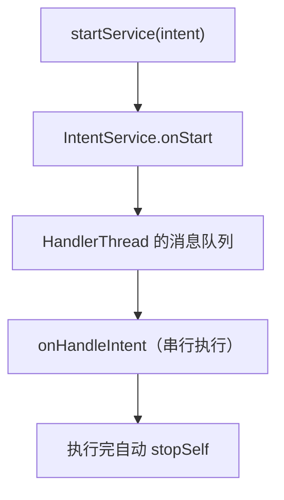

# HandlerThread 与 IntentService

> 系列：Framework-Source-Note · handler
> 难度：⭐⭐⭐ 进阶
> 更新：2026-08-27
> 前置知识：《Handler 消息机制》

---

## 一、问题：子线程里怎么用 Handler

Handler 需要 Looper，但普通子线程默认没有 Looper：

```java
// ❌ 普通子线程直接用 Handler 会崩溃
new Thread(() -> {
    Handler handler = new Handler();  // 报错：Looper not prepared
}).start();
```

**HandlerThread** 就是解决这个问题的：一个自带 Looper 的子线程。

## 二、HandlerThread 是什么

HandlerThread 是 Thread 的子类，它的 `run()` 里创建了 Looper：

```java
public class HandlerThread extends Thread {
    @Override
    public void run() {
        Looper.prepare();        // 1. 准备 Looper
        mLooper = Looper.myLooper();
        onLooperPrepared();      // 2. 回调
        Looper.loop();           // 3. 进入消息循环
    }
}
```

**核心理解**：HandlerThread = 一个「自带消息循环」的线程，可以用 Handler 给它投递任务。

## 三、HandlerThread 的用法

```java
// 1. 创建并启动
HandlerThread handlerThread = new HandlerThread("work-thread");
handlerThread.start();

// 2. 用它的 Looper 创建 Handler
Handler workHandler = new Handler(handlerThread.getLooper()) {
    @Override
    public void handleMessage(Message msg) {
        // 在 HandlerThread 线程执行
    }
};

// 3. 投递任务
workHandler.post(() -> {
    // 耗时任务在这里执行，不阻塞主线程
});
```

## 四、IntentService：HandlerThread 的经典应用

IntentService 是一个「串行处理 Intent」的 Service，内部就用了 HandlerThread：



```java
public class MyIntentService extends IntentService {
    public MyIntentService() {
        super("MyIntentService");
    }

    @Override
    protected void onHandleIntent(Intent intent) {
        // 在 HandlerThread 线程串行执行
        String data = intent.getStringExtra("data");
        doWork(data);
    }
}
```

**关键特性**：
1. **串行**：多个 Intent 排队，一个一个处理。
2. **异步**：不阻塞主线程。
3. **自动停止**：队列清空后自动 stopSelf。

## 五、HandlerThread 的生命周期陷阱

HandlerThread 的 Looper 一旦启动，就**一直在循环**，不会自动退出。不用了要手动退出：

```java
handlerThread.quit();        // 退出，不处理剩余消息
// 或
handlerThread.quitSafely();  // 退出，先处理完剩余消息
```

**典型内存泄漏**：Activity 里启动 HandlerThread，销毁时忘记 quit，线程一直存活。

## 六、一个完整示例

```java
public class MainActivity extends AppCompatActivity {
    private HandlerThread workerThread;
    private Handler workerHandler;

    @Override
    protected void onCreate(Bundle savedInstanceState) {
        super.onCreate(savedInstanceState);
        setContentView(R.layout.activity_main);

        workerThread = new HandlerThread("worker");
        workerThread.start();
        workerHandler = new Handler(workerThread.getLooper());

        workerHandler.post(() -> {
            // 后台耗时任务
        });
    }

    @Override
    protected void onDestroy() {
        super.onDestroy();
        workerThread.quitSafely();  // 记得退出！
    }
}
```

## 七、总结

| 要点 | 结论 |
|------|------|
| HandlerThread | 自带 Looper 的子线程 |
| 用途 | 后台串行任务 |
| IntentService | 基于 HandlerThread 的 Service |
| 注意 | 用完后要 quit，否则泄漏 |

---

**下一篇预告**：《Looper 的退出与消息循环的边界》

> 配套仓库：[Framework-Source-Note](https://github.com/jason5200/Framework-Source-Note)
