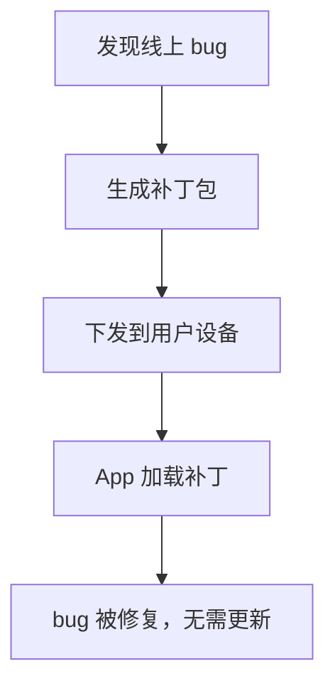
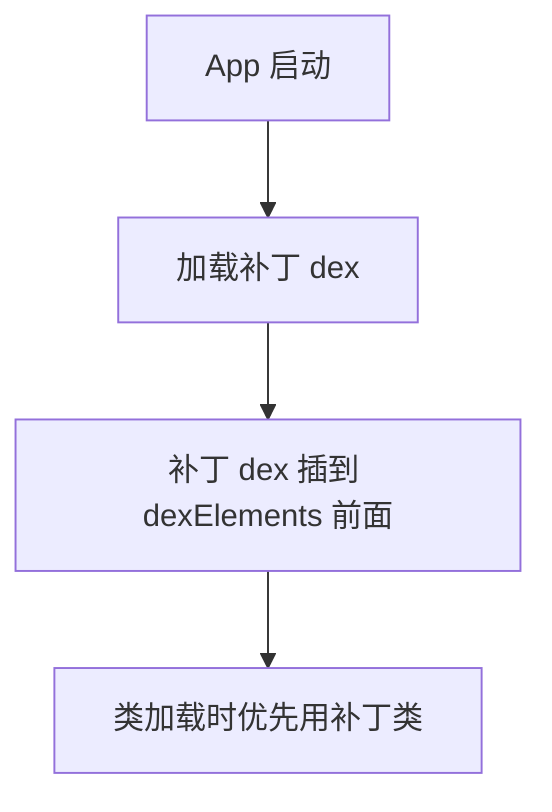
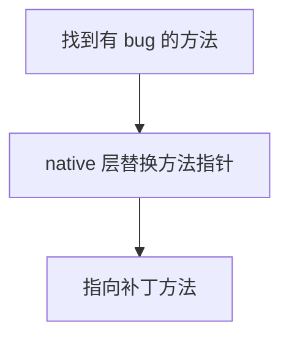

# 热修复原理深入：Tinker 与 Sophix

> 系列：Framework-Source-Note · classloader
> 难度：⭐⭐⭐⭐⭐ 深入
> 更新：2026-08-27
> 前置知识：《类加载机制：ClassLoader 与双亲委派》

---

## 一、热修复要解决什么问题

线上 App 出了 bug，如果走「发新版 → 用户更新」，周期太长。热修复让用户**不更新 App 就能修复 bug**：



## 二、热修复的三大技术流派

| 流派 | 代表框架 | 原理 |
|------|----------|------|
| 类加载 | Tinker | 补丁 dex 插到加载器前面 |
| 底层替换 | AndFix | native 层替换方法指针 |
| 混合 | Sophix | 类加载 + 底层替换 |

## 三、Tinker：类加载方案

Tinker 的核心原理基于上一篇文章讲的类加载机制：**把补丁 dex 插到 ClassLoader 的 dexElements 数组前面**。



### 关键实现

```java
// 核心：反射往 dexElements 数组前面插入补丁
public static void installDex(ClassLoader loader, File patchDex) {
    // 1. 拿到 BaseDexClassLoader 的 pathList
    Object pathList = getField(loader, "pathList");

    // 2. 拿到 dexElements 数组
    Object[] oldElements = (Object[]) getField(pathList, "dexElements");

    // 3. 创建补丁 dex 的 Element
    Object[] patchElements = makePatchElements(patchDex);

    // 4. 合并：补丁在前，旧的在后
    Object[] newElements = new Object[oldElements.length + patchElements.length];
    System.arraycopy(patchElements, 0, newElements, 0, patchElements.length);
    System.arraycopy(oldElements, 0, newElements, patchElements.length, oldElements.length);

    // 5. 写回
    setField(pathList, "dexElements", newElements);
}
```

**核心理解**：Android 加载类时按 dexElements 顺序查找，补丁 dex 在前，补丁类就被优先加载，覆盖有 bug 的旧类。

## 四、AndFix：底层替换方案

AndFix 不走类加载，而是在 **native 层**直接替换方法指针：



**优点**：即时生效，无需重启。
**缺点**：兼容性差，依赖底层实现，已基本废弃。

## 五、Sophix：混合方案

Sophix（阿里）结合两种方案：

| 修复类型 | 方案 |
|----------|------|
| 代码修复 | 类加载（类加载方案） |
| 资源修复 | 资源替换 |
| SO 修复 | 底层替换 |

**优势**：即时生效 + 兼容性好，是工业级的完整方案。

## 六、热修复的限制

| 限制 | 说明 |
|------|------|
| 不能新增字段/方法 | 类结构不能变 |
| 不能修改资源 ID | 资源替换有限制 |
| 不能修复 native 复杂逻辑 | 底层替换有局限 |
| 加固 App 可能冲突 | 加固会改类结构 |

## 七、热修复 vs 冷启动

| 维度 | 热修复 | 正常发版 |
|------|--------|----------|
| 生效时间 | 即时/重启 | 用户更新 |
| 修复范围 | 有局限 | 无限制 |
| 适用场景 | 紧急 bug | 功能迭代 |

## 八、总结

| 要点 | 结论 |
|------|------|
| 热修复 | 不更新 App 修复 bug |
| Tinker | 补丁 dex 插到加载器前面 |
| AndFix | native 替换方法指针 |
| Sophix | 混合方案 |
| 限制 | 不能改类结构 |

---

**本系列完**。Framework 方向 30 篇全部完成，形成从 Binder 到热修复的完整体系。

> 配套仓库：[Framework-Source-Note](https://github.com/jason5200/Framework-Source-Note)
