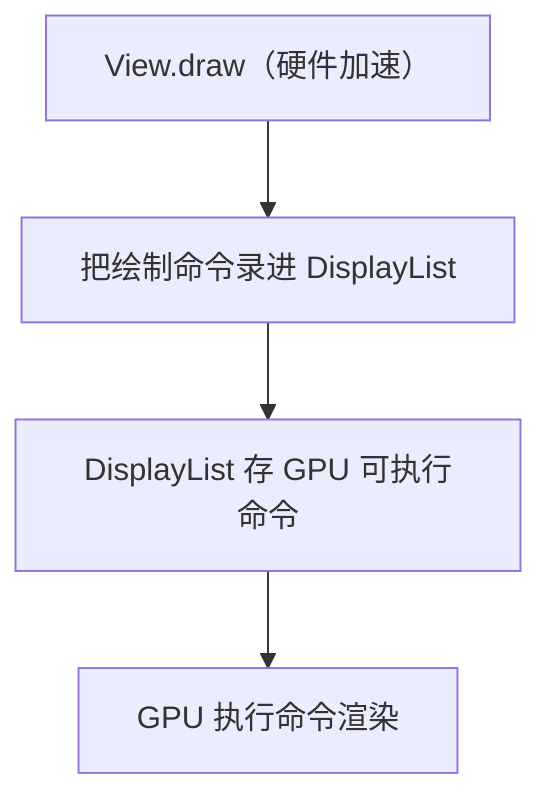
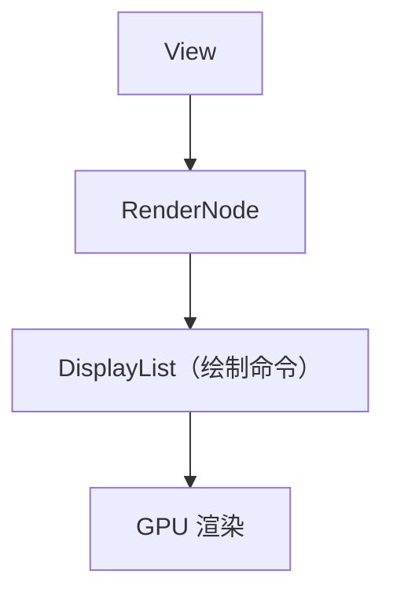
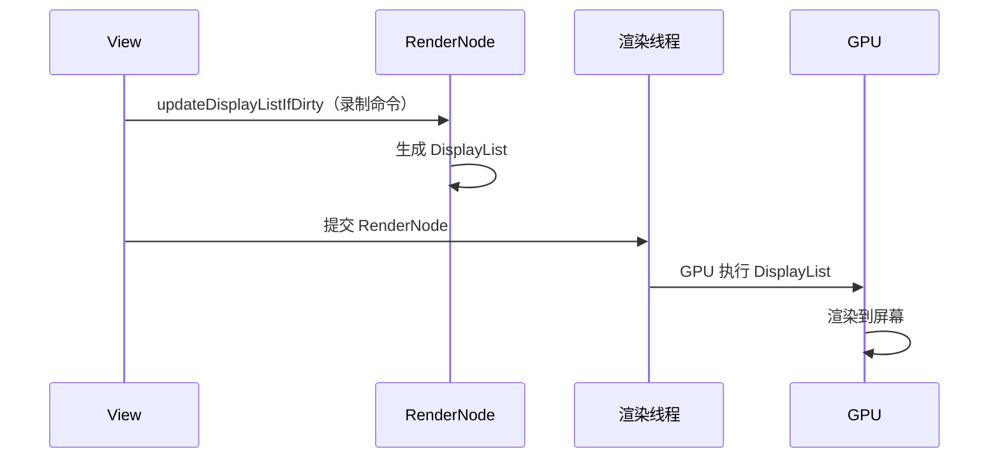

# View 硬件加速的完整源码

> 系列：Framework-Source-Note · view
> 难度：⭐⭐⭐⭐⭐ 深入
> 更新：2026-08-27
> 前置知识：《View 绘制流程》《ViewRootImpl 绘制流程的完整源码》

---

## 一、本文目标

前面讲的绘制都是「软件绘制」（直接调 Canvas.draw）。这一篇深入到**硬件加速**：GPU 渲染到底怎么工作，DisplayList 是什么。

## 二、硬件加速 vs 软件绘制

| 维度 | 软件绘制 | 硬件加速 |
|------|----------|----------|
| 执行者 | CPU | GPU |
| 记录方式 | 直接画 | DisplayList 记录命令 |
| 性能 | 慢 | 快 |

## 三、硬件加速的开关

```java
// View.java
public void draw(Canvas canvas) {
    if (mAttachInfo.mThreadedRenderer != null
            && mAttachInfo.mThreadedRenderer.isEnabled()) {
        // 硬件加速路径
        mAttachInfo.mThreadedRenderer.draw(this, mAttachInfo, ...);
    } else {
        // 软件绘制路径
        super.draw(canvas);
    }
}
```

**关键理解**：硬件加速时，`draw` 不直接画，而是交给 `ThreadedRenderer`（渲染线程）。

## 四、ThreadedRenderer 是什么

ThreadedRenderer 是硬件加速的核心，负责管理 DisplayList 和 GPU 渲染：

```java
// ThreadedRenderer.java
public class ThreadedRenderer extends HardwareRenderer {
    // 每个 View 有一个 DisplayList（记录绘制命令）
    // 渲染线程负责把 DisplayList 提交给 GPU
}
```

## 五、DisplayList 是什么

DisplayList 是「绘制命令的录制」：



**关键理解**：DisplayList 把「怎么画」录下来，交给 GPU 执行。CPU 只负责录制，GPU 负责画。

## 六、View 的 updateDisplayListIfDirty

每个 View 维护自己的 DisplayList，脏了才重新录制：

```java
// View.java
public RenderNode updateDisplayListIfDirty() {
    RenderNode renderNode = mRenderNode;
    if (!mAttachInfo.mThreadedRenderer.isRequested()) {
        return null;
    }

    // 脏了（内容变了）才重新录制
    if ((mPrivateFlags & PFLAG_DRAWING_CACHE_VALID) == 0
            || !mAttachInfo.mThreadedRenderer.isRequested()) {
        // 开始录制
        DisplayListCanvas canvas = renderNode.start(width, height);
        // 调用 draw，把命令录进 canvas
        draw(canvas);
        // 结束录制
        renderNode.end(canvas);
    }
    return renderNode;
}
```

**关键理解**：`updateDisplayListIfDirty` 只在 View 脏时重新录制 DisplayList，不脏就直接复用。这就是为什么「局部重绘」能高效。

## 七、RenderNode 与 DisplayList 的关系

RenderNode 是 DisplayList 的载体：



## 八、硬件加速的完整流程



## 九、硬件加速的优缺点

| 优点 | 缺点 |
|------|------|
| 快（GPU 并行） | 内存占用增加 |
| 动画流畅 | 部分 API 不支持 |
| 省电（GPU 高效） | 调试困难 |

## 十、总结

| 要点 | 结论 |
|------|------|
| 硬件加速 | GPU 渲染 |
| DisplayList | 绘制命令录制 |
| RenderNode | DisplayList 载体 |
| 脏检查 | 不脏不复录 |

---

**下一篇预告**：《Binder 驱动 binder_transaction 的完整源码》

> 配套仓库：[Framework-Source-Note](https://github.com/jason5200/Framework-Source-Note)
