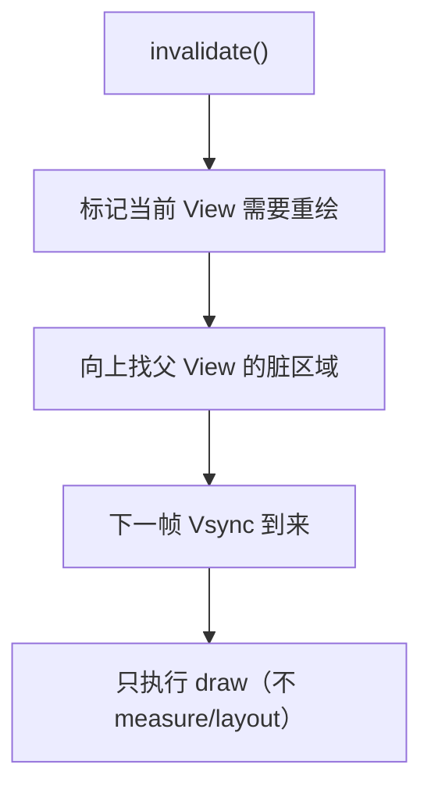
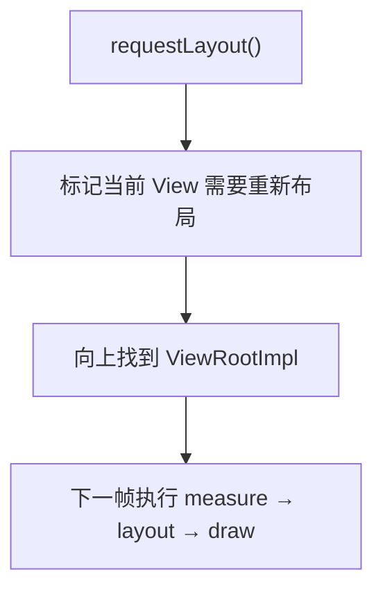

# View 的 invalidate 与 requestLayout

> 系列：Framework-Source-Note · view
> 难度：⭐⭐⭐ 进阶
> 更新：2026-08-27
> 前置知识：《View 绘制流程》

---

## 一、两个被混淆的方法

View 有两个「刷新」方法，很多人分不清：

| 方法 | 触发流程 | 用途 |
|------|----------|------|
| `invalidate()` | 只重绘（draw） | 内容变了 |
| `requestLayout()` | 重新测量+布局+绘制 | 尺寸/位置变了 |

**一句话**：改「样子」用 invalidate，改「大小位置」用 requestLayout。

## 二、invalidate 的流程



```java
public void invalidate() {
    invalidate(true);
}

// 底层：标记重绘
void invalidate(boolean invalidateCache) {
    // ...
    if (mParent != null) {
        mParent.invalidateChild(this, null);  // 向上传播
    }
}
```

**关键理解**：invalidate 只触发 draw，measure 和 layout 不会重新执行，所以快。

## 三、requestLayout 的流程



```java
public void requestLayout() {
    if (mParent != null && !mParent.isLayoutRequested()) {
        mParent.requestLayout();  // 向上传播到根
    }
}
```

**关键理解**：requestLayout 会触发完整的 measure → layout → draw 三阶段，比 invalidate 重。

## 四、什么时候用哪个

| 场景 | 方法 |
|------|------|
| 文字内容变了 | invalidate |
| 颜色变了 | invalidate |
| 背景图变了 | invalidate |
| 尺寸变了（宽高） | requestLayout |
| 位置变了 | requestLayout |
| 子 View 增删 | requestLayout |

## 五、两者配合使用

有时需要同时改内容和尺寸：

```java
// 自定义 View 里
myView.setText("新内容");   // 触发 invalidate
myView.setSize(200, 200);  // 触发 requestLayout
```

**注意**：requestLayout 本身会包含 draw，所以如果改了尺寸，不需要再手动 invalidate。

## 六、postInvalidate

invalidate 必须在主线程调用，子线程刷新用 postInvalidate：

```java
// 子线程里
new Thread(() -> {
    // 耗时操作
    myView.postInvalidate();  // 内部切到主线程执行 invalidate
}).start();
```

## 七、常见坑

| 坑 | 说明 |
|----|------|
| 子线程调 invalidate | 可能不生效，用 postInvalidate |
| 频繁 requestLayout | 性能差，尽量用 invalidate |
| 改了尺寸只调 invalidate | 尺寸不更新，布局错乱 |
| 误以为 invalidate 会重新测量 | 它只重绘 |

## 八、总结

| 要点 | 结论 |
|------|------|
| invalidate | 只重绘，快 |
| requestLayout | 重新测量+布局+绘制，重 |
| 选择原则 | 内容变 invalidate，尺寸变 requestLayout |
| 子线程 | postInvalidate |

---

**下一篇预告**：《滑动冲突的完整解决方案》

> 配套仓库：[Framework-Source-Note](https://github.com/jason5200/Framework-Source-Note)
