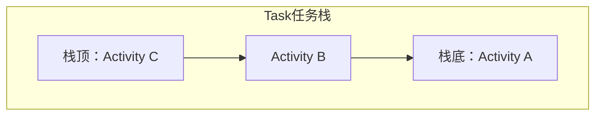
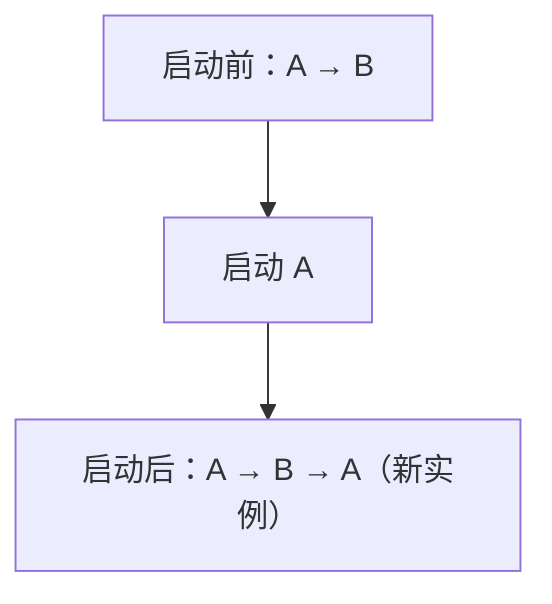
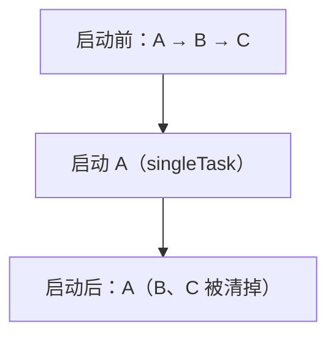

# Activity 启动模式与任务栈

> 系列：Framework-Source-Note · component
> 难度：⭐⭐⭐ 进阶
> 更新：2026-08-27
> 前置知识：《AMS 启动流程解析》

---

## 一、任务栈（Task）是什么

Android 用「任务栈」管理 Activity 的返回逻辑。一个 Task 就是一个栈，先进后出：



- 按返回键：弹出栈顶，回到上一个。
- 启动新 Activity：压入栈顶。

**核心理解**：任务栈决定了「按返回键会回到哪」。

## 二、四种启动模式

| launchMode | 行为 | 典型场景 |
|-----------|------|----------|
| `standard` | 每次都新建实例 | 默认，普通页面 |
| `singleTop` | 栈顶复用 | 避免重复打开同一页 |
| `singleTask` | 栈内复用，清掉上方 | 主页面 |
| `singleInstance` | 独立任务栈 | 电话、闹钟 |

### 1. standard（默认）

每次启动都创建新实例，即使栈里已有：



### 2. singleTop

如果目标 Activity 在**栈顶**，则复用（不新建）；不在栈顶则新建：

```java
// 场景：避免连点按钮打开多个相同页面
<activity android:launchMode="singleTop" />
```

### 3. singleTask

栈内已存在该 Activity，则**把它上面的都清掉**，让它回到栈顶：



### 4. singleInstance

该 Activity 独占一个独立任务栈：

```java
// 场景：来电界面，独立于任何应用
<activity android:launchMode="singleInstance" />
```

## 三、Intent Flags 也能控制

除了 launchMode，Intent 的 flag 也能影响任务栈：

| flag | 作用 |
|------|------|
| `FLAG_ACTIVITY_NEW_TASK` | 在新任务栈启动 |
| `FLAG_ACTIVITY_CLEAR_TOP` | 清掉栈顶以上的 |
| `FLAG_ACTIVITY_SINGLE_TOP` | 等价 singleTop |
| `FLAG_ACTIVITY_CLEAR_TASK` | 清空整个任务栈 |

```java
Intent intent = new Intent(this, TargetActivity.class);
intent.setFlags(Intent.FLAG_ACTIVITY_CLEAR_TOP | Intent.FLAG_ACTIVITY_NEW_TASK);
startActivity(intent);
```

## 四、onNewIntent 回调

当 Activity 被复用时（singleTop/singleTask），不会走 onCreate，而是走 `onNewIntent`：

```java
@Override
protected void onNewIntent(Intent intent) {
    super.onNewIntent(intent);
    // 复用时的数据更新在这里处理
    setIntent(intent);
    handleNewData(intent);
}
```

**关键理解**：复用场景下，数据更新逻辑要放在 onNewIntent，而不是 onCreate（因为 onCreate 不会再走）。

## 五、任务栈的实际场景

### 场景 1：点击通知回到已有页面

```java
Intent intent = new Intent(this, MainActivity.class);
intent.setFlags(Intent.FLAG_ACTIVITY_CLEAR_TOP | Intent.FLAG_ACTIVITY_SINGLE_TOP);
// 如果 MainActivity 已在栈里，清掉上方的，复用它
```

### 场景 2：退出登录

```java
// 清空所有 Activity，回到登录页
Intent intent = new Intent(this, LoginActivity.class);
intent.setFlags(Intent.FLAG_ACTIVITY_CLEAR_TASK | Intent.FLAG_ACTIVITY_NEW_TASK);
startActivity(intent);
```

## 六、常见坑

| 坑 | 说明 |
|----|------|
| 忘记 onNewIntent | 复用时不更新数据 |
| launchMode 和 flag 冲突 | flag 优先级更高 |
| singleInstance 滥用 | 独立栈导致返回逻辑混乱 |
| 任务栈混乱 | 理解每个 flag 的副作用 |

## 七、总结

| 要点 | 结论 |
|------|------|
| 任务栈 | 管理 Activity 返回逻辑 |
| 四种模式 | standard/singleTop/singleTask/singleInstance |
| flag 控制 | NEW_TASK/CLEAR_TOP 等 |
| 复用回调 | onNewIntent |

---

**下一篇预告**：《Activity 生命周期与异常恢复》

> 配套仓库：[Framework-Source-Note](https://github.com/jason5200/Framework-Source-Note)
