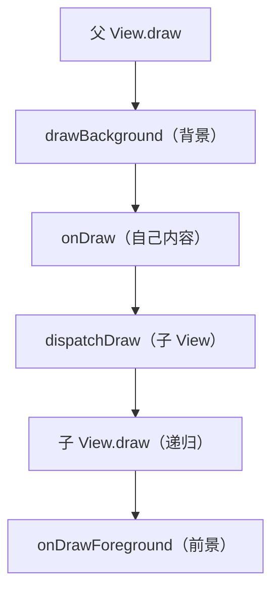

# View layout 与 draw 的源码全链路

> 系列：Framework-Source-Note · view
> 难度：⭐⭐⭐⭐⭐ 深入
> 更新：2026-08-27
> 前置知识：《View measure 的源码全链路》

---

## 一、本文目标

上一篇深入了 measure，这一篇继续深入 **layout 和 draw** 的源码，把绘制的后两步讲透。

## 二、layout：确定位置

### 1. View.layout 的源码

```java
// View.java
public void layout(int l, int t, int r, int b) {
    int oldL = mLeft;
    int oldT = mTop;
    int oldR = mRight;
    int oldB = mBottom;

    // 1. 设置自己的四个坐标
    boolean changed = setFrame(l, t, r, b);

    if (changed) {
        // 2. 调用 onLayout（子类确定子 View 位置）
        onLayout(changed, l, t, r, b);
    }
}
```

### 2. setFrame 源码

```java
protected boolean setFrame(int left, int top, int right, int bottom) {
    boolean changed = false;
    if (mLeft != left || mRight != right || mTop != top || mBottom != bottom) {
        changed = true;
        mLeft = left;
        mTop = top;
        mRight = right;
        mBottom = bottom;
        // 位置变了，标记需要重绘
        invalidate();
    }
    return changed;
}
```

**关键理解**：`setFrame` 判断位置是否变化，变了才 `invalidate` 重绘。

### 3. ViewGroup 的 onLayout

View 的 onLayout 是空的，ViewGroup 才需要实现：

```java
// 自定义 ViewGroup 的 onLayout
@Override
protected void onLayout(boolean changed, int l, int t, int r, int b) {
    int childLeft = 0;
    for (int i = 0; i < getChildCount(); i++) {
        View child = getChildAt(i);
        int w = child.getMeasuredWidth();
        int h = child.getMeasuredHeight();
        // 摆放子 View
        child.layout(childLeft, 0, childLeft + w, h);
        childLeft += w;
    }
}
```

## 三、draw：绘制内容

### 1. View.draw 的源码

```java
public void draw(Canvas canvas) {
    // 1. 绘制背景
    drawBackground(canvas);

    // 2. 保存画布（可选）
    if (!dirtyOpaque) onDraw(canvas);

    // 3. 绘制子 View
    dispatchDraw(canvas);

    // 4. 绘制前景/滚动条
    onDrawForeground(canvas);
}
```

### 2. onDraw 的默认实现

```java
protected void onDraw(Canvas canvas) {
    // 默认空实现，子类重写
}
```

### 3. dispatchDraw 的默认实现

```java
protected void dispatchDraw(Canvas canvas) {
    // View 默认空实现；ViewGroup 重写，遍历子 View 绘制
}
```

## 四、ViewGroup 的 dispatchDraw

```java
// ViewGroup.java
protected void dispatchDraw(Canvas canvas) {
    // 遍历所有子 View
    for (int i = 0; i < mChildrenCount; i++) {
        View child = mChildren[i];
        if (child.getVisibility() != View.GONE) {
            // 绘制子 View
            drawChild(canvas, child, drawingTime);
        }
    }
}

protected boolean drawChild(Canvas canvas, View child, long drawingTime) {
    return child.draw(canvas, this, drawingTime);
}
```

**核心理解**：ViewGroup 的 `dispatchDraw` 递归调用每个子 View 的 `draw`，形成完整的绘制树。

## 五、绘制顺序：先画自己再画子



**关键点**：先画父的背景和内容，再画子 View（子覆盖父），最后画前景。这个顺序决定了「谁盖住谁」。

## 六、硬件加速下的 draw

开启硬件加速时，draw 走的是 `ThreadedRenderer`：

```java
public void draw(Canvas canvas) {
    if (mAttachInfo.mThreadedRenderer != null && mAttachInfo.mThreadedRenderer.isEnabled()) {
        // 硬件加速：用 DisplayList 记录绘制命令
        mAttachInfo.mThreadedRenderer.draw(this, ...);
    } else {
        // 软件绘制：直接 draw
        super.draw(canvas);
    }
}
```

**核心理解**：硬件加速把绘制命令记录成 DisplayList，由 GPU 渲染，更快。

## 七、layout 与 draw 的触发条件

| 操作 | 触发 layout | 触发 draw |
|------|------------|-----------|
| requestLayout | ✅ | ✅ |
| invalidate | ❌ | ✅ |
| setFrame 位置变 | ✅ | ✅ |

## 八、总结

| 要点 | 结论 |
|------|------|
| layout | setFrame + onLayout |
| draw | 背景→onDraw→dispatchDraw→前景 |
| 递归 | ViewGroup dispatchDraw 遍历子 View |
| 顺序 | 父先子后，子覆盖父 |

---

**下一篇预告**：《Binder 线程池的完整源码》

> 配套仓库：[Framework-Source-Note](https://github.com/jason5200/Framework-Source-Note)
