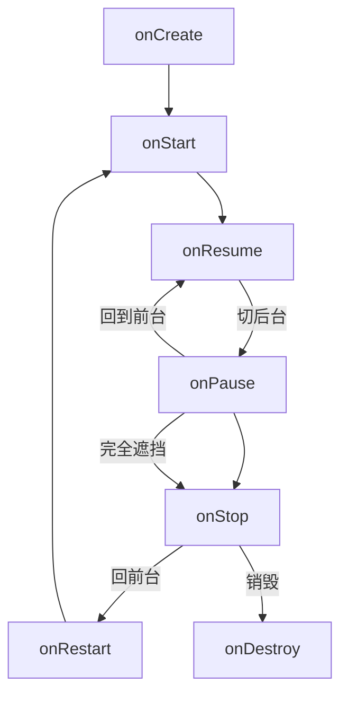
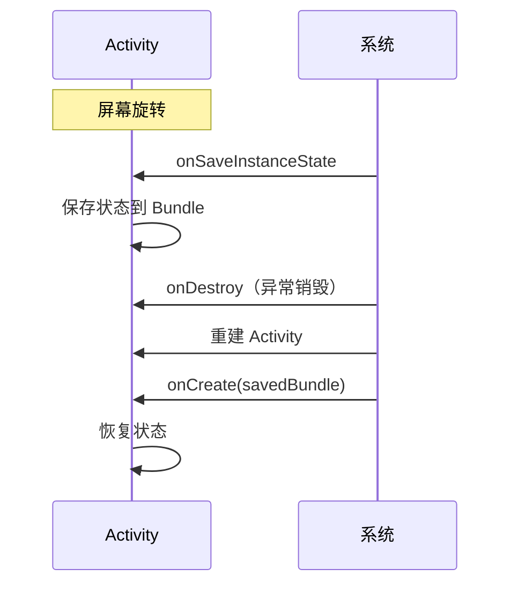

# Activity 生命周期与异常恢复

> 系列：Framework-Source-Note · component
> 难度：⭐⭐⭐⭐ 深入
> 更新：2026-08-27
> 前置知识：《AMS 启动流程解析》《Activity 启动模式》

---

## 一、完整的生命周期

Activity 的生命周期是面试和实战的高频考点，完整流程如下：



## 二、三个阶段

| 阶段 | 回调 | 状态 |
|------|------|------|
| 前台运行 | onResume | 可见可交互 |
| 部分可见 | onPause | 可见但失去焦点 |
| 完全不可见 | onStop | 完全遮挡 |
| 已销毁 | onDestroy | 释放资源 |

## 三、onSaveInstanceState 与异常恢复

这是最容易被忽略的机制。当 Activity 被系统**异常销毁**（如内存不足、屏幕旋转）时，系统会调用 `onSaveInstanceState` 保存状态，重建时恢复。



```java
@Override
protected void onSaveInstanceState(Bundle outState) {
    super.onSaveInstanceState(outState);
    outState.putString("data", "要保存的数据");
    outState.putInt("count", 100);
}

@Override
protected void onCreate(Bundle savedInstanceState) {
    super.onCreate(savedInstanceState);
    if (savedInstanceState != null) {
        String data = savedInstanceState.getString("data");
        int count = savedInstanceState.getInt("count");
        // 恢复状态
    }
}
```

**关键理解**：只有「异常销毁」才会触发 onSaveInstanceState，「正常销毁」（用户按返回键）不会。

## 四、ViewModel 与配置变更

现代开发中，用 ViewModel 处理配置变更（如旋转）更优雅：

```kotlin
class MyViewModel : ViewModel() {
    val data = MutableLiveData<String>()
}

class MyActivity : AppCompatActivity() {
    private val viewModel by viewModels<MyViewModel>()

    override fun onCreate(savedInstanceState: Bundle?) {
        // ViewModel 在旋转后仍然存活，数据不丢失
        viewModel.data.observe(this) { ... }
    }
}
```

**原理**：ViewModel 的生命周期比 Activity 长，旋转导致的 Activity 销毁不影响 ViewModel。

## 五、常见场景的生命周期流转

| 场景 | 触发 |
|------|------|
| 打开新 Activity | onPause → onStop |
| 返回 | onRestart → onStart → onResume |
| 按 Home 键 | onPause → onStop |
| 旋转屏幕 | onPause → onStop → onDestroy → onCreate（重建） |
| 弹窗遮挡 | onPause（不 onStop） |

## 六、生命周期的最佳实践

| 原则 | 说明 |
|------|------|
| onCreate 只做初始化 | 别做耗时操作 |
| onStart/onStop 配对外观 | 控制可见性相关 |
| onResume/onPause 配对交互 | 控制前台交互 |
| onDestroy 释放资源 | 避免内存泄漏 |

## 七、常见坑

| 坑 | 说明 |
|----|------|
| 在 onCreate 恢复状态后忘了初始化 | savedInstanceState 为 null 的首次启动 |
| 耗时操作放 onCreate | 拖慢启动 |
| 忘记在 onPause 取消注册 | 内存泄漏 |
| 混淆 onPause 和 onStop | 部分遮挡时 onPause 不 onStop |

## 八、总结

| 要点 | 结论 |
|------|------|
| 生命周期 | onCreate→onStart→onResume→onPause→onStop→onDestroy |
| 异常恢复 | onSaveInstanceState + Bundle |
| ViewModel | 配置变更时保持数据 |
| 实践 | 资源释放、可见性配对 |

---

**下一篇预告**：《Service 的启动与绑定机制》

> 配套仓库：[Framework-Source-Note](https://github.com/jason5200/Framework-Source-Note)
