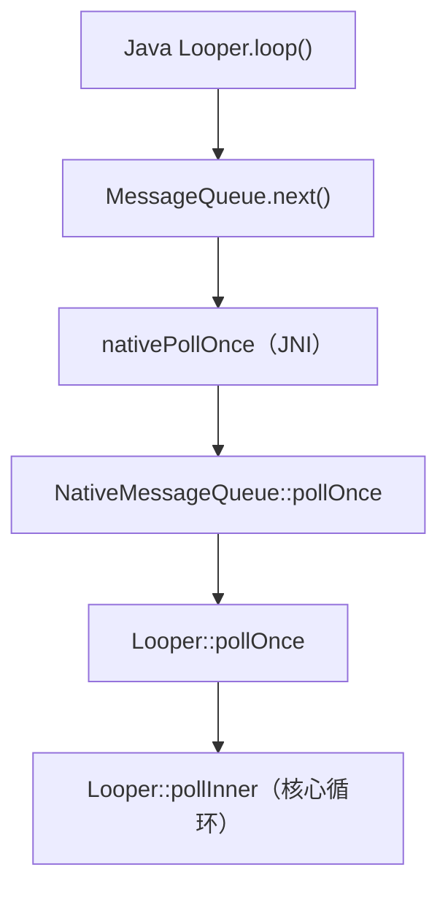
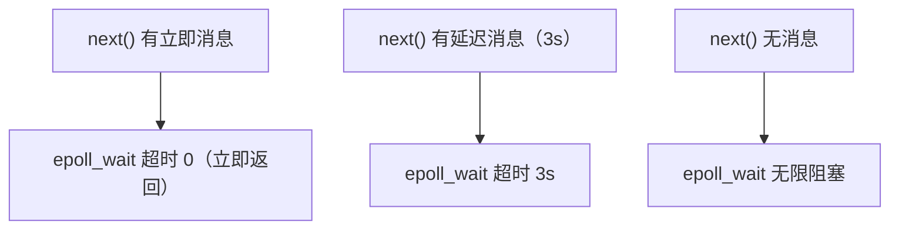
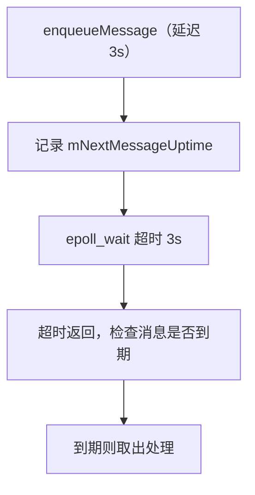

# Looper 消息循环的 C++ 源码

> 系列：Framework-Source-Note · handler
> 难度：⭐⭐⭐⭐⭐ 深入
> 更新：2026-08-27
> 前置知识：《Handler native 层唤醒机制》

---

## 一、本文目标

上一篇《Handler native 层唤醒机制》讲了 epoll + eventfd 的唤醒，这一篇继续深入，看 native Looper 的**完整消息循环**——`pollOnce` 和 `pollInner` 到底怎么处理消息。

## 二、Java 层到 native 层的调用链

Java 层的 `Looper.loop()` 最终调用 native 的 `pollOnce`：



## 三、pollOnce 的源码

```cpp
// Looper.cpp
int Looper::pollOnce(int timeoutMillis, int* outFd, int* outEvents, void** outData) {
    int result = 0;
    for (;;) {
        // 处理响应事件
        while (mResponseIndex < mResponses.size()) {
            const Response& response = mResponses.itemAt(mResponseIndex++);
            int ident = response.request.ident;
            if (ident >= 0) {
                // 处理事件
                result = ident;
                break;
            }
        }

        if (result != 0) break;

        // ★ 核心：pollInner
        result = pollInner(timeoutMillis);
    }
    return result;
}
```

## 四、pollInner 的核心逻辑

```cpp
int Looper::pollInner(int timeoutMillis) {
    // 1. 计算超时时间
    if (timeoutMillis != 0 && mNextMessageUptime != 0) {
        nsecs_t now = systemTime(SYSTEM_TIME_MONOTONIC);
        int messageTimeoutMillis = toMillisecondTimeoutDelay(now, mNextMessageUptime);
        timeoutMillis = messageTimeoutMillis;
    }

    // 2. ★ 阻塞等待事件（epoll_wait）
    struct epoll_event eventItems[EPOLL_MAX_EVENTS];
    int eventCount = epoll_wait(mEpollFd, eventItems, EPOLL_MAX_EVENTS, timeoutMillis);

    // 3. 处理事件
    for (int i = 0; i < eventCount; i++) {
        int fd = eventItems[i].data.fd;
        if (fd == mWakeEventFd) {
            // 唤醒事件，读取 eventfd
            awoken();
        } else {
            // 其他事件（输入、传感器等），加入响应队列
            pushResponse(eventItems[i].data.fd, ...);
        }
    }

    return result;
}
```

**关键理解**：`pollInner` 的 `epoll_wait` 是阻塞的核心——超时时间由「下一条消息的延迟时间」决定。

## 五、超时时间如何决定

这是关键细节：`epoll_wait` 的超时 = 下一条消息的延迟时间。

```cpp
int messageTimeoutMillis = toMillisecondTimeoutDelay(now, mNextMessageUptime);
timeoutMillis = messageTimeoutMillis;
```

**场景**：
- 有延迟消息（3 秒后）→ epoll_wait 阻塞最多 3 秒
- 无消息 → epoll_wait 阻塞无限久（-1）
- 有立即消息 → epoll_wait 立即返回（0）



## 六、awoken 的作用

```cpp
void Looper::awoken() {
    uint64_t counter;
    // 读取 eventfd 的值，清空它
    ssize_t nRead = read(mWakeEventFd, &counter, sizeof(uint64_t));
}
```

**关键理解**：`awoken` 读取 eventfd，清空它的值。这样下次 `epoll_wait` 才能再次被唤醒（eventfd 是「边沿触发」语义）。

## 七、延迟消息的精确计时

延迟消息靠「超时」实现，而不是「定时器」：



**核心理解**：延迟消息不是「定时回调」，而是「epoll 阻塞到时间，再检查是否到期」。

## 八、sendMessage 如何触发 wake

Java 层 `enqueueMessage` 后，native 层会 `wake()`：

```cpp
// NativeMessageQueue::wake
void NativeMessageQueue::wake() {
    mLooper->wake();
}

void Looper::wake() {
    uint64_t inc = 1;
    write(mWakeEventFd, &inc, sizeof(uint64_t));  // 唤醒 epoll_wait
}
```

**关键理解**：`wake` 写 eventfd，让阻塞的 `epoll_wait` 立即返回，主线程醒来处理新消息。

## 九、完整总结

| 要点 | 结论 |
|------|------|
| pollOnce | 循环入口 |
| pollInner | epoll_wait 阻塞 |
| 超时 | = 下一条消息延迟 |
| wake | 写 eventfd 唤醒 |
| 延迟消息 | epoll 超时实现 |

---

**下一篇预告**：《Llama 注意力实现的源码解读》

> 配套仓库：[Framework-Source-Note](https://github.com/jason5200/Framework-Source-Note)
