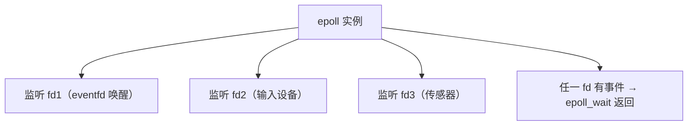
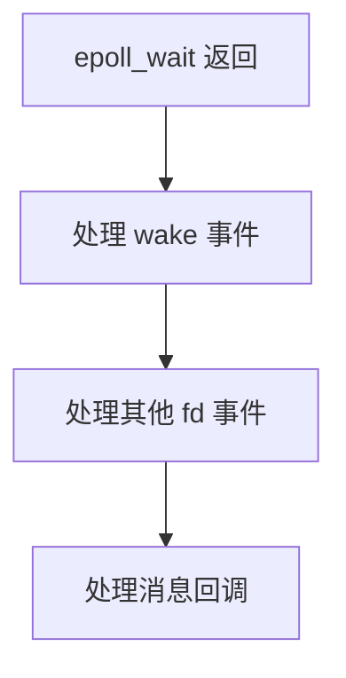
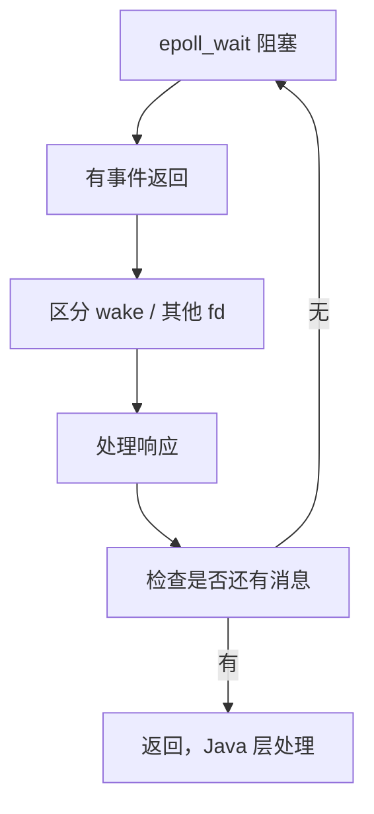

# Looper epoll 事件循环的完整源码

> 系列：Framework-Source-Note · handler
> 难度：⭐⭐⭐⭐⭐ 深入
> 更新：2026-08-27
> 前置知识：《Handler native 层唤醒机制》《Looper 消息循环的 C++ 源码》

---

## 一、本文目标

前两篇讲了 epoll + eventfd 的唤醒、pollInner 的循环。这一篇深入**事件循环的完整机制**：epoll 到底怎么管理多个 fd、事件怎么分发的完整源码。

## 二、epoll 是什么

epoll 是 Linux 的高性能 IO 多路复用机制，能同时监听多个文件描述符（fd）：



## 三、Looper 的 epoll 初始化

```cpp
// Looper.cpp 构造函数
Looper::Looper(bool allowNonCallbacks) {
    // 1. 创建 eventfd（唤醒用）
    mWakeEventFd = eventfd(0, EFD_NONBLOCK | EFD_CLOEXEC);

    // 2. 创建 epoll 实例
    mEpollFd = epoll_create(EPOLL_SIZE_HINT);  // EPOLL_SIZE_HINT = 8

    // 3. 把 eventfd 加入 epoll 监听
    struct epoll_event eventItem;
    memset(&eventItem, 0, sizeof(eventItem));
    eventItem.events = EPOLLIN;  // 可读事件
    eventItem.data.fd = mWakeEventFd;
    epoll_ctl(mEpollFd, EPOLL_CTL_ADD, mWakeEventFd, &eventItem);
}
```

## 四、addFd：添加新的监听 fd

Looper 支持添加其他 fd（如输入设备），核心是 addFd：

```cpp
int Looper::addFd(int fd, int ident, int events, ...) {
    // 1. 创建 epoll_event
    struct epoll_event eventItem;
    eventItem.events = events;
    eventItem.data.fd = fd;

    // 2. 加入 epoll 监听
    int epollResult = epoll_ctl(mEpollFd, EPOLL_CTL_ADD, fd, &eventItem);

    // 3. 记录到 mRequests 列表
    Request request;
    request.fd = fd;
    request.ident = ident;
    mRequests.push_back(request);

    return 1;
}
```

**关键理解**：`addFd` 让 Looper 能监听「不只是消息唤醒」的事件，比如输入设备的触摸事件。这就是为什么 Looper 能统一处理消息和输入。

## 五、pollInner 的事件处理

```cpp
int Looper::pollInner(int timeoutMillis) {
    // 1. epoll_wait 阻塞等待
    struct epoll_event eventItems[EPOLL_MAX_EVENTS];  // 最多 16 个事件
    int eventCount = epoll_wait(mEpollFd, eventItems, EPOLL_MAX_EVENTS, timeoutMillis);

    // 2. 遍历所有就绪的事件
    for (int i = 0; i < eventCount; i++) {
        int fd = eventItems[i].data.fd;
        uint32_t epollEvents = eventItems[i].events;

        if (fd == mWakeEventFd) {
            // 唤醒事件：读 eventfd 清空
            awoken();
        } else {
            // 其他事件（输入等），加入响应队列
            ssize_t requestIndex = mRequests.indexOfKey(fd);
            pushResponse(events, mRequests.valueAt(requestIndex));
        }
    }

    // 3. 处理响应队列
    for (size_t i = 0; i < mResponses.size(); i++) {
        Response& response = mResponses.editItemAt(i);
        // 回调处理
        if (response.request.callback) {
            response.request.callback->handleEvent(fd, events, data);
        }
    }
}
```

## 六、事件的优先级

Looper 处理事件的顺序：



**关键理解**：唤醒事件和输入事件在同一个 epoll 循环里处理，这就是「消息」和「触摸」能被统一调度的原因。

## 七、为什么用 epoll 而不是 select

| 机制 | 性能 | 说明 |
|------|------|------|
| select | O(n) | 每次都要遍历所有 fd |
| poll | O(n) | 同上 |
| epoll | O(1) | 内核直接返回就绪 fd |

**关键理解**：epoll 的 O(1) 复杂度，让主线程能高效监听多个事件源。

## 八、完整的 epoll 循环



## 九、总结

| 要点 | 结论 |
|------|------|
| epoll | O(1) 多路复用 |
| addFd | 添加输入等事件源 |
| 优先级 | wake 先于其他 |
| 统一调度 | 消息 + 输入同一循环 |

---

**下一篇预告**：《Embedding 模型的完整源码解读》

> 配套仓库：[Framework-Source-Note](https://github.com/jason5200/Framework-Source-Note)
