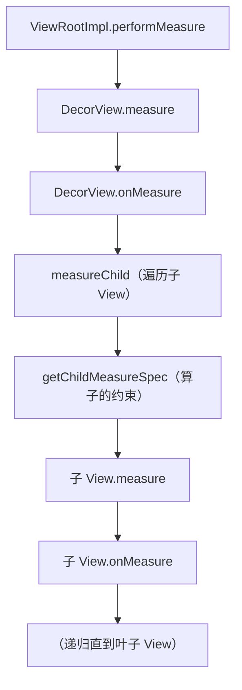

# View measure 的源码全链路

> 系列：Framework-Source-Note · view
> 难度：⭐⭐⭐⭐⭐ 深入
> 更新：2026-08-27
> 前置知识：《View 绘制流程》《ViewRootImpl 绘制流程的完整源码》

---

## 一、本文目标

前面讲了 measure 的概念，这一篇深入到**从根 View 到叶子 View 的完整 measure 调用链**，看 MeasureSpec 是怎么一层层传递和计算的。

## 二、measure 的入口

根 View（DecorView）的 measure 由 ViewRootImpl 发起：

```java
// ViewRootImpl.performMeasure
private void performMeasure(int childWidthMeasureSpec, int childHeightMeasureSpec) {
    mView.measure(childWidthMeasureSpec, childHeightMeasureSpec);
}
```

这里的 `childWidthMeasureSpec` 来自 Window 尺寸，是整棵 View 树的「根约束」。

## 三、View.measure 的 final 方法

```java
// View.java
public final void measure(int widthMeasureSpec, int heightMeasureSpec) {
    // ... 缓存判断 ...

    // 调用 onMeasure（子类重写）
    onMeasure(widthMeasureSpec, heightMeasureSpec);

    // 标记已测量
    mPrivateFlags |= PFLAG_MEASURED_DIMENSION_SET;
}
```

**关键**：`measure` 是 final 的，不能重写；真正做测量的是 `onMeasure`。

## 四、View 的默认 onMeasure

```java
protected void onMeasure(int widthMeasureSpec, int heightMeasureSpec) {
    setMeasuredDimension(
        getDefaultSize(getSuggestedMinimumWidth(), widthMeasureSpec),
        getDefaultSize(getSuggestedMinimumHeight(), heightMeasureSpec)
    );
}

public static int getDefaultSize(int size, int measureSpec) {
    int specMode = MeasureSpec.getMode(measureSpec);
    int specSize = MeasureSpec.getSize(measureSpec);

    switch (specMode) {
        case MeasureSpec.UNSPECIFIED:
            return size;       // 无限制，用建议值
        case MeasureSpec.AT_MOST:
        case MeasureSpec.EXACTLY:
            return specSize;   // 有约束，用约束值
    }
    return size;
}
```

## 五、ViewGroup 的 measure：遍历子 View

ViewGroup 的 onMeasure 要负责测量所有子 View：

```java
// ViewGroup.java
protected void measureChild(View child, int parentWidthSpec, int parentHeightSpec) {
    LayoutParams lp = child.getLayoutParams();

    // ★ 核心：结合父约束 + 子 LayoutParams，算子的 MeasureSpec
    int childWidthSpec = getChildMeasureSpec(parentWidthSpec, mPaddingLeft + mPaddingRight, lp.width);
    int childHeightSpec = getChildMeasureSpec(parentHeightSpec, mPaddingTop + mPaddingBottom, lp.height);

    child.measure(childWidthSpec, childHeightSpec);
}
```

## 六、getChildMeasureSpec：MeasureSpec 的计算核心

这是整个 measure 链路最关键的函数：

```java
public static int getChildMeasureSpec(int spec, int padding, int childDimension) {
    int specMode = MeasureSpec.getMode(spec);
    int specSize = MeasureSpec.getSize(spec);

    int size = Math.max(0, specSize - padding);  // 减去 padding

    int resultSize = 0;
    int resultMode = 0;

    switch (specMode) {
        case MeasureSpec.EXACTLY:
            if (childDimension >= 0) {
                // 子 View 固定尺寸
                resultSize = childDimension;
                resultMode = MeasureSpec.EXACTLY;
            } else if (childDimension == LayoutParams.MATCH_PARENT) {
                // 子 View match_parent
                resultSize = size;
                resultMode = MeasureSpec.EXACTLY;
            } else if (childDimension == LayoutParams.WRAP_CONTENT) {
                // 子 View wrap_content
                resultSize = size;
                resultMode = MeasureSpec.AT_MOST;
            }
            break;

        case MeasureSpec.AT_MOST:
            if (childDimension >= 0) {
                resultSize = childDimension;
                resultMode = MeasureSpec.EXACTLY;
            } else if (childDimension == LayoutParams.MATCH_PARENT) {
                resultSize = size;
                resultMode = MeasureSpec.AT_MOST;
            } else if (childDimension == LayoutParams.WRAP_CONTENT) {
                resultSize = size;
                resultMode = MeasureSpec.AT_MOST;
            }
            break;

        case MeasureSpec.UNSPECIFIED:
            // ...
            break;
    }
    return MeasureSpec.makeMeasureSpec(resultSize, resultMode);
}
```

## 七、MeasureSpec 的组合规则表

| 父约束 | 子 LayoutParams | 子的 MeasureSpec |
|--------|----------------|-----------------|
| EXACTLY | 固定值 | EXACTLY（固定值） |
| EXACTLY | match_parent | EXACTLY（父尺寸） |
| EXACTLY | wrap_content | AT_MOST（父尺寸） |
| AT_MOST | match_parent | AT_MOST（父尺寸） |
| AT_MOST | wrap_content | AT_MOST（父尺寸） |

**核心理解**：父的约束 + 子的 LayoutParams，共同决定子的 MeasureSpec。这就是「约束层层传递」的机制。

## 八、完整的 measure 调用链



## 九、总结

| 要点 | 结论 |
|------|------|
| 入口 | ViewRootImpl.performMeasure |
| 核心 | getChildMeasureSpec 算约束 |
| 规则 | 父约束 + LayoutParams → 子 MeasureSpec |
| 递归 | 层层传递到叶子 View |

---

**下一篇预告**：《llama.cpp 的 KV Cache 实现》

> 配套仓库：[Framework-Source-Note](https://github.com/jason5200/Framework-Source-Note)
