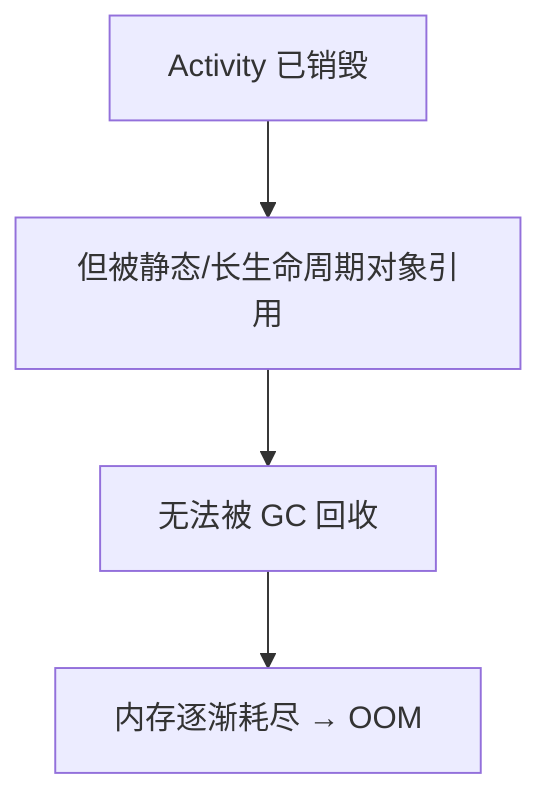
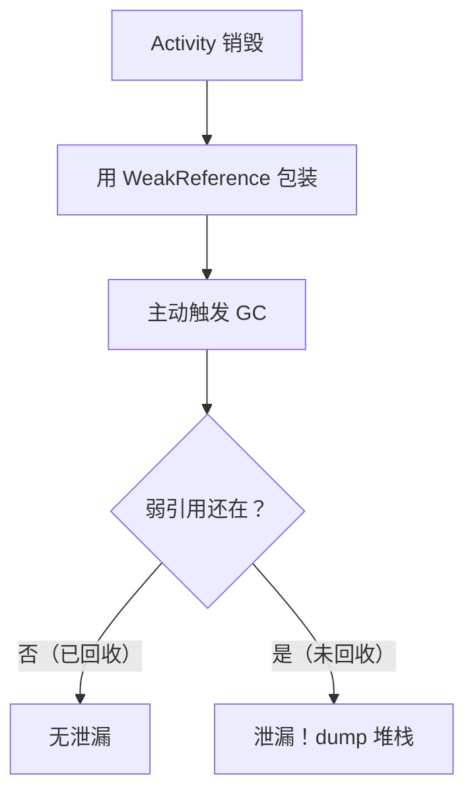

# 内存泄漏与 LeakCanary 原理

> 系列：Framework-Source-Note · ams-wms
> 难度：⭐⭐⭐⭐ 深入
> 更新：2026-08-27
> 前置知识：《Handler 消息机制》《Activity 生命周期》

---

## 一、什么是内存泄漏

对象不再使用，但因为被其他对象**强引用**着，无法被 GC 回收，就是内存泄漏。



## 二、常见的泄漏场景

### 1. 非静态内部类持有外部引用

```java
public class MainActivity extends AppCompatActivity {
    // ❌ 非静态 Handler 持有 Activity 引用
    private final Handler handler = new Handler() {
        @Override
        public void handleMessage(Message msg) {
            // 如果这里有延迟消息，Activity 销毁后仍被持有
        }
    };
}
```

**原因**：非静态内部类会隐式持有外部类（Activity）的引用。延迟消息没处理完，Handler 就活着，Activity 也无法回收。

### 2. 单例持有 Context

```java
public class Singleton {
    private static Singleton instance;
    private Context context;

    private Singleton(Context context) {
        this.context = context;  // ❌ 传入 Activity Context
    }
}
```

**修复**：用 `context.getApplicationContext()`。

### 3. 静态变量持有 Activity

```java
public class MainActivity extends AppCompatActivity {
    private static MainActivity instance;  // ❌ 静态引用

    @Override
    protected void onCreate(Bundle savedInstanceState) {
        instance = this;  // 静态变量持有 Activity，永不回收
    }
}
```

### 4. 注册未反注册

```java
// ❌ 注册了监听器，销毁时忘记反注册
@Override
protected void onCreate(Bundle savedInstanceState) {
    EventBus.getDefault().register(this);
}

@Override
protected void onDestroy() {
    // 忘记 unregister！
}
```

## 三、LeakCanary 的原理

LeakCanary 是 Square 出品的泄漏检测库，原理巧妙：

### 1. 监听 Activity 销毁

```java
// 核心：监听 Activity 销毁
application.registerActivityLifecycleCallbacks(new ActivityLifecycleCallbacks() {
    @Override
    public void onActivityDestroyed(Activity activity) {
        // Activity 销毁了，监控它是否被回收
        refWatcher.watch(activity);
    }
});
```

### 2. 弱引用 + GC + 检查



```java
public void watch(Object watched) {
    // 1. 创建弱引用
    KeyedWeakReference ref = new KeyedWeakReference(watched, key);

    // 2. 延迟触发 GC
    handler.postDelayed(() -> {
        // 3. GC 后检查弱引用是否被清空
        if (ref.get() != null) {
            // 对象还在 → 泄漏了
            dumpHeap();  // dump 内存快照
        }
    }, 5000);
}
```

**核心理解**：如果对象被 GC 回收了，弱引用会变 null；如果弱引用还能拿到对象，说明有强引用链，就是泄漏。

### 3. dump 堆并分析引用链

LeakCanary dump 内存快照后，用 Shark 库分析「谁持有这个泄漏对象」，给出引用链。

## 四、修复泄漏的通用方法

| 泄漏类型 | 修复 |
|----------|------|
| 非静态内部类 | 改为静态内部类 + 弱引用 |
| 单例持有 Activity | 用 Application Context |
| 静态变量 | 及时置 null |
| 监听器未反注册 | 成对反注册 |
| Handler 延迟消息 | onDestroy 里 removeCallbacksAndMessages |

## 五、一个正确的 Handler 写法

```java
public class MainActivity extends AppCompatActivity {
    // 静态内部类 + 弱引用，避免泄漏
    private static class MyHandler extends Handler {
        private final WeakReference<MainActivity> ref;

        MyHandler(MainActivity activity) {
            ref = new WeakReference<>(activity);
        }

        @Override
        public void handleMessage(Message msg) {
            MainActivity activity = ref.get();
            if (activity != null) {
                activity.handleMessage(msg);
            }
        }
    }

    @Override
    protected void onDestroy() {
        super.onDestroy();
        handler.removeCallbacksAndMessages(null);  // 清理消息
    }
}
```

## 六、总结

| 要点 | 结论 |
|------|------|
| 泄漏本质 | 对象被强引用，无法 GC |
| 常见场景 | 内部类、单例、静态、监听器 |
| LeakCanary 原理 | 弱引用 + GC + 检查 |
| 修复 | 静态内部类、Application Context、反注册 |

---

**下一篇预告**：《ANR 原理与排查方法》

> 配套仓库：[Framework-Source-Note](https://github.com/jason5200/Framework-Source-Note)
