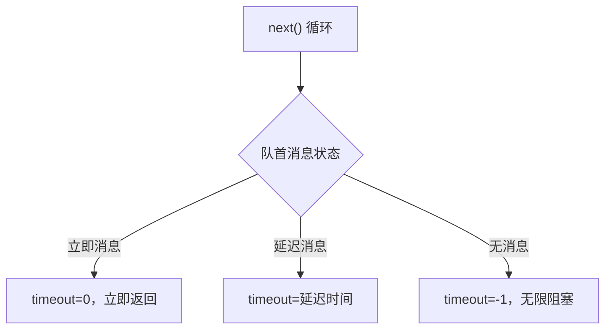
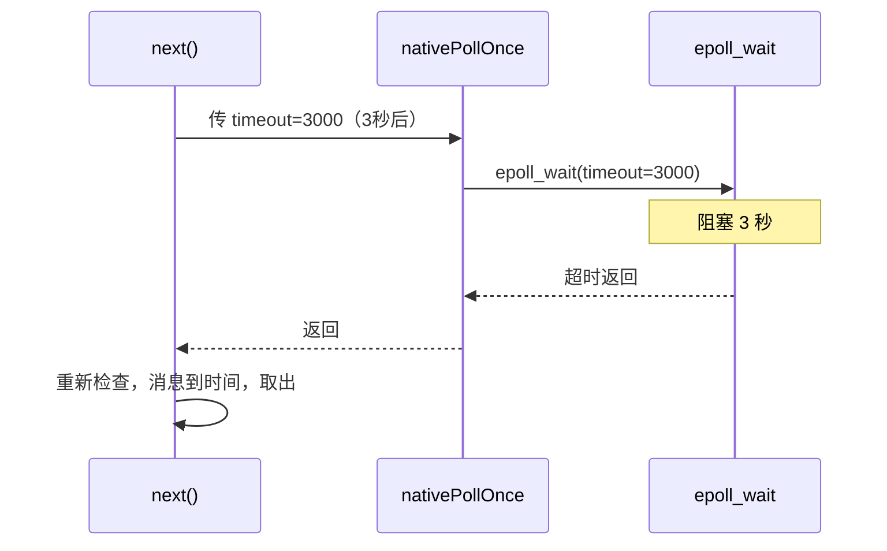
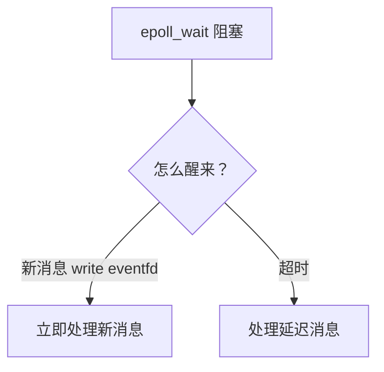
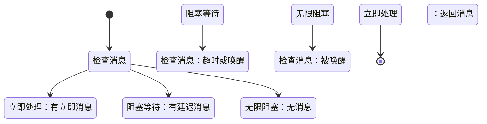

# MessageQueue 的 native 层 next 唤醒源码

> 系列：Framework-Source-Note · handler
> 难度：⭐⭐⭐⭐⭐ 深入
> 更新：2026-08-27
> 前置知识：《Handler native 层唤醒机制》《Looper epoll 事件循环的完整源码》

---

## 一、本文目标

前面讲了 epoll 的循环，这一篇把视角拉回 **MessageQueue.next()**，看 Java 层的 `next()` 和 native 层 `nativePollOnce` 到底怎么配合，实现「有消息处理消息，没消息阻塞等待」。

## 二、MessageQueue.next() 的完整源码

```java
// MessageQueue.java
Message next() {
    int pendingIdleHandlerCount = -1;
    int nextPollTimeoutMillis = 0;

    for (;;) {
        if (nextPollTimeoutMillis != 0) {
            Binder.flushPendingCommands();
        }

        // ★ 调用 native 层，阻塞等待
        // 返回前，主线程一直阻塞在这里
        nativePollOnce(ptr, nextPollTimeoutMillis);

        synchronized (this) {
            final long now = SystemClock.uptimeMillis();
            Message prevMsg = null;
            Message msg = mMessages;

            // 检查队首消息是否到时间
            if (msg != null && msg.target == null) {
                // 同步屏障，跳过同步消息，找异步消息
                do {
                    prevMsg = msg;
                    msg = msg.next;
                } while (msg != null && !msg.isAsynchronous());
            }

            if (msg != null) {
                if (now < msg.when) {
                    // 消息还没到时间，计算还要等多久
                    nextPollTimeoutMillis = (int) Math.min(msg.when - now, Integer.MAX_VALUE);
                } else {
                    // 消息到时间了，取出它
                    mBlocked = false;
                    if (prevMsg != null) {
                        prevMsg.next = msg.next;
                    } else {
                        mMessages = msg.next;
                    }
                    msg.next = null;
                    msg.markInUse();
                    return msg;  // 返回消息
                }
            } else {
                // 没有消息，无限等待
                nextPollTimeoutMillis = -1;
            }
        }
    }
}
```

## 三、关键变量：nextPollTimeoutMillis

这是 next() 的核心，它控制 native 层阻塞多久：

| 值 | 含义 |
|----|------|
| 0 | 有立即消息，立即返回 |
| >0 | 有延迟消息，阻塞这么久 |
| -1 | 无消息，无限阻塞 |



## 四、nativePollOnce 的底层

`nextPollTimeoutMillis` 传给 native 层，最终变成 epoll_wait 的超时：

```cpp
// android_os_MessageQueue.cpp
static void android_os_MessageQueue_nativePollOnce(JNIEnv* env, jobject obj,
        jlong ptr, jint timeoutMillis) {
    NativeMessageQueue* nativeMessageQueue = reinterpret_cast<NativeMessageQueue*>(ptr);
    nativeMessageQueue->pollOnce(env, obj, timeoutMillis);
}
```

```cpp
// Looper.cpp
int Looper::pollInner(int timeoutMillis) {
    // timeoutMillis 就是 Java 层传来的 nextPollTimeoutMillis
    int eventCount = epoll_wait(mEpollFd, eventItems, EPOLL_MAX_EVENTS, timeoutMillis);
    // ...
}
```

## 五、延迟消息的精确定时

延迟消息的「等待」靠 epoll_wait 的超时：



**关键理解**：延迟消息不是「定时器」，而是「epoll 阻塞到时间，超时返回后重新检查」。这避免了额外的定时器线程。

## 六、消息唤醒 vs 延迟超时

两种「醒来」的方式：

| 醒来方式 | 触发 | 场景 |
|----------|------|------|
| eventfd 唤醒 | 新消息入队 | 立即消息 |
| epoll 超时 | 时间到 | 延迟消息 |



## 七、next() 的完整状态机



## 八、总结

| 要点 | 结论 |
|------|------|
| next() 循环 | 检查消息 → 阻塞 → 返回 |
| timeout | 0/延迟时间/-1 |
| nativePollOnce | 转成 epoll_wait 超时 |
| 延迟消息 | epoll 超时实现 |

---

**下一篇预告**：《量化感知训练 QAT 的完整流程》

> 配套仓库：[Framework-Source-Note](https://github.com/jason5200/Framework-Source-Note)
