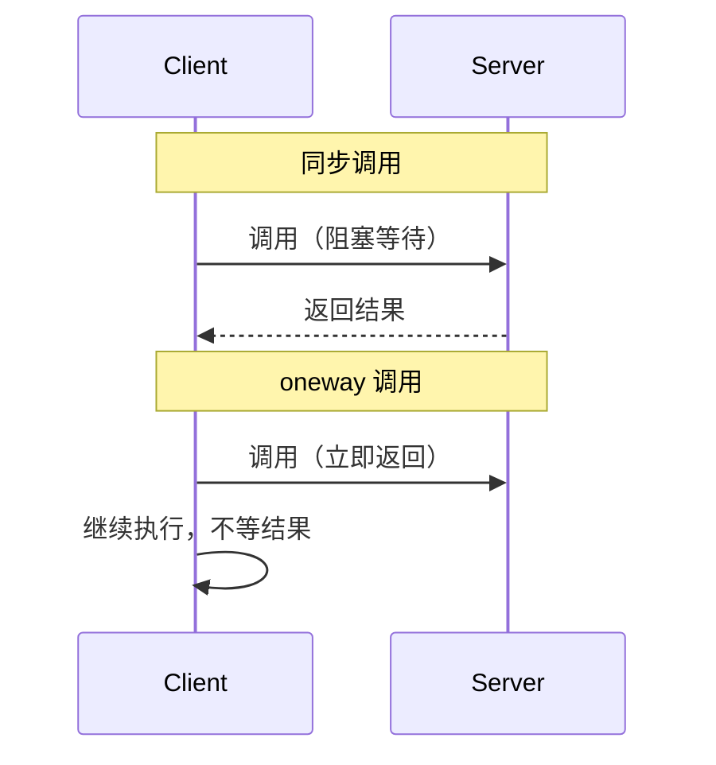

# Binder 的 oneway 异步调用

> 系列：Framework-Source-Note · binder
> 难度：⭐⭐⭐⭐ 深入
> 更新：2026-08-27
> 前置知识：《一次 Binder 通信的完整流程》《Binder 连接池》

---

## 一、同步调用 vs 异步调用

前面讲的 Binder 调用都是**同步**的：Client 调 `transact()` 后阻塞，等 Server 返回。

但有些场景不需要等结果：

- 通知 Server「某件事发生了」（如日志上报）
- 广播式通知（如「系统时间变了」）

这时用 **oneway（异步单向调用）** 更合适。



## 二、oneway 的声明方式

在 AIDL 方法前加 `oneway` 关键字：

```java
// IMyService.aidl
interface IMyService {
    void syncMethod(String param);      // 同步
    oneway void asyncMethod(String param);  // 异步单向
}
```

**效果**：`asyncMethod` 调用后 Client 立即返回，不等待 Server 执行完成。

## 三、oneway 的底层实现

oneway 是通过 `transact` 的 flag 实现的：

```java
// 底层：oneway 对应 FLAG_ONEWAY
mRemote.transact(code, data, reply, FLAG_ONEWAY);
```

**关键区别**：

| | 同步 | oneway |
|---|------|--------|
| flag | 0 | `FLAG_ONEWAY` |
| Client 阻塞 | 是 | 否 |
| 有返回值 | 是 | 否（reply 为空） |
| 异常传播 | 能 | 不能 |

## 四、oneway 的三个重要特性

### 1. 无返回值

oneway 方法不能有返回值，即使 AIDL 里写了，Client 也拿不到（`reply` 是空的）。

### 2. 不保证执行顺序

多个 oneway 调用，Server 端执行的**顺序不保证**与调用顺序一致。因为它们是异步排队处理的。

### 3. 异常无法传播

Server 端如果抛异常，Client 端**感知不到**。所以 oneway 方法内部要自己处理异常。

## 五、oneway 的典型应用场景

### 1. 系统广播通知

```java
// 系统时间变化时，通知所有监听者
oneway void onTimeChanged(long newTime);
```

### 2. 日志/埋点上报

```java
// 上报埋点，不关心结果
oneway void reportEvent(String event);
```

### 3. 状态变更通知

```java
// 通知 Client 某个状态变了
oneway void onStateChanged(int newState);
```

## 六、oneway 的坑

| 坑 | 说明 |
|----|------|
| 以为有返回值 | oneway 拿不到返回值 |
| 依赖执行顺序 | oneway 不保证顺序 |
| 依赖异常传播 | Server 异常 Client 感知不到 |
| 滥用 oneway | 需要结果的场景不能用 |

## 七、一个实际例子

```java
// 音乐播放服务：进度回调
interface IPlaybackListener {
    oneway void onProgressUpdate(int position, int duration);
}
```

音乐播放时，Server 频繁回调进度给 Client，用 oneway 避免阻塞。

## 八、总结

| 要点 | 结论 |
|------|------|
| oneway 是什么 | 异步单向调用，不等返回 |
| 底层 | transact 的 FLAG_ONEWAY |
| 特性 | 无返回、不保证顺序、异常不传播 |
| 适用 | 通知、埋点、状态回调 |

---

**下一篇预告**：《HandlerThread 与 IntentService》

> 配套仓库：[Framework-Source-Note](https://github.com/jason5200/Framework-Source-Note)
