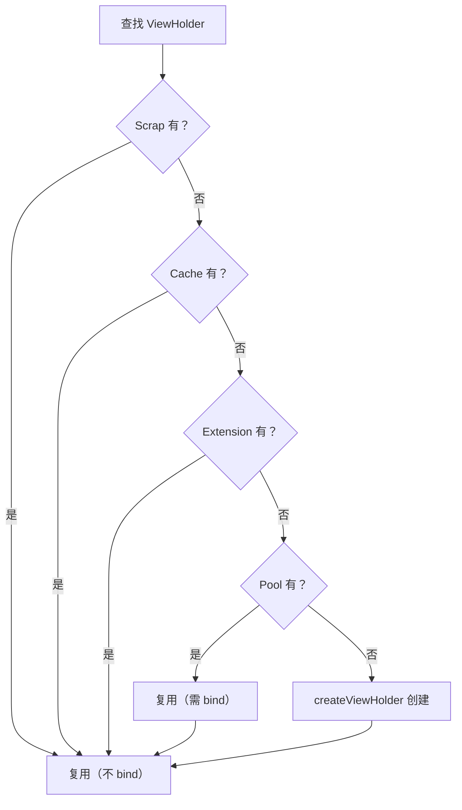

# RecyclerView 缓存复用的完整源码

> 系列：Framework-Source-Note · view
> 难度：⭐⭐⭐⭐⭐ 深入
> 更新：2026-08-27
> 前置知识：《RecyclerView 缓存与复用机制》

---

## 一、本文目标

上一篇《RecyclerView 缓存与复用机制》讲了四级缓存的概念，这一篇**深入到源码**，看 `RecyclerView` 到底怎么从缓存里「找 ViewHolder」。

## 二、查找 ViewHolder 的入口

RecyclerView 拿到一个 item 时，先尝试从缓存获取，找不到才创建：

```java
// RecyclerView.Recycler.java
ViewHolder tryGetViewHolderForPositionByDeadline(int position, ...) {
    // 1. 先从 Scrap（mChangedScrap / mAttachedScrap）找
    ViewHolder holder = getChangedScrapViewForPosition(position);
    if (holder == null) {
        holder = getScrapOrHiddenOrCachedHolderForPosition(position, ...);
    }

    if (holder == null) {
        // 2. 从 Cache / ViewCacheExtension / Pool 找
        final int type = adapter.getItemViewType(position);
        if (mViewCacheExtension != null) {
            View view = mViewCacheExtension.getViewForPositionAndType(...);
            if (view != null) {
                holder = getChildViewHolder(view);
            }
        }
        if (holder == null) {
            holder = getRecycledViewPool().getRecycledView(type);
        }
    }

    if (holder == null) {
        // 3. 缓存都找不到，创建新的
        holder = adapter.createViewHolder(RecyclerView.this, type);
    }

    // 绑定数据
    adapter.bindViewHolder(holder, position);
    return holder;
}
```

**关键理解**：查找顺序是 **Scrap → Cache → Extension → Pool → 创建**，这个顺序决定了复用的效率。

## 三、getScrapOrHiddenOrCachedHolderForPosition 源码

这是最核心的查找逻辑：

```java
ViewHolder getScrapOrHiddenOrCachedHolderForPosition(int position, ...) {
    // 1. 从 mAttachedScrap 找（还在屏幕上的）
    for (int i = 0; i < mAttachedScrap.size(); i++) {
        ViewHolder holder = mAttachedScrap.get(i);
        if (!holder.wasReturnedFromScrap() && holder.getLayoutPosition() == position) {
            return holder;
        }
    }

    // 2. 从 mCachedViews 找（刚滚出屏幕的）
    if (mCachedViews.size() > 0) {
        ViewHolder holder = mCachedViews.get(mCachedViews.size() - 1);
        if (holder.getLayoutPosition() == position) {
            return holder;
        }
    }

    return null;
}
```

**关键点**：
1. `mAttachedScrap`：还在屏幕上的 View，位置匹配才复用。
2. `mCachedViews`：刚滚出屏幕的缓存，默认大小 2，位置匹配才复用。

## 四、RecycledViewPool 的 getRecycledView 源码

Pool 按 viewType 分类存储：

```java
public static class RecycledViewPool {
    // viewType -> 该类型的 ViewHolder 列表
    SparseArray<ArrayList<ViewHolder>> mScrap = new SparseArray<>();

    public ViewHolder getRecycledView(int viewType) {
        ArrayList<ViewHolder> scrapHeap = mScrap.get(viewType);
        if (scrapHeap != null && !scrapHeap.isEmpty()) {
            // 取最后一个（后进先出）
            final int index = scrapHeap.size() - 1;
            ViewHolder scrap = scrapHeap.get(index);
            scrapHeap.remove(index);
            return scrap;
        }
        return null;
    }

    public void putRecycledView(ViewHolder scrap) {
        int viewType = scrap.getItemViewType();
        ArrayList<ViewHolder> scrapHeap = getScrapDataForType(viewType).mScrapHeap;
        // 超过上限就不缓存
        if (mScrap.get(viewType).mMaxScrap <= scrapHeap.size()) {
            return;
        }
        // 清空 ViewHolder 的数据，防止脏数据
        scrap.resetInternal();
        scrapHeap.add(scrap);
    }
}
```

**关键点**：
1. Pool 按 `viewType` 分组，不同类型不混用。
2. 存入时调用 `resetInternal()` 清空数据，所以取出后必须重新 `bindViewHolder`。
3. 每个类型有 `mMaxScrap` 上限，默认 5。

## 五、ViewHolder 的回收流程

View 滚出屏幕时，被回收进缓存：

```java
// Recycler.recycleViewHolderInternal
void recycleViewHolderInternal(ViewHolder holder) {
    // 1. 先尝试进 Cache（mCachedViews）
    if (mCachedViews.size() < mViewCacheMax) {  // 默认 2
        mCachedViews.add(holder);
        cached = true;
    }

    // 2. Cache 满了，进 Pool
    if (!cached) {
        addViewHolderToRecycledViewPool(holder);
    }
}
```

**关键理解**：先 Cache（保留数据，复用快），Cache 满了再进 Pool（清空数据，复用慢）。

## 六、为什么 Cache 比 Pool 快

| 缓存 | 数据状态 | 复用时 |
|------|----------|--------|
| Cache | 保留数据 | 直接复用，不用 bind |
| Pool | 已清空 | 必须重新 bind |

**源码证据**：

```java
if (holder == null) {
    // 从 Cache 拿到，位置匹配，直接返回（不重新 bind）
    holder = getScrapOrHiddenOrCachedHolderForPosition(...);
    if (holder != null && !validateViewHolderForOffsetPosition(holder)) {
        // Cache 的不匹配，回收进 Pool
        recycleViewHolderInternal(holder);
        holder = null;
    }
}
```

## 七、四级缓存的完整流程图



## 八、总结

| 要点 | 结论 |
|------|------|
| 查找顺序 | Scrap→Cache→Extension→Pool→创建 |
| Cache | 保留数据，复用快（默认2） |
| Pool | 清空数据，复用需 bind（默认5） |
| 分类型 | Pool 按 viewType 分组 |

---

**下一篇预告**：《CarService 启动流程的完整源码》

> 配套仓库：[Framework-Source-Note](https://github.com/jason5200/Framework-Source-Note)
