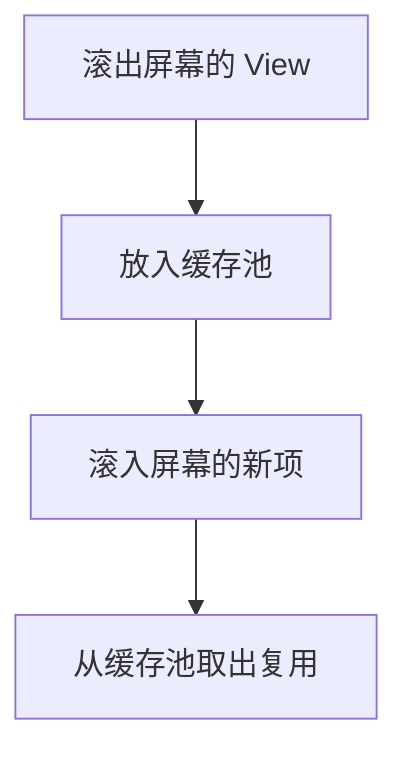
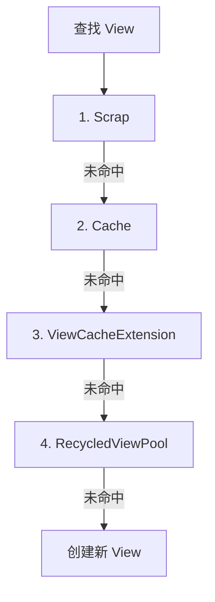

# RecyclerView 缓存与复用机制

> 系列：Framework-Source-Note · view
> 难度：⭐⭐⭐⭐ 深入
> 更新：2026-08-27
> 前置知识：《View 绘制流程》

---

## 一、为什么需要复用

列表有 1000 条数据，如果每条都创建一个 View，内存会爆炸。RecyclerView 的核心优化就是**复用**：只创建屏幕可见的 View，滚动的复用旧 View。



## 二、四级缓存

RecyclerView 有四级缓存，这是它的核心机制：

| 级别 | 缓存 | 作用 |
|------|------|------|
| 1 | Scrap | 屏幕内，未与 RecyclerView 分离 |
| 2 | Cache | 刚滚出屏幕，直接复用 |
| 3 | ViewCacheExtension | 自定义缓存（开发者扩展） |
| 4 | RecycledViewPool | 跨类型的通用缓存池 |



## 三、Scrap 与 Cache 的区别

| 缓存 | 特点 |
|------|------|
| Scrap | 屏幕内，未分离，直接复用（最快） |
| Cache | 刚离开屏幕，保留数据，无需重新绑定 |

**关键理解**：Cache 里的 View 还保留着原数据，复用时不走 `onBindViewHolder`（或走部分），性能更好。

## 四、RecycledViewPool 的复用

Pool 是最后一级，View 被「洗掉数据」后放入：

```java
// 自定义 Pool 大小
recyclerView.setRecycledViewPool(new RecyclerView.RecycledViewPool());
recyclerView.getRecycledViewPool().setMaxRecycledViews(0, 20);
```

**注意**：从 Pool 取出的 View，数据已被清空，必须重新走 `onBindViewHolder`。

## 五、onCreateViewHolder vs onBindViewHolder

这是理解复用的关键：

```java
public class MyAdapter extends RecyclerView.Adapter<MyAdapter.VH> {
    @Override
    public VH onCreateViewHolder(ViewGroup parent, int viewType) {
        // 只在「创建新 View」时调用（复用时不走这里）
        View view = LayoutInflater.from(parent.getContext())
            .inflate(R.layout.item, parent, false);
        return new VH(view);
    }

    @Override
    public void onBindViewHolder(VH holder, int position) {
        // 每次绑定数据都调用（复用时会重新走这里）
        holder.textView.setText(data.get(position));
    }
}
```

**核心理解**：
- `onCreateViewHolder`：创建 View（昂贵，少调用）
- `onBindViewHolder`：绑定数据（便宜，每次滚动都调用）

## 六、多 ViewType 与复用

不同 ViewType 的 View 不能互相复用：

```java
@Override
public int getItemViewType(int position) {
    return data.get(position).type;  // 0: 文本, 1: 图片
}
```

不同 viewType 会放到 Pool 的不同槽位，互不干扰。

## 七、setHasStableIds 优化

如果数据有稳定 ID，开启后能减少不必要的 onBind：

```java
adapter.setHasStableIds(true);

@Override
public long getItemId(int position) {
    return data.get(position).id;  // 稳定 ID
}
```

## 八、性能优化清单

| 优化 | 说明 |
|------|------|
| 固定高度 | `setHasFixedSize(true)` |
| 减少嵌套 | 布局层级浅 |
| 合理 Pool 大小 | 按需设置缓存数 |
| 避免在 onBind 做重活 | 保持绑定轻量 |
| setHasStableIds | 减少重复绑定 |

## 九、总结

| 要点 | 结论 |
|------|------|
| 复用目的 | 避免重复创建 View |
| 四级缓存 | Scrap→Cache→Extension→Pool |
| 关键方法 | onCreate（创建）/ onBind（绑定） |
| 优化 | 固定高度、稳定 ID、浅布局 |

---

**下一篇预告**：《内存泄漏与 LeakCanary 原理》

> 配套仓库：[Framework-Source-Note](https://github.com/jason5200/Framework-Source-Note)
