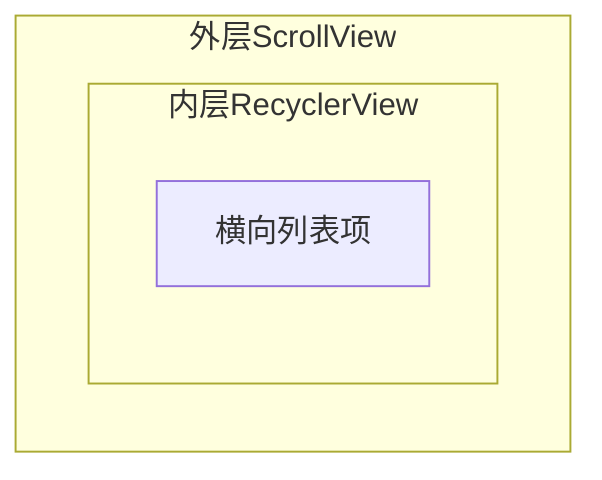

# 滑动冲突的完整解决方案

> 系列：Framework-Source-Note · view
> 难度：⭐⭐⭐⭐ 深入
> 更新：2026-08-27
> 前置知识：《View 事件分发机制》

---

## 一、滑动冲突是什么

当**内外两层都能滑动**时，就产生冲突：用户滑动时，系统不知道这个滑动该给谁处理。



**典型场景**：
1. 外层纵向 ScrollView + 内层横向 RecyclerView
2. 外层 ViewPager + 内层 RecyclerView
3. 下拉刷新 + 列表滑动

## 二、三种常见冲突类型

| 类型 | 场景 | 冲突点 |
|------|------|--------|
| 方向不同 | 外层纵向 + 内层横向 | 判断滑动方向 |
| 方向相同 | 外层 ViewPager + 内层列表 | 谁先响应 |
| 嵌套复杂 | 多层嵌套 | 多级判断 |

## 三、解决方案一：外部拦截法

**父 View 在 onInterceptTouchEvent 里判断是否拦截**（推荐，最常用）。

```java
public class OuterLayout extends LinearLayout {
    private float lastX, lastY;

    @Override
    public boolean onInterceptTouchEvent(MotionEvent ev) {
        switch (ev.getAction()) {
            case MotionEvent.ACTION_DOWN:
                lastX = ev.getX();
                lastY = ev.getY();
                break;
            case MotionEvent.ACTION_MOVE:
                float dx = Math.abs(ev.getX() - lastX);
                float dy = Math.abs(ev.getY() - lastY);
                // 横向滑动：父不拦截（给内层横向列表）
                // 纵向滑动：父拦截（自己滚动）
                if (dx > dy) {
                    return false;  // 不拦截，给子 View
                } else {
                    return true;   // 拦截，自己处理
                }
        }
        return super.onInterceptTouchEvent(ev);
    }
}
```

**原理**：父 View 在 MOVE 时判断滑动方向，决定是否拦截。

## 四、解决方案二：内部拦截法

**子 View 用 requestDisallowInterceptTouchEvent 请求父不拦截**。

```java
public class InnerView extends RecyclerView {
    private float lastX, lastY;

    @Override
    public boolean dispatchTouchEvent(MotionEvent ev) {
        switch (ev.getAction()) {
            case MotionEvent.ACTION_DOWN:
                // 请求父 View 不要拦截
                getParent().requestDisallowInterceptTouchEvent(true);
                lastX = ev.getX();
                lastY = ev.getY();
                break;
            case MotionEvent.ACTION_MOVE:
                float dx = Math.abs(ev.getX() - lastX);
                float dy = Math.abs(ev.getY() - lastY);
                if (dy > dx) {
                    // 纵向滑动，让父 View 拦截
                    getParent().requestDisallowInterceptTouchEvent(false);
                }
                break;
        }
        return super.dispatchTouchEvent(ev);
    }
}
```

## 五、两种方案对比

| 方案 | 实现位置 | 复杂度 | 推荐度 |
|------|----------|--------|--------|
| 外部拦截 | 父 View | 低 | ⭐⭐⭐ 推荐 |
| 内部拦截 | 子 View | 中 | ⭐⭐ |

**结论**：优先用外部拦截法，简单清晰。

## 六、完整实例：外层纵向 + 内层横向

```java
public class VerticalScrollContainer extends LinearLayout {
    private float downX, downY;

    @Override
    public boolean onInterceptTouchEvent(MotionEvent ev) {
        boolean intercept = false;
        switch (ev.getAction()) {
            case MotionEvent.ACTION_DOWN:
                downX = ev.getX();
                downY = ev.getY();
                break;
            case MotionEvent.ACTION_MOVE:
                float dx = Math.abs(ev.getX() - downX);
                float dy = Math.abs(ev.getY() - downY);
                // 纵向滑动 > 横向滑动 → 父拦截，自己纵向滚动
                intercept = dy > dx;
                break;
            case MotionEvent.ACTION_UP:
                intercept = false;
                break;
        }
        return intercept;
    }
}
```

## 七、判断滑动方向的技巧

核心是「横向位移 vs 纵向位移」：

```java
float dx = Math.abs(currentX - downX);
float dy = Math.abs(currentY - downY);

if (dx > dy) {
    // 横向滑动为主
} else {
    // 纵向滑动为主
}
```

## 八、总结

| 要点 | 结论 |
|------|------|
| 冲突本质 | 内外都能滑动，方向/优先级不明 |
| 外部拦截 | 父 onInterceptTouchEvent 判断 |
| 内部拦截 | 子 requestDisallowIntercept |
| 核心技巧 | 比较 dx 和 dy 判断方向 |

---

**下一篇预告**：《RecyclerView 缓存与复用机制》

> 配套仓库：[Framework-Source-Note](https://github.com/jason5200/Framework-Source-Note)
