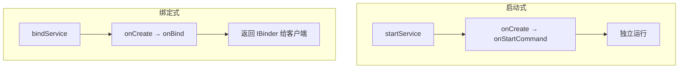

# Service 的启动与绑定机制

> 系列：Framework-Source-Note · component
> 难度：⭐⭐⭐⭐ 深入
> 更新：2026-08-27
> 前置知识：《AMS 启动流程解析》《Binder 连接池》

---

## 一、Service 的两种形态

Service 有两种使用方式，对应两种生命周期：

| 方式 | 方法 | 特点 |
|------|------|------|
| 启动式 | `startService()` | 独立运行，无交互 |
| 绑定式 | `bindService()` | 与组件绑定，可交互 |



## 二、启动式 Service（startService）

```java
// 启动
Intent intent = new Intent(this, MyService.class);
startService(intent);

// 停止
stopService(intent);
```

生命周期：`onCreate → onStartCommand → onDestroy`

```java
public class MyService extends Service {
    @Override
    public int onStartCommand(Intent intent, int flags, int startId) {
        // 执行后台任务
        return START_STICKY;  // 被系统杀死后自动重启
    }
}
```

**返回值含义**：
- `START_STICKY`：被杀后自动重启（intent 为 null）
- `START_NOT_STICKY`：被杀后不重启
- `START_REDELIVER_INTENT`：重启并重传 intent

## 三、绑定式 Service（bindService）

绑定式 Service 通过 Binder 与客户端交互：

```java
public class MyService extends Service {
    private final IBinder binder = new LocalBinder();

    public class LocalBinder extends Binder {
        MyService getService() {
            return MyService.this;
        }
    }

    @Override
    public IBinder onBind(Intent intent) {
        return binder;  // 返回 Binder 给客户端
    }
}
```

客户端绑定：

```java
private ServiceConnection connection = new ServiceConnection() {
    @Override
    public void onServiceConnected(ComponentName name, IBinder service) {
        MyService.LocalBinder binder = (MyService.LocalBinder) service;
        MyService myService = binder.getService();
        // 拿到 Service 引用，可以调用它的方法
    }

    @Override
    public void onServiceDisconnected(ComponentName name) {
    }
};

bindService(intent, connection, BIND_AUTO_CREATE);
```

## 四、AIDL 跨进程 Service

如果 Service 和客户端在不同进程，需要用 AIDL：

```java
// IMyService.aidl
interface IMyService {
    String getData();
    void setData(String data);
}
```

Service 端：

```java
public class MyService extends Service {
    private final IMyService.Stub binder = new IMyService.Stub() {
        @Override
        public String getData() {
            return "data";
        }
        @Override
        public void setData(String data) {
            // 处理
        }
    };

    @Override
    public IBinder onBind(Intent intent) {
        return binder;
    }
}
```

## 五、前台 Service

后台 Service 容易被系统回收，重要任务（如音乐播放）要升级为**前台 Service**：

```java
// 前台 Service 需要通知栏
Notification notification = buildNotification();
startForeground(NOTIFICATION_ID, notification);
```

```xml
<!-- 需要权限 -->
<uses-permission android:name="android.permission.FOREGROUND_SERVICE" />
```

## 六、IntentService vs Service

前面讲过的 IntentService 是 Service 的特例：

| 特性 | Service | IntentService |
|------|---------|---------------|
| 线程 | 主线程 | 独立 HandlerThread |
| 串行 | 需自己处理 | 自动串行 |
| 自动停止 | 需手动 | 自动 |

## 七、常见坑

| 坑 | 说明 |
|----|------|
| Service 里做耗时操作 | Service 默认在主线程！ |
| 忘记 unbind | 内存泄漏 |
| 绑定式 Service 生命周期 | 所有客户端解绑后自动销毁 |
| 后台 Service 被回收 | 升级为前台 Service |

## 八、总结

| 要点 | 结论 |
|------|------|
| 两种形态 | 启动式 / 绑定式 |
| 启动式 | startService，独立运行 |
| 绑定式 | bindService，Binder 交互 |
| 前台 Service | 重要任务，通知栏常驻 |

---

**下一篇预告**：《BroadcastReceiver 的动态注册与分发》

> 配套仓库：[Framework-Source-Note](https://github.com/jason5200/Framework-Source-Note)
