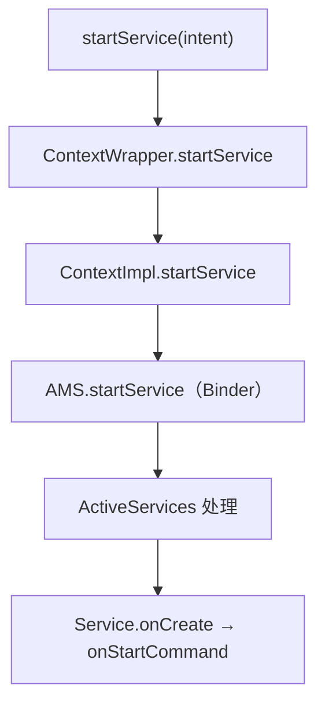
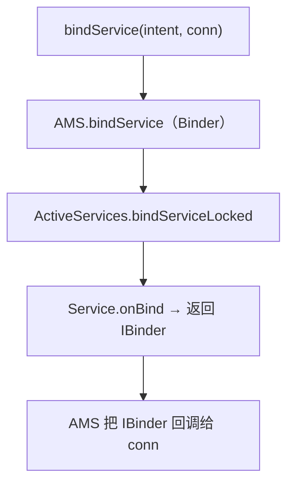

# Service 启动与绑定的完整源码

> 系列：Framework-Source-Note · component
> 难度：⭐⭐⭐⭐⭐ 深入
> 更新：2026-08-27
> 前置知识：《Service 的启动与绑定机制》

---

## 一、本文目标

上一篇《Service 的启动与绑定机制》讲了概念，这一篇深入到**源码**，看 startService 和 bindService 在 AMS 里到底怎么走。

## 二、startService 的调用链



## 三、AMS 的 startService 入口

```java
// ActivityManagerService.java
public ComponentName startService(IApplicationThread caller, Intent service, ...) {
    synchronized(this) {
        // 交给 ActiveServices 处理
        ComponentName res = mServices.startServiceLocked(caller, service, ...);
        return res;
    }
}
```

## 四、ActiveServices.startServiceLocked

这是 Service 启动的核心：

```java
// ActiveServices.java
ComponentName startServiceLocked(IApplicationThread caller, Intent service, ...) {
    // 1. 查找 Service 记录
    ServiceLookupResult res = retrieveServiceLocked(service, ...);
    ServiceRecord r = res.record;

    // 2. 如果进程还没启动，先启动进程
    if (r.app == null && r.appInfo.persistent == false) {
        // 启动 Service 所在进程
        startProcessLocked(r.processName, ...);
    }

    // 3. 调用 realStartServiceLocked
    realStartServiceLocked(r, ...);
}
```

## 五、realStartServiceLocked

```java
private void realStartServiceLocked(ServiceRecord r, ...) {
    // 通过 ApplicationThread 通知进程创建 Service
    app.thread.scheduleCreateService(r, r.serviceInfo, ...);

    // 通知调用 onStartCommand
    app.thread.scheduleServiceArgs(r, ...);
}
```

**关键理解**：AMS 通过 `ApplicationThread`（Binder）跨进程通知 App 进程创建 Service。

## 六、App 进程侧的 onCreate

```java
// ActivityThread.java
private void handleCreateService(CreateServiceData data) {
    // 1. 加载 Service 类
    Service service = (Service) cl.loadClass(data.info.name).newInstance();

    // 2. 创建 Context
    ContextImpl context = ContextImpl.createAppContext(this, ...);

    // 3. 调用 attach 和 onCreate
    service.attach(context, this, ...);
    service.onCreate();
}
```

## 七、bindService 的调用链



## 八、bindService 的核心差异

bindService 比 startService 多了「返回 IBinder」这一步：

```java
// ActiveServices.java
int bindServiceLocked(IApplicationThread caller, IBinder token, ...) {
    // ...
    // 通知进程 bind
    app.thread.scheduleBindService(r, ...);

    // Service.onBind 返回的 IBinder 会通过 ServiceConnection 回调给客户端
    // ...
}
```

```java
// 客户端收到 IBinder
private class ServiceConnection {
    public void onServiceConnected(ComponentName name, IBinder service) {
        // service 就是 Service.onBind 返回的 IBinder
    }
}
```

## 九、总结

| 要点 | 结论 |
|------|------|
| startService 链 | Context → AMS → ActiveServices → onCreate |
| bindService 链 | 多了 onBind 返回 IBinder |
| 跨进程通知 | ApplicationThread（Binder） |
| 核心类 | ActiveServices |

---

**下一篇预告**：《Looper epoll 事件循环的完整源码》

> 配套仓库：[Framework-Source-Note](https://github.com/jason5200/Framework-Source-Note)
