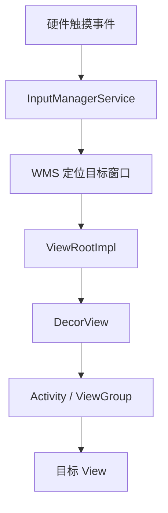
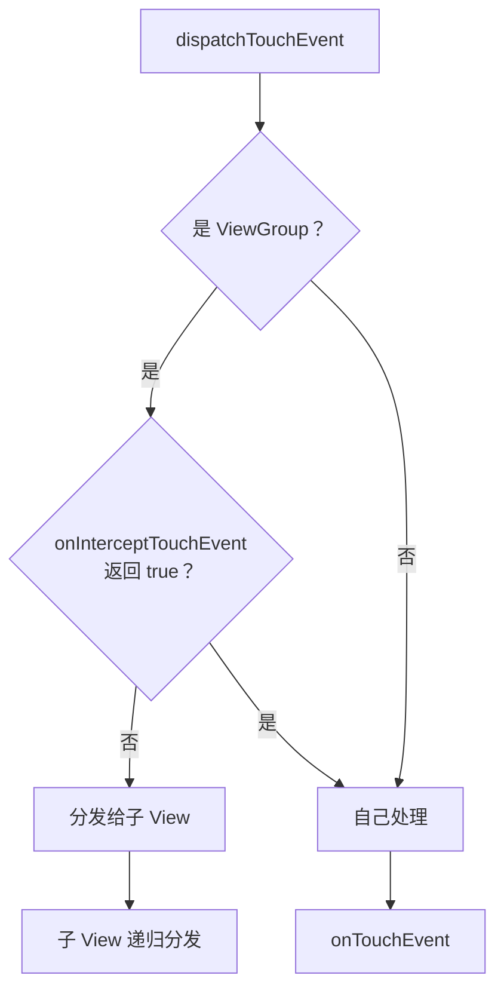
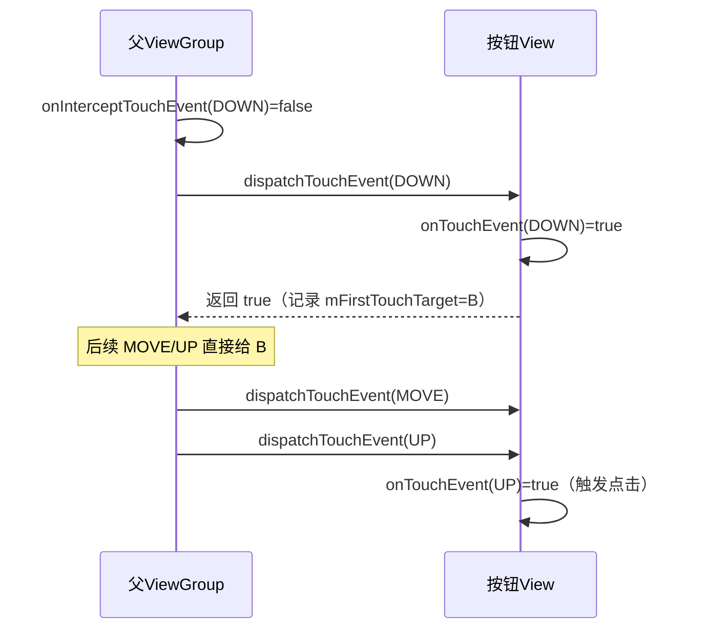

# View 事件分发机制：从 Activity 到 View 的触摸旅程

> 系列：Framework-Source-Note · view
> 难度：⭐⭐⭐⭐ 深入
> 更新：2026-08-26
> 前置知识：Handler 消息机制、Window 基础

---

## 一、一个触摸事件的完整旅程

当手指点一下屏幕，触摸事件要经过一条漫长的链路，最终到达处理它的 View：



**关键理解**：事件分发发生在 View 树内部，核心是三个方法，它们共同决定了「事件给谁、能不能被拦截、最终谁消费」。

## 二、事件分发的三个核心方法

| 方法 | 作用 | 返回值含义 |
|------|------|-----------|
| `dispatchTouchEvent()` | 分发事件（入口） | true = 事件被消费 |
| `onInterceptTouchEvent()` | 拦截事件（仅 ViewGroup） | true = 拦截，不给子 View |
| `onTouchEvent()` | 处理事件 | true = 自己消费 |

**核心关系**：



## 三、事件分发源码解读

### 1. ViewGroup.dispatchTouchEvent 的核心逻辑

```java
public boolean dispatchTouchEvent(MotionEvent ev) {
    boolean handled = false;
    // 1. 判断是否拦截
    final boolean intercepted;
    if (actionMasked == ACTION_DOWN || mFirstTouchTarget != null) {
        intercepted = onInterceptTouchEvent(ev);
    } else {
        intercepted = true;  // 非 DOWN 且无 target，直接拦截
    }

    // 2. 不拦截，则分发给子 View
    if (!intercepted) {
        // 遍历子 View，找到能接收事件的
        for (int i = childrenCount - 1; i >= 0; i--) {
            if (dispatchTransformedTouchEvent(ev, child)) {
                // 子 View 消费了，记录 target
                mFirstTouchTarget = child;
                handled = true;
                break;
            }
        }
    }

    // 3. 没子 View 消费，自己处理
    if (mFirstTouchTarget == null) {
        handled = dispatchTransformedTouchEvent(ev, null);
    }
    return handled;
}
```

**三个关键点**：
1. **拦截只在 DOWN 或已有 target 时判断**：一旦事件序列开始，后续 MOVE/UP 会沿用第一次的决定。
2. **从后往前遍历子 View**：后添加的 View 在上层，优先接收。
3. **mFirstTouchTarget**：记录消费了 DOWN 的子 View，后续事件直接给它。

### 2. onInterceptTouchEvent 默认返回 false

```java
public boolean onInterceptTouchEvent(MotionEvent ev) {
    return false;  // 默认不拦截
}
```

ViewGroup 默认不拦截，让子 View 优先处理。这就是「事件从外到内」的体现。

## 四、一个完整的 DOWN → UP 序列

以「父 ViewGroup 里一个按钮被点击」为例：



**核心理解**：一个完整的事件序列（DOWN → MOVE → UP），一旦 DOWN 被某个 View 消费，整个序列都会交给它，中途不会换人。

## 五、事件拦截的经典场景：滑动冲突

这是事件分发最经典的应用。比如外层 ScrollView 内嵌横向 RecyclerView：

```java
// 父 ViewGroup 重写 onInterceptTouchEvent
@Override
public boolean onInterceptTouchEvent(MotionEvent ev) {
    switch (ev.getAction()) {
        case MotionEvent.ACTION_MOVE:
            // 横向滑动时拦截（自己处理），纵向滑动时不拦截（给子 View）
            if (横向滑动) {
                return true;  // 拦截，父自己处理
            }
            break;
    }
    return super.onInterceptTouchEvent(ev);
}
```

**解决滑动冲突的两条路**：
1. **外部拦截法**：父 ViewGroup 在 MOVE 时判断是否需要拦截。
2. **内部拦截法**：子 View 通过 `requestDisallowInterceptTouchEvent(true)` 请求父不要拦截。

## 六、onTouchEvent 的点击判定

View 的点击（onClick）是在 onTouchEvent 的 UP 事件里判定的：

```java
public boolean onTouchEvent(MotionEvent event) {
    switch (event.getAction()) {
        case MotionEvent.ACTION_UP:
            // 满足条件则触发 onClick
            if (mPerformClick == null) {
                mPerformClick = new PerformClick();
            }
            if (!post(mPerformClick)) {
                performClick();
            }
            break;
    }
}
```

**注意**：如果 View 的 `onTouchEvent` 返回 false（不消费），那么 onClick 不会触发。

## 七、常见问题总结

| 问题 | 答案 |
|------|------|
| 事件分发顺序 | Activity → Window → DecorView → ViewGroup → View |
| 拦截发生在哪 | ViewGroup 的 onInterceptTouchEvent |
| 子 View 怎么阻止父拦截 | `requestDisallowInterceptTouchEvent(true)` |
| 一次序列几个事件 | DOWN → 多个 MOVE → UP（还可能 CANCEL） |
| 点击在哪触发 | onTouchEvent 的 UP |

## 八、总结

| 要点 | 结论 |
|------|------|
| 三个方法 | dispatch（分发）/ intercept（拦截）/ touch（处理） |
| 分发方向 | 从外到内，从父到子 |
| 消费规则 | DOWN 被谁消费，整个序列归谁 |
| 拦截默认 | ViewGroup 默认不拦截 |
| 经典应用 | 滑动冲突、事件拦截 |

---

**下一篇预告**：《View 绘制流程：measure / layout / draw》

> 配套仓库：[Framework-Source-Note](https://github.com/jason5200/Framework-Source-Note)
