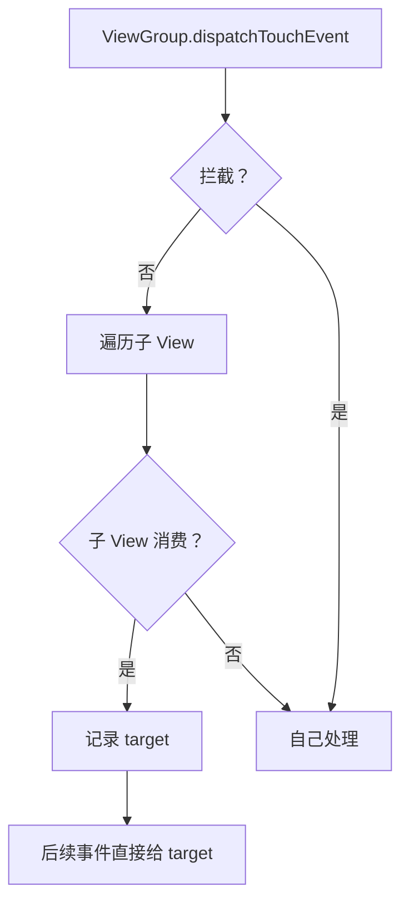

# View 事件分发的完整源码

> 系列：Framework-Source-Note · view
> 难度：⭐⭐⭐⭐⭐ 深入
> 更新：2026-08-27
> 前置知识：《View 事件分发机制》

---

## 一、本文目标

上一篇《View 事件分发机制》讲了三个方法的概念，这一篇深入到 `dispatchTouchEvent` 的**完整源码**，看事件到底怎么在 View 树里传递。

## 二、ViewGroup.dispatchTouchEvent 的完整源码

这是事件分发的核心，代码很长，但逻辑清晰：

```java
// ViewGroup.java
public boolean dispatchTouchEvent(MotionEvent ev) {
    boolean handled = false;
    if (onFilterTouchEventForSecurity(ev)) {
        final int action = ev.getAction();
        final int actionMasked = action & MotionEvent.ACTION_MASK;

        // ★ 1. 判断是否拦截（只在 DOWN 或已有 target 时）
        if (actionMasked == MotionEvent.ACTION_DOWN) {
            // DOWN 事件：重置状态
            cancelAndClearTouchTargets(ev);
            resetTouchState();
        }

        final boolean intercepted;
        if (actionMasked == MotionEvent.ACTION_DOWN
                || mFirstTouchTarget != null) {
            // 询问是否拦截
            intercepted = onInterceptTouchEvent(ev);
        } else {
            // 非 DOWN 且无 target，直接拦截
            intercepted = true;
        }

        // ★ 2. 不拦截，分发给子 View
        if (!intercepted) {
            if (actionMasked == MotionEvent.ACTION_DOWN) {
                // 遍历子 View（从后往前）
                for (int i = childrenCount - 1; i >= 0; i--) {
                    View child = getAndVerifyPreorderedView(i);
                    // 判断事件是否落在子 View 上
                    if (!canViewReceivePointerEvents(child)
                            || !isTransformedTouchPointInView(x, y, child)) {
                        continue;
                    }

                    // 递归分发
                    if (dispatchTransformedTouchEvent(ev, false, child, ...)) {
                        // 子 View 消费了，记录 target
                        newTouchTarget = addTouchTarget(child, ...);
                        alreadyDispatchedToNewTouchTarget = true;
                        break;
                    }
                }
            }
        }

        // ★ 3. 没子 View 消费，自己处理
        if (mFirstTouchTarget == null) {
            handled = dispatchTransformedTouchEvent(ev, true, null, ...);
        }
    }
    return handled;
}
```

## 三、onInterceptTouchEvent 的默认实现

```java
// ViewGroup.java
public boolean onInterceptTouchEvent(MotionEvent ev) {
    if (ev.isFromSource(InputDevice.SOURCE_MOUSE)
            && ev.getAction() == MotionEvent.ACTION_DOWN
            && ev.isButtonPressed(MotionEvent.BUTTON_PRIMARY)
            && isOnScrollbarThumb(ev.getX(), ev.getY())) {
        return true;  // 特殊情况：点击滚动条拦截
    }
    return false;  // 默认不拦截
}
```

## 四、dispatchTransformedTouchEvent 源码

这是「真正把事件传给子 View 或自己」的方法：

```java
private boolean dispatchTransformedTouchEvent(MotionEvent event, boolean cancel,
        View child, int desiredPointerIdBits) {
    boolean handled;

    if (child == null) {
        // 没有子 View，自己处理
        handled = super.dispatchTouchEvent(event);
    } else {
        // 传给子 View
        handled = child.dispatchTouchEvent(event);
    }
    return handled;
}
```

## 五、View.dispatchTouchEvent（叶子节点）

```java
// View.java
public boolean dispatchTouchEvent(MotionEvent event) {
    boolean result = false;

    if (onFilterTouchEventForSecurity(event)) {
        // 1. 如果有 OnTouchListener，先调用它
        ListenerInfo li = mListenerInfo;
        if (li != null && li.mOnTouchListener != null
                && (mViewFlags & ENABLED_MASK) == ENABLED
                && li.mOnTouchListener.onTouch(this, event)) {
            result = true;  // OnTouchListener 消费了
        }

        // 2. 否则调用 onTouchEvent
        if (!result && onTouchEvent(event)) {
            result = true;
        }
    }
    return result;
}
```

**关键点**：`OnTouchListener` 优先于 `onTouchEvent`，如果前者返回 true，后者不再调用。

## 六、addTouchTarget：记录消费的 target

```java
private TouchTarget addTouchTarget(View child, int pointerIdBits) {
    TouchTarget target = TouchTarget.obtain(child, pointerIdBits);
    target.next = mFirstTouchTarget;
    mFirstTouchTarget = target;
    return target;
}
```

**关键理解**：`mFirstTouchTarget` 是一个链表，记录「消费了 DOWN 的子 View」。后续 MOVE/UP 直接沿这个链表分发。

## 七、完整的事件分发流程



## 八、总结

| 要点 | 结论 |
|------|------|
| 拦截判断 | DOWN 或已有 target 时才问 |
| 子 View 遍历 | 从后往前（后画的在上层） |
| target 记录 | mFirstTouchTarget 链表 |
| 叶子分发 | OnTouchListener → onTouchEvent |

---

**下一篇预告**：《模型量化误差的完整分析》

> 配套仓库：[Framework-Source-Note](https://github.com/jason5200/Framework-Source-Note)
