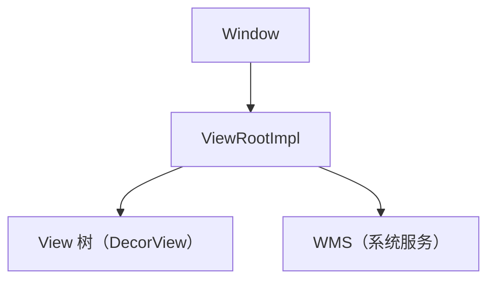
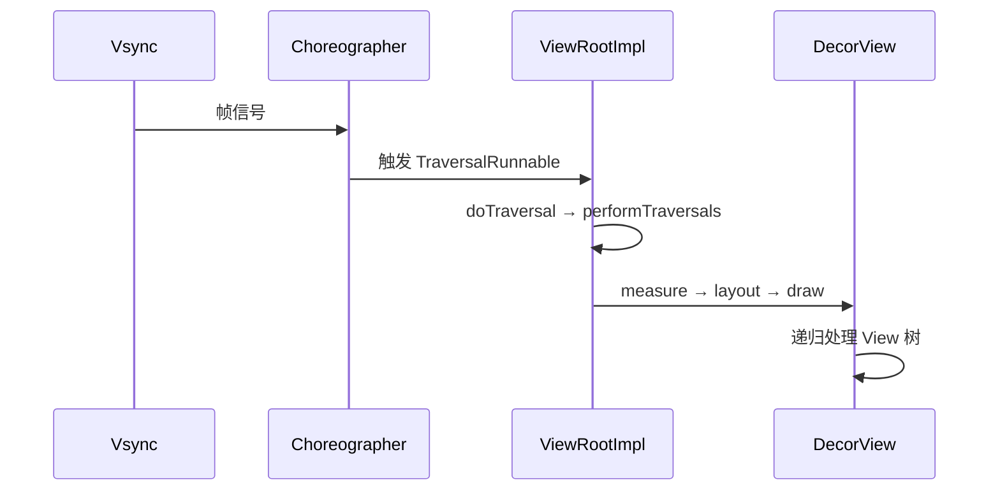

# ViewRootImpl 绘制流程的完整源码

> 系列：Framework-Source-Note · view
> 难度：⭐⭐⭐⭐⭐ 深入
> 更新：2026-08-27
> 前置知识：《View 绘制流程》《Choreographer 与渲染机制》

---

## 一、本文目标

前面讲过 measure/layout/draw 三阶段，但都是「概念」。这一篇深入到 `ViewRootImpl` 源码，看这三阶段到底是怎么被调度的。

## 二、ViewRootImpl 是什么

ViewRootImpl 是连接 Window 和 View 树的桥梁，每个 Window 有一个：



## 三、performTraversals：绘制的总入口

所有绘制都从 `performTraversals` 开始：

```java
// ViewRootImpl.java
private void performTraversals() {
    // 1. 测量（measure）
    performMeasure(childWidthMeasureSpec, childHeightMeasureSpec);

    // 2. 布局（layout）
    performLayout(lp, desiredWindowWidth, desiredWindowHeight);

    // 3. 绘制（draw）
    performDraw();
}
```

## 四、performMeasure 源码

```java
private void performMeasure(int childWidthMeasureSpec, int childHeightMeasureSpec) {
    // 调用 View 树的 measure
    mView.measure(childWidthMeasureSpec, childHeightMeasureSpec);
}
```

`mView` 就是 DecorView，调用它的 `measure` 会递归测量整个 View 树。

## 五、performLayout 源码

```java
private void performLayout(WindowManager.LayoutParams lp, int desiredWindowWidth, int desiredWindowHeight) {
    // 调用 View 树的 layout
    mView.layout(0, 0, mView.getMeasuredWidth(), mView.getMeasuredHeight());
}
```

## 六、performDraw 源码

```java
private void performDraw() {
    // 1. 绘制到软件或硬件 Canvas
    boolean canUseAsync = draw(fullRedrawNeeded);

    // 2. 最终合成
    mAttachInfo.mThreadedRenderer.draw(...);  // 硬件加速
}
```

## 七、为什么「一个 performTraversals 不一定走三步」

performTraversals 内部有大量**判断**，不是每次都执行三步：

```java
private void performTraversals() {
    boolean layoutRequested = ...;
    boolean windowSizeMayChange = ...;

    // 只有尺寸变化时才 measure
    if (layoutRequested || windowSizeMayChange) {
        performMeasure(...);
    }

    // 只有布局变化时才 layout
    if (layoutRequested) {
        performLayout(...);
    }

    // 内容变化时才 draw
    if (mDirty) {
        performDraw();
    }
}
```

**关键理解**：这正是上一篇《invalidate vs requestLayout》的源码依据：
- `invalidate` 只标记 dirty → 只走 draw
- `requestLayout` 标记 layoutRequested → 走 measure+layout+draw

## 八、scheduleTraversals 与 Vsync

performTraversals 不是立即执行，而是调度到下一个 Vsync：

```java
void scheduleTraversals() {
    if (!mTraversalScheduled) {
        mTraversalScheduled = true;
        // 通过 Choreographer 调度到下一帧
        mChoreographer.postCallback(
            Choreographer.CALLBACK_TRAVERSAL, mTraversalRunnable, null);
    }
}

final class TraversalRunnable implements Runnable {
    @Override
    public void run() {
        doTraversal();  // 最终调用 performTraversals
    }
}
```

**核心理解**：`requestLayout`/`invalidate` 不是立即重绘，而是「标记 + 调度到下一帧」，由 Vsync 驱动统一执行。

## 九、完整的绘制调度链



## 十、总结

| 要点 | 结论 |
|------|------|
| 总入口 | performTraversals |
| 三步 | performMeasure/Layout/Draw |
| 按需执行 | 有判断，非每次都三步 |
| 调度 | scheduleTraversals + Vsync |

---

**下一篇预告**：《RAG 向量检索的完整实现》

> 配套仓库：[Framework-Source-Note](https://github.com/jason5200/Framework-Source-Note)
