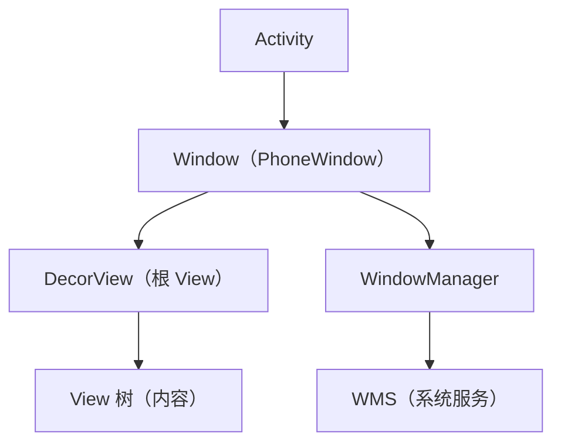
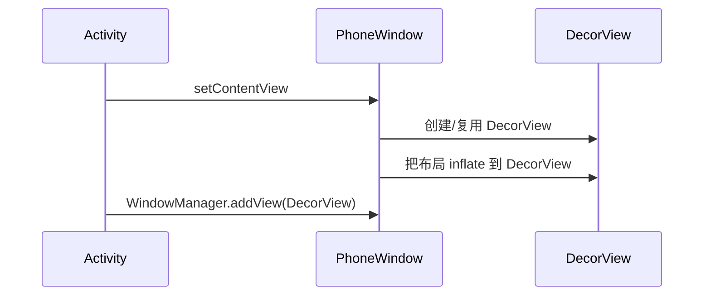

# Window 与 WindowManager 体系

> 系列：Framework-Source-Note · component
> 难度：⭐⭐⭐⭐ 深入
> 更新：2026-08-27
> 前置知识：《WMS 窗口管理解析》《View 绘制流程》

---

## 一、Window 是什么

Window 是「窗口」的抽象，代表屏幕上一块独立的显示区域。每个 Activity 都有一个 Window，但 Window 本身不承载内容，内容由 View 树提供。



## 二、Window / WindowManager / WMS 三者关系

| 角色 | 作用 | 位置 |
|------|------|------|
| `Window` | 窗口抽象 | App 进程 |
| `WindowManager` | 操作窗口的接口 | App 进程 |
| `WMS` | 窗口管理服务 | system_server |

**关键理解**：App 通过 WindowManager 操作 Window，WindowManager 通过 Binder 与 WMS 通信。

## 三、Window 的类型

窗口有层级之分，用 type 表示：

| type | 层级 | 示例 |
|------|------|------|
| 应用窗口 | 1~99 | Activity |
| 子窗口 | 1000~1999 | Dialog、PopupWindow |
| 系统窗口 | 2000+ | Toast、状态栏、悬浮窗 |

```java
// 悬浮窗需要系统窗口类型
WindowManager.LayoutParams params = new WindowManager.LayoutParams(
    WindowManager.LayoutParams.TYPE_APPLICATION_OVERLAY,
    WindowManager.LayoutParams.FLAG_NOT_FOCUSABLE,
    PixelFormat.TRANSLUCENT
);
```

## 四、添加一个 Window

```java
WindowManager wm = getSystemService(WindowManager.class);

// 创建 View
TextView view = new TextView(this);
view.setText("悬浮窗");

// 设置参数
WindowManager.LayoutParams params = new WindowManager.LayoutParams(
    WindowManager.LayoutParams.WRAP_CONTENT,
    WindowManager.LayoutParams.WRAP_CONTENT,
    WindowManager.LayoutParams.TYPE_APPLICATION_OVERLAY,
    WindowManager.LayoutParams.FLAG_NOT_FOCUSABLE,
    PixelFormat.TRANSLUCENT
);

// 添加窗口
wm.addView(view, params);
```

**关键**：`addView` 最终通过 Binder 走到 WMS 的 `addWindow`。

## 五、Window 的 flags

| flag | 作用 |
|------|------|
| `FLAG_NOT_FOCUSABLE` | 不获取焦点 |
| `FLAG_NOT_TOUCH_MODAL` | 窗口外点击不消失 |
| `FLAG_FULLSCREEN` | 全屏 |
| `FLAG_KEEP_SCREEN_ON` | 保持屏幕常亮 |

## 六、DecorView 的创建流程



## 七、Dialog / PopupWindow / Toast 的本质

它们都是「Window」的不同封装：

| 组件 | 本质 |
|------|------|
| Dialog | 子窗口，独立的 DecorView |
| PopupWindow | 子窗口，锚定位置 |
| Toast | 系统窗口，不获取焦点 |

**核心理解**：理解了 Window，就理解了「为什么 Dialog 有独立的生命周期、为什么 Toast 点击穿透」。

## 八、常见坑

| 坑 | 说明 |
|----|------|
| 忘记 removeView | 窗口泄漏 |
| 悬浮窗权限 | 需要 OVERLAY 权限 |
| type 使用错误 | 层级混乱 |
| Window 泄漏 | Activity 销毁后 Window 还在 |

## 九、总结

| 要点 | 结论 |
|------|------|
| Window | 窗口抽象，承载 View 树 |
| WindowManager | 操作窗口的接口 |
| WMS | 系统侧窗口管理 |
| 三种层级 | 应用/子/系统窗口 |

---

**下一篇预告**：《View 的 invalidate 与 requestLayout》

> 配套仓库：[Framework-Source-Note](https://github.com/jason5200/Framework-Source-Note)
