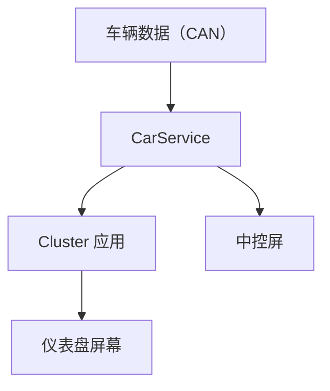
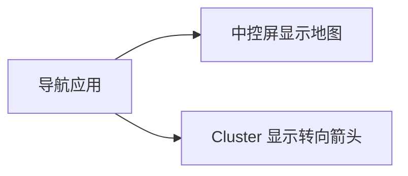

# 车载仪表盘：Cluster 显示

> 系列：AAOS-Guide · 17-cluster
> 难度：⭐⭐⭐⭐ 深入
> 更新：2026-08-27
> 前置知识：《车机多屏显示》
>
> 车速等信号请用 `CarPropertyManager`。

---

## 一、仪表盘（Cluster）的特殊性

仪表盘是驾驶员正前方的屏幕，显示车速、转速、导航等关键信息。它有几个特殊要求：

| 要求 | 说明 |
|------|------|
| 绝对可靠 | 不能黑屏、卡顿 |
| 信息精简 | 一眼能看清，避免分心 |
| 高刷新率 | 车速等数据实时更新 |
| 独立显示 | 不依赖中控屏 |

## 二、Cluster 的显示架构



**关键理解**：Cluster 是一个独立的显示区域，可以和中控屏共用同一个 Android 系统，但内容独立。

## 三、Cluster 的显示方式

| 方式 | 说明 |
|------|------|
| 独立 Activity | 指定 displayId 启动 |
| Presentation | 副屏显示类 |
| 硬件渲染 | 独立 GPU 输出 |

### 使用 Presentation 显示仪表盘

```kotlin
class ClusterPresentation(context: Context, display: Display) :
    Presentation(context, display) {

    override fun onCreate(savedInstanceState: Bundle?) {
        super.onCreate(savedInstanceState)
        setContentView(R.layout.cluster_view)
    }

    fun updateSpeed(speed: Float) {
        findViewById<TextView>(R.id.tvSpeed).text = speed.toString()
    }
}
```

## 四、启动仪表盘到 Cluster 屏

```kotlin
val displayManager = getSystemService(DisplayManager::class.java)
// 找到仪表盘屏
val clusterDisplay = displayManager.displays.firstOrNull {
    it.displayId != Display.DEFAULT_DISPLAY
}

val options = ActivityOptions.makeBasic()
options.launchDisplayId = clusterDisplay?.displayId ?: 0

startActivity(intent, options.toBundle())
```

## 五、Cluster 的数据实时更新

仪表盘数据（车速、转速）变化快，用 `CarPropertyManager.registerCallback`：

```kotlin
propertyManager.registerCallback(
    object : CarPropertyManager.CarPropertyEventCallback {
        override fun onChangeEvent(value: CarPropertyValue<*>) {
            if (value.propertyId == VehiclePropertyIds.PERF_VEHICLE_SPEED
                && value.status == CarPropertyValue.STATUS_AVAILABLE) {
                val mps = value.value as Float
                clusterPresentation.updateSpeed(mps * 3.6f)
            }
        }
        override fun onErrorEvent(propId: Int, areaId: Int) {}
    },
    VehiclePropertyIds.PERF_VEHICLE_SPEED,
    CarPropertyManager.SENSOR_RATE_UI
)
```

## 六、Cluster 显示的关键信息

| 信息 | 数据来源 |
|------|----------|
| 车速 | `PERF_VEHICLE_SPEED`（Property） |
| 转速 | `ENGINE_RPM`（Property，有发动机才有） |
| 油量/电量 | `FUEL_LEVEL` / `EV_BATTERY_LEVEL` |
| 导航指引 | 导航应用 |
| 警示灯 | 诊断相关 Property / 车身信号 |

## 七、Cluster 与中控屏的联动

导航信息常在 Cluster 和中控屏之间联动：



## 八、常见坑

| 坑 | 说明 |
|----|------|
| 数据刷新卡顿 | 优化采样率，减少不必要的更新 |
| 信息过载 | Cluster 信息要精简 |
| displayId 写死 | 动态查询 |
| 渲染性能差 | 仪表盘要求高刷新 |

## 九、总结

| 要点 | 结论 |
|------|------|
| Cluster | 驾驶员正前方，独立显示 |
| 显示方式 | Presentation / 指定 displayId |
| 数据实时 | 监听传感器变化 |
| 要求 | 可靠、精简、高刷新 |

---

**下一篇预告**：《车载 HUD：抬头显示》

> 配套仓库：[AAOS-Guide](https://github.com/jason5200/AAOS-Guide)
