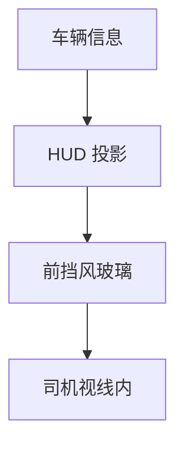
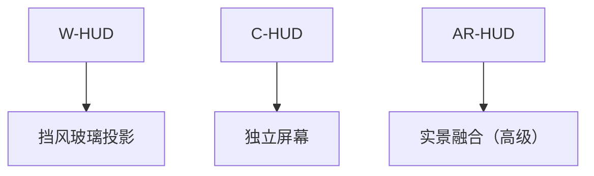
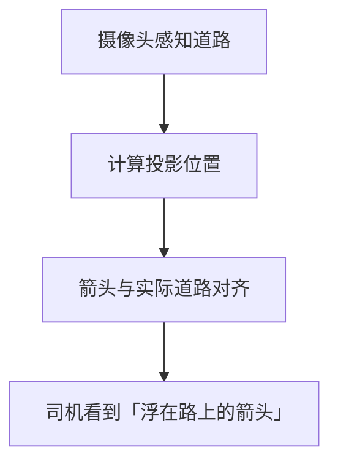
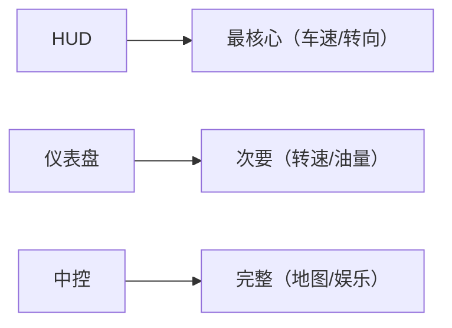

# 车载 HUD：抬头显示

> 系列：AAOS-Guide · 18-hud
> 难度：⭐⭐⭐ 进阶
> 更新：2026-08-27
> 前置知识：《车载仪表盘》《车机多屏显示》

---

## 一、HUD 是什么

**HUD（Head-Up Display，抬头显示）**：把关键信息投影到前挡风玻璃或专用屏幕上，让司机**不低头**就能看到信息。



**核心价值**：减少视线离开路面的时间，提升安全。

## 二、HUD 显示的关键信息

HUD 只显示**最关键的驾驶信息**，不是第二个仪表盘：

| 信息 | 说明 |
|------|------|
| 车速 | 最核心 |
| 导航转向 | 箭头指引 |
| 限速 | 当前限速 |
| 警示 | 碰撞预警等 |

**原则**：信息极简，一眼能懂。

## 三、HUD 的显示技术

| 技术 | 说明 |
|------|------|
| W-HUD（挡风玻璃式） | 投影到前挡风 |
| C-HUD（组合式） | 独立小屏幕 |
| AR-HUD | 增强现实，与实景融合 |



## 四、AR-HUD 的前景

AR-HUD 是趋势，把导航箭头「画」在实际道路上：



## 五、Android 侧 HUD 的实现

HUD 通常也是独立的显示区域，用 Presentation 或指定 displayId：

```kotlin
class HudPresentation(context: Context, display: Display) :
    Presentation(context, display) {

    override fun onCreate(savedInstanceState: Bundle?) {
        super.onCreate(savedInstanceState)
        setContentView(R.layout.hud_view)
    }

    fun updateSpeed(speed: Float) {
        findViewById<TextView>(R.id.tvHudSpeed).text = speed.toString()
    }
}
```

## 六、HUD 的信息设计原则

| 原则 | 说明 |
|------|------|
| 极简 | 只显示关键信息 |
| 高对比 | 任何光照下清晰 |
| 不遮挡视线 | 信息放在视线边缘 |
| 快速更新 | 数据实时 |

## 七、HUD 与仪表盘/中控的分工



**核心理解**：三个屏幕信息量递增，HUD 最少但最关键，中控最多但次要。

## 八、常见坑

| 坑 | 说明 |
|----|------|
| 信息过载 | HUD 只显示关键信息 |
| 对比度不足 | 强光下看不清 |
| 遮挡视线 | 信息位置要合理 |
| 更新延迟 | 车速等要实时 |

## 九、总结

| 要点 | 结论 |
|------|------|
| HUD | 抬头显示，减少低头 |
| 三种技术 | W-HUD/C-HUD/AR-HUD |
| 信息原则 | 极简、高对比、关键 |
| 三屏分工 | HUD 最少最关键 |

---

**下一篇预告**：《车载通信：V2X 车联网》

> 配套仓库：[AAOS-Guide](https://github.com/jason5200/AAOS-Guide)
