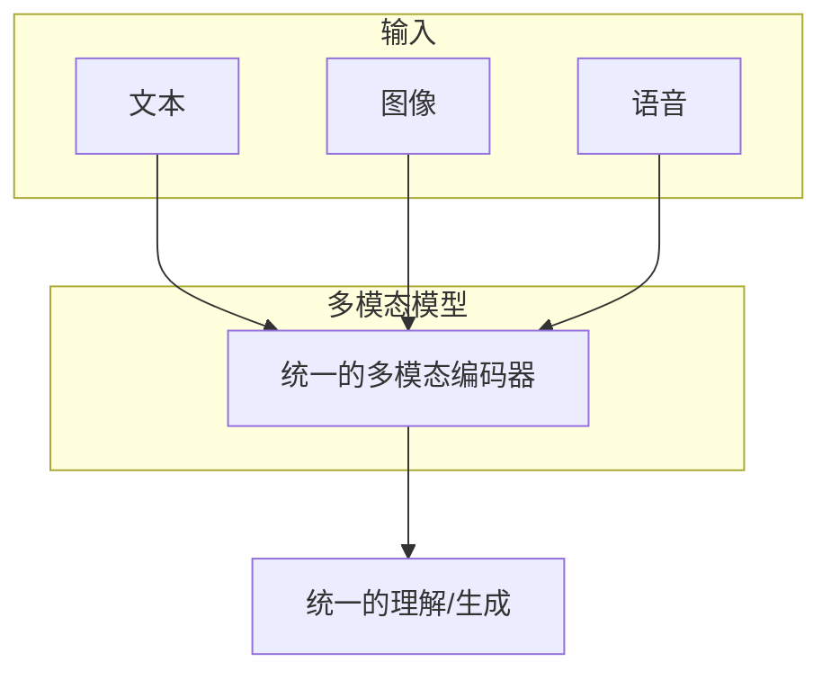
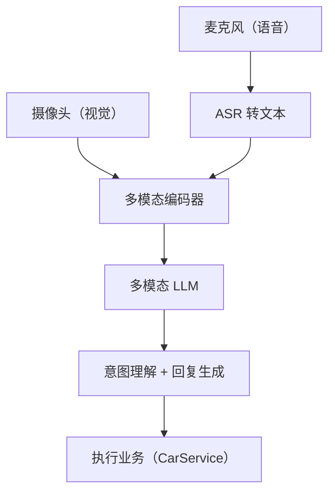

# 车载多模态：语音 + 视觉融合

> 系列：AAOS-Guide · 10-multimodal
> 难度：⭐⭐⭐⭐ 进阶
> 更新：2026-08-26
> 前置知识：《车载语音助手》《大模型上车：端侧推理》

---

## 一、为什么车机需要多模态

单独靠语音或单独靠视觉，都覆盖不了真实驾驶场景：

| 场景 | 单模态的问题 |
|------|-------------|
| 手势 + 语音「把空调调低」 | 只听语音，不知道手指的是空调还是音乐 |
| 看一眼副驾「帮他调座椅」 | 只看视觉，不知道意图 |
| 嘈杂环境语音指令 | 语音识别容易出错 |

**多模态（Multimodal）** 就是让模型同时理解**语音 + 图像 + 文本**等多种输入，交叉印证，理解更准。

## 二、多模态大模型是什么

传统模型：一种输入一种输出（如语音→文本）。

多模态模型：**多种输入统一理解**。



## 三、车载多模态的典型场景

### 1. 视觉 + 语音：指着问

```
用户（指着中控某个按钮）：「这个是什么意思？」

多模态理解：
- 视觉：识别手指指向的按钮位置
- 语音：理解"这个"指代
- 融合：定位到具体按钮，给出解释
```

### 2. 视线 + 语音：看向问

```
用户看向后视镜：「后面那车离我多远？」

多模态理解：
- 视线追踪：判断用户在看后视镜
- 结合车辆传感器：读取后车距离
```

### 3. 手势 + 语音：比划 + 说

```
用户挥手 + 「把音乐关掉」

多模态理解：
- 视觉：识别挥手手势
- 语音：理解指令
- 融合：执行关音乐
```

## 四、技术架构



## 五、端侧多模态的挑战

| 挑战 | 说明 | 对策 |
|------|------|------|
| 模型更大 | 多模态模型比纯文本大 | 量化 + 小模型 |
| 算力需求高 | 图像处理吃算力 | NPU 加速 |
| 实时性 | 视觉处理要快 | 轻量视觉编码器 |
| 隐私 | 车内图像敏感 | 端侧处理，不上传 |

## 六、一个简化的多模态问答流程

```kotlin
// 伪代码：视觉 + 语音融合问答
suspend fun multimodalAsk(image: Bitmap, question: String): String {
    // 1. 图像编码
    val imageEmbedding = visionEncoder.encode(image)

    // 2. 文本编码
    val textEmbedding = textEncoder.encode(question)

    // 3. 融合输入多模态模型
    val answer = multimodalLLM.generate(
        image = imageEmbedding,
        text = textEmbedding
    )
    return answer
}
```

## 七、当前可用的多模态模型

| 模型 | 特点 | 端侧可行性 |
|------|------|-----------|
| GPT-4V / GPT-4o | 云端最强 | 需云端 |
| Qwen-VL | 开源，中文好 | 量化后可行 |
| MiniCPM-V | 轻量，端侧友好 | 适合端侧 |
| LLaVA | 学术经典 | 量化后可行 |

## 八、落地建议

| 阶段 | 目标 | 方案 |
|------|------|------|
| MVP | 打通多模态 | 云端多模态 API |
| 优化 | 隐私 + 低延迟 | 视觉端侧 + 语音端侧 |
| 进阶 | 深度定制 | 车载场景微调 |

## 九、总结

| 要点 | 结论 |
|------|------|
| 多模态是什么 | 统一理解语音+图像+文本 |
| 车机价值 | 交叉印证，理解更准 |
| 典型场景 | 指着问、看向问、手势+语音 |
| 核心挑战 | 模型大、算力、实时性、隐私 |

---

**下一篇预告**：《Agent 框架：Function Calling 实战》

> 配套仓库：[AAOS-Guide](https://github.com/jason5200/AAOS-Guide)
