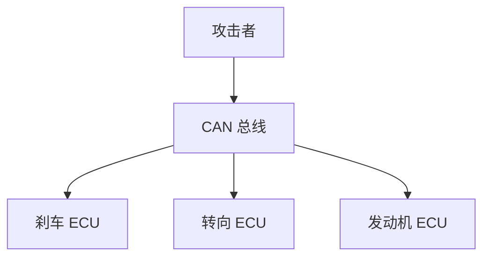
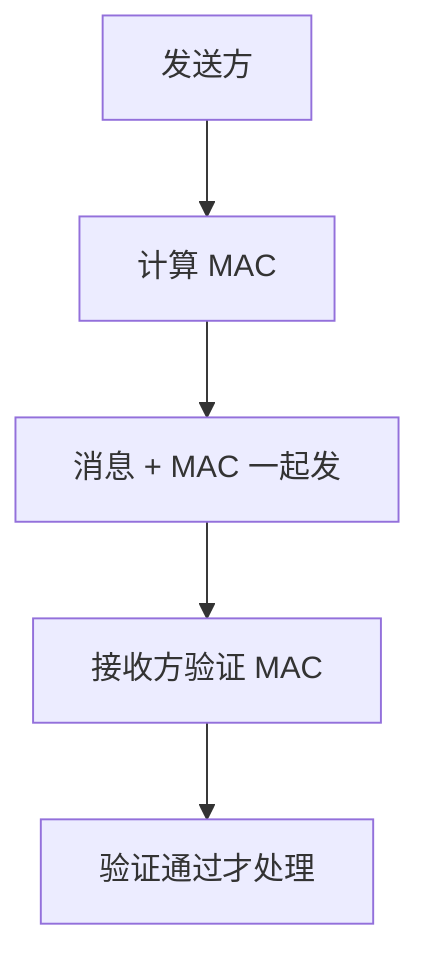
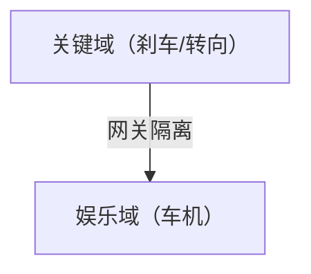

# 车载网络安全：CAN 总线安全

> 系列：AAOS-Guide · 21-security
> 难度：⭐⭐⭐⭐ 进阶
> 更新：2026-08-27
> 前置知识：《Vehicle HAL 深入》

---

## 一、车载网络安全的严峻性

现代汽车有几十个 ECU（电子控制单元），通过 CAN 总线互联。一旦被攻击，后果严重：

- 远程控制刹车、转向
- 窃取车辆数据
- 干扰驾驶辅助系统



## 二、CAN 总线的安全缺陷

CAN 总线设计之初没考虑安全：

| 缺陷 | 说明 |
|------|------|
| 无认证 | 任何节点都能发消息 |
| 无加密 | 消息明文传输 |
| 广播式 | 所有节点都能收到 |

**关键理解**：CAN 总线「谁都能说、说啥都信」，这是根本安全隐患。

## 三、典型攻击方式

| 攻击 | 说明 |
|------|------|
| 消息注入 | 伪造 CAN 消息 |
| 重放攻击 | 重发合法消息 |
| 拒绝服务 | 洪水攻击占用总线 |
| 固件篡改 | 修改 ECU 固件 |

## 四、防护措施

### 1. 消息认证

给 CAN 消息加认证码（MAC）：



### 2. 入侵检测（IDS）

监测 CAN 总线的异常流量：

```java
// 简化：监测 CAN 消息频率
class CanIntrusionDetector {
    Map<Integer, Integer> msgCount = new HashMap<>();

    void onMessage(CanMessage msg) {
        int count = msgCount.getOrDefault(msg.id, 0);
        if (count > THRESHOLD) {
            // 异常频率，可能是攻击
            alert("异常 CAN 消息频率: " + msg.id);
        }
        msgCount.put(msg.id, count + 1);
    }
}
```

### 3. 网络隔离

关键 ECU（刹车、转向）与娱乐系统隔离：



**核心理解**：即使车机被攻破，也不能影响刹车、转向等关键系统。

## 五、安全网关

安全网关是隔离的关键：

| 功能 | 说明 |
|------|------|
| 域隔离 | 关键域与娱乐域隔离 |
| 消息过滤 | 只放行合法消息 |
| 防火墙 | 阻止异常访问 |

## 六、车载网络安全的法规

- **UNECE WP.29**：要求车辆具备网络安全能力
- **ISO 21434**：车载网络安全工程标准

## 七、开发中的安全实践

| 实践 | 说明 |
|------|------|
| 最小权限 | 每个 ECU 只做必要的事 |
| 安全启动 | 验证固件完整性 |
| 安全更新 | OTA 更新要签名验证 |
| 密钥管理 | 密钥安全存储 |

## 八、总结

| 要点 | 结论 |
|------|------|
| CAN 缺陷 | 无认证、无加密、广播 |
| 攻击方式 | 注入、重放、DoS |
| 防护 | 认证、IDS、隔离 |
| 标准 | ISO 21434 |

---

**下一篇预告**：《车载启动流程：从开机到座舱可用》

> 配套仓库：[AAOS-Guide](https://github.com/jason5200/AAOS-Guide)
