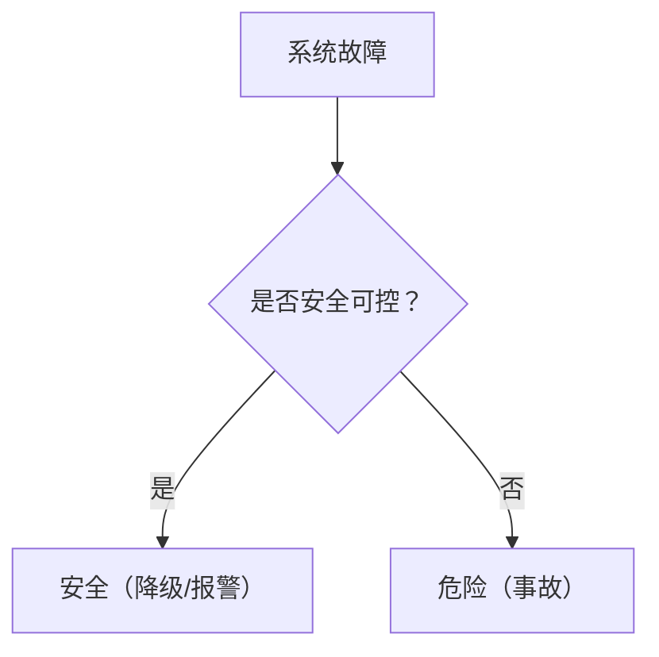
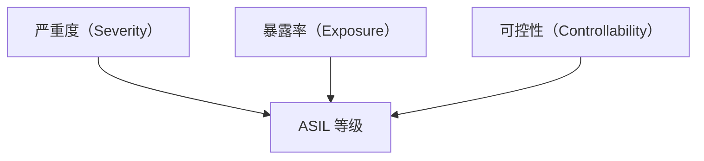
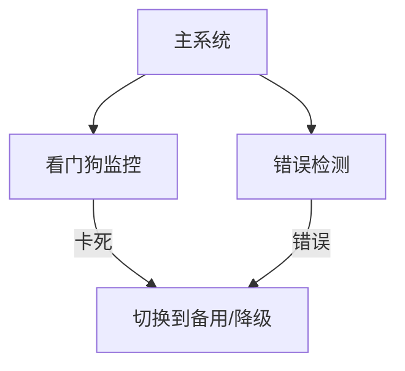

# 车载安全：功能安全与 ISO 26262

> 系列：AAOS-Guide · 20-safety
> 难度：⭐⭐⭐⭐ 进阶
> 更新：2026-08-27
> 前置知识：《车载仪表盘》

---

## 一、功能安全是什么

**功能安全**：确保系统在故障时不会导致危险。对车载系统，就是「系统出错了，也不能导致事故」。



## 二、ISO 26262 标准

ISO 26262 是车载功能安全的国际标准，定义了安全等级：

| 等级 | ASIL | 要求 |
|------|------|------|
| QM | - | 无安全要求 |
| A | ASIL-A | 最低 |
| B | ASIL-B | 低 |
| C | ASIL-C | 中 |
| D | ASIL-D | 最高（如刹车、转向） |

**关键理解**：不同功能有不同的安全等级，等级越高，开发流程和验证越严格。

## 三、ASIL 等级的确定

ASIL 等级由三个因素决定：



| 因素 | 问题 |
|------|------|
| 严重度 | 出事故多严重？ |
| 暴露率 | 场景多常见？ |
| 可控性 | 司机能控制吗？ |

## 四、车载 Android 与功能安全

车载 Android 里，功能安全相关的部分要特别注意：

| 场景 | 安全等级 |
|------|----------|
| 仪表盘显示车速 | ASIL-B（信息错误危险） |
| 倒车影像 | ASIL-B |
| 转向控制 | ASIL-D（最高） |

## 五、安全机制

功能安全的实现依赖多种机制：

| 机制 | 说明 |
|------|------|
| 冗余 | 双份关键部件 |
| 看门狗 | 检测系统卡死 |
| 错误检测 | 校验、自检 |
| 降级模式 | 故障时安全降级 |



## 六、Android 的看门狗（Watchdog）

Android 系统有 Watchdog，监控关键服务：

```java
// Watchdog 监控 AMS 等关键服务
Watchdog.getInstance().addMonitor(new Monitor() {
    @Override
    public void monitor() {
        // 检查服务是否正常
    }
});
```

**关键理解**：Watchdog 超时会触发系统重启，避免「假死」状态。

## 七、开发中的功能安全实践

| 实践 | 说明 |
|------|------|
| 需求追溯 | 每个需求可追溯到安全目标 |
| 严格测试 | 故障注入测试 |
| 代码审查 | 安全关键代码双人审查 |
| 文档 | 安全分析文档齐全 |

## 八、总结

| 要点 | 结论 |
|------|------|
| 功能安全 | 故障不导致危险 |
| ISO 26262 | ASIL 等级 |
| 等级因素 | 严重度/暴露率/可控性 |
| 安全机制 | 冗余、看门狗、降级 |

---

**下一篇预告**：《车载网络安全：CAN 总线安全》

> 配套仓库：[AAOS-Guide](https://github.com/jason5200/AAOS-Guide)
