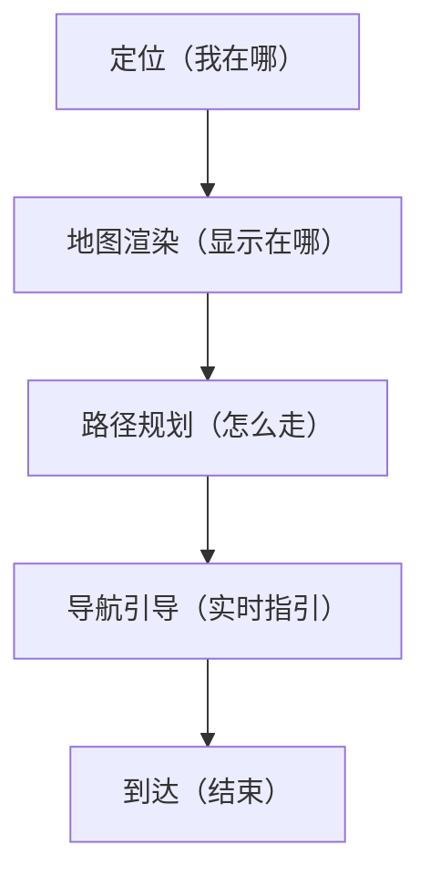
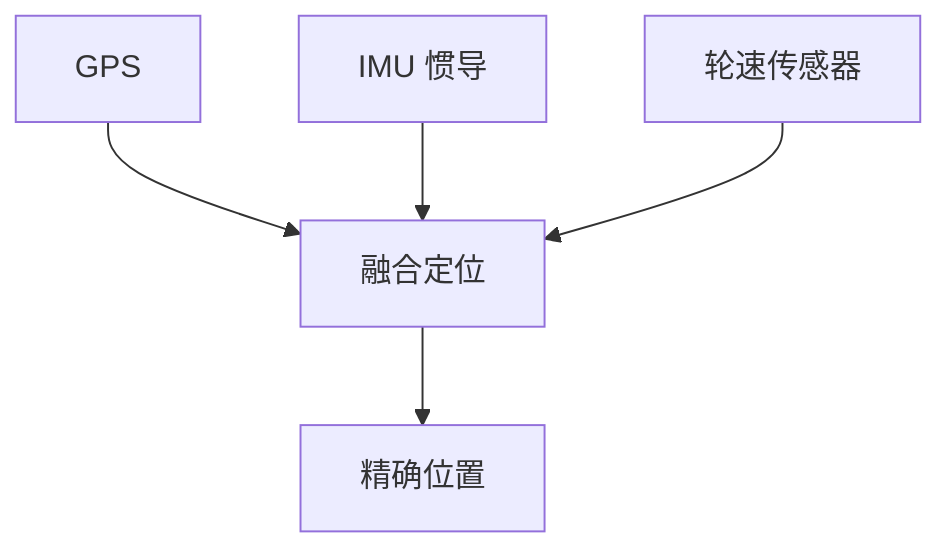
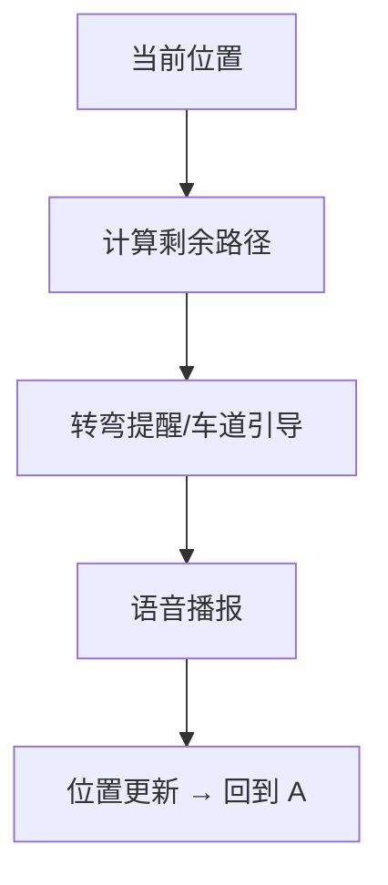

# 车载导航：从定位到路径规划

> 系列：AAOS-Guide · 14-navigation
> 难度：⭐⭐⭐⭐ 深入
> 更新：2026-08-27
> 前置知识：《CarService 架构》《车载语音助手》

---

## 一、车载导航的完整链路

车载导航从「我在哪」到「怎么走」，是一条完整的技术链路：



## 二、定位：我在哪

车载定位通常融合多种信号：

| 信号源 | 作用 |
|--------|------|
| GPS/GNSS | 卫星定位 |
| 惯性导航（IMU） | 隧道/高楼补偿 |
| 轮速传感器 | 车辆自身数据 |
| 地图匹配 | 修正到道路上 |



**关键理解**：单纯 GPS 在隧道、地下车库会失效，多源融合才能连续定位。

## 三、地图渲染

车载地图不是简单图片，而是矢量数据实时渲染：

```java
// 使用地图 SDK（如高德、百度、Mapbox）
MapView mapView = findViewById(R.id.mapView);
mapView.onCreate(savedInstanceState);

// 定位到当前位置
CameraUpdate update = CameraUpdateFactory.newLatLngZoom(
    new LatLng(lat, lng), 15);
mapView.moveCamera(update);
```

## 四、路径规划

路径规划的核心是**图搜索算法**：

| 算法 | 特点 |
|------|------|
| Dijkstra | 最短路径，经典 |
| A* | 启发式，更快 |
| 双向搜索 | 更快 |


## 五、实时导航引导

导航中持续更新：



## 六、车载导航与手机导航的区别

| 维度 | 车载导航 | 手机导航 |
|------|----------|----------|
| 屏幕 | 大屏，仪表盘/HUD 联动 | 小屏 |
| 定位 | 融合车辆传感器 | 依赖手机 GPS |
| 交互 | 语音优先 | 触控为主 |
| 集成 | 与车机系统深度融合 | 独立 App |

## 七、导航的语音播报

导航播报通过 TTS，且要考虑音频焦点（避开音乐、优先播报）：

```java
// 导航播报，请求音频焦点
AudioFocusRequest request = new AudioFocusRequest.Builder(
    AudioManager.AUDIOFOCUS_GAIN_TRANSIENT_MAY_DUCK)
    .setAudioAttributes(new AudioAttributes.Builder()
        .setUsage(AudioAttributes.USAGE_NAVIGATION_GUIDANCE)
        .build())
    .build();
audioManager.requestAudioFocus(request);
// 播放播报
tts.speak("前方 200 米右转", ...);
```

## 八、常见坑

| 坑 | 说明 |
|----|------|
| 隧道 GPS 丢失 | 需惯导融合 |
| 地图数据过大 | 离线包分级下载 |
| 播报与音乐冲突 | 音频焦点管理 |
| 定位漂移 | 地图匹配修正 |

## 九、总结

| 要点 | 结论 |
|------|------|
| 定位 | GPS + IMU + 轮速融合 |
| 路径规划 | A*/Dijkstra 图搜索 |
| 车载特点 | 多屏联动、语音优先 |
| 播报 | TTS + 音频焦点 |

---

**下一篇预告**：《车载多媒体：音频焦点与分区》

> 配套仓库：[AAOS-Guide](https://github.com/jason5200/AAOS-Guide)
