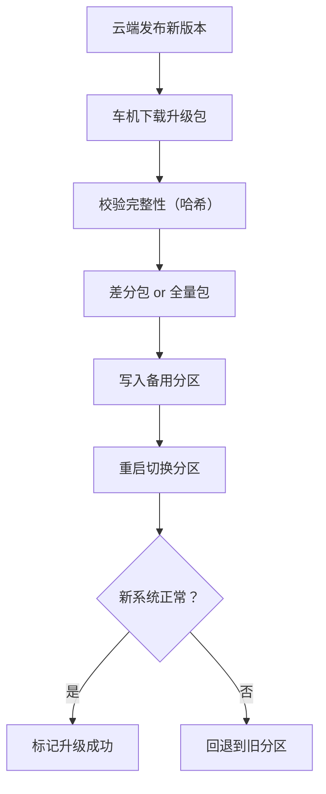
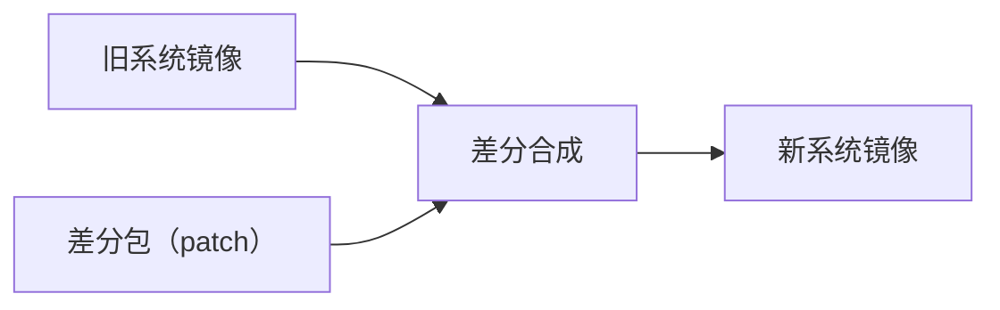
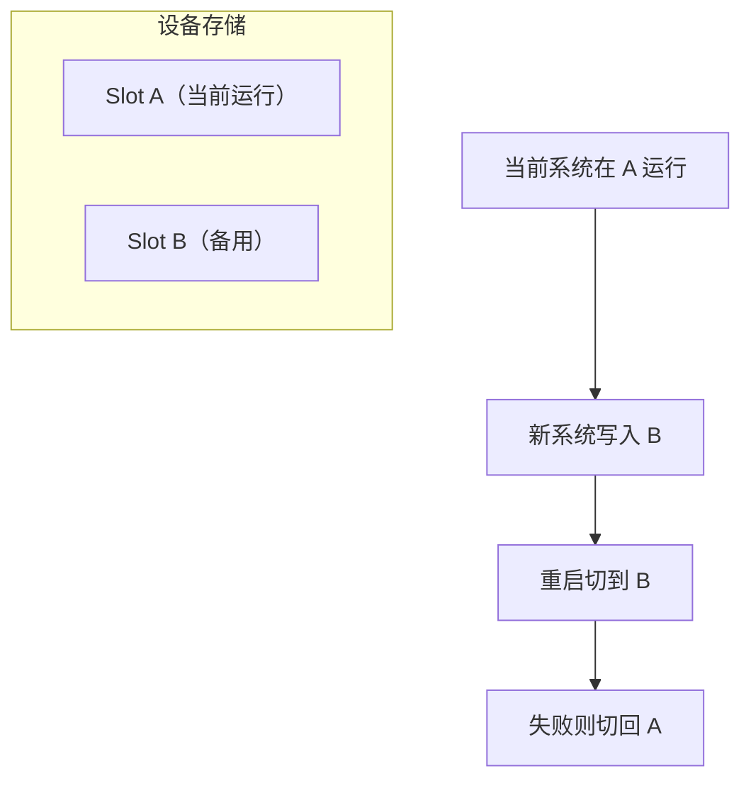
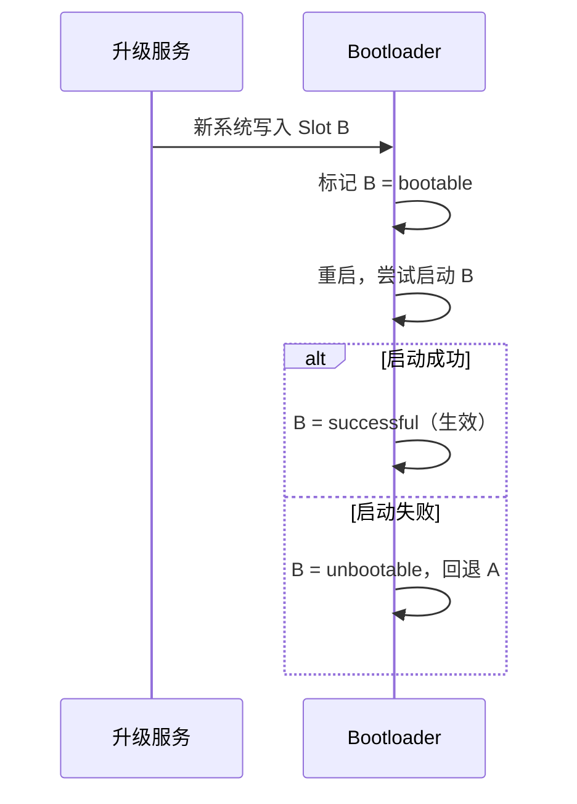

# 车载 OTA 升级：从差分包到 A/B 分区

> 系列：AAOS-Guide · 07-ota
> 难度：⭐⭐⭐⭐ 深入
> 更新：2026-08-26
> 前置知识：《CarService 架构》、Android 系统启动

---

## 一、为什么车载 OTA 特别重要

手机 OTA 升级失败，顶多用户抱怨两句。但车机 OTA 失败可能导致：

- 车机变砖，无法启动
- 影响行车安全（仪表盘黑屏）
- 需要回 4S 店维修，成本极高

所以车载 OTA 的核心诉求是：**升级要安全可靠，失败要能回退**。

## 二、OTA 升级的完整流程



## 三、全量包 vs 差分包

| 类型 | 原理 | 优点 | 缺点 |
|------|------|------|------|
| **全量包** | 完整系统镜像 | 简单可靠 | 体积大（几个 GB） |
| **差分包** | 新旧版本差异 | 体积小（几十 MB） | 生成复杂 |

**差分包原理**：只下发「旧版本 → 新版本」的变化部分，车机本地用差分算法合成新系统。



## 四、A/B 分区机制

这是车载 OTA 安全性的核心。设备有两套系统分区：



**关键优势**：
1. **升级时不中断**：新版本写到备用分区，当前系统继续跑。
2. **失败可回退**：新系统起不来，自动切回旧分区。
3. **无缝升级**：重启后直接是完整的新系统。

## 五、A/B 升级的状态机

A/B 分区的核心是「槽位状态」管理：

| 状态 | 含义 |
|------|------|
| `active` | 当前运行的分区 |
| `bootable` | 可启动的分区 |
| `successful` | 已验证成功的分区 |
| `unbootable` | 启动失败的分区 |

升级流程的状态变化：



## 六、update_engine 与 UpdateEngine

Android 官方的 OTA 引擎是 **update_engine**（系统服务），App 通过 `UpdateEngine` API 与之交互：

```java
// 车机 App 触发 OTA 升级
UpdateEngine updateEngine = new UpdateEngine();

UpdateEngineCallback callback = new UpdateEngineCallback() {
    @Override
    public void onStatusUpdate(int status, float percent) {
        // 升级进度
    }

    @Override
    public void onPayloadApplicationComplete(int errorCode) {
        // 升级完成，可以重启
    }
};

updateEngine.bind(callback);
// 传入差分包 URL 和参数
updateEngine.applyPayload("https://ota.example.com/patch.bin", ...);
```

## 七、车载 OTA 的特殊考虑

### 1. 升级时机

- **停车状态升级**：最安全，避免行驶中升级。
- **分段升级**：大包分多次下载。

### 2. 电量要求

- 升级前检查电量（如 > 50%），防止升级中途断电。

### 3. 分区升级

车机系统复杂，可能有多个分区需要升级：

| 分区 | 内容 |
|------|------|
| `system` | Android 系统 |
| `vendor` | 硬件相关 |
| `boot` | 内核 |
| `vbmeta` | 校验信息 |

### 4. 回滚保护

防止降级到有漏洞的旧版本，用 `vbmeta` 和 rollback index 机制。

## 八、总结

| 要点 | 结论 |
|------|------|
| OTA 核心诉求 | 安全可靠、失败可回退 |
| 全量 vs 差分 | 差分体积小，全量简单 |
| A/B 分区 | 双分区，升级不中断、失败可回退 |
| 引擎 | update_engine / UpdateEngine API |
| 车机特殊 | 停车升级、电量检查、多分区 |

---

**下一篇预告**：《CarService 权限模型：系统权限与驾驶分心》

> 配套仓库：[AAOS-Guide](https://github.com/jason5200/AAOS-Guide)
