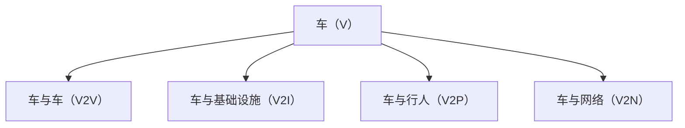
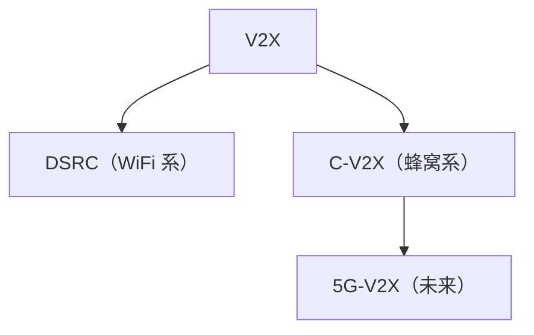
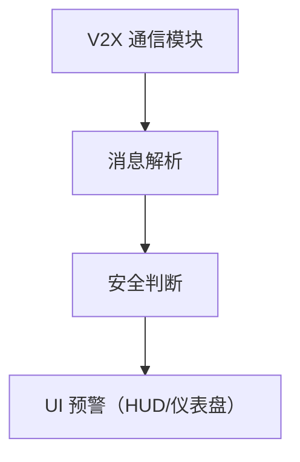

# 车载通信：V2X 车联网

> 系列：AAOS-Guide · 19-v2x
> 难度：⭐⭐⭐⭐ 进阶
> 更新：2026-08-27
> 前置知识：《车载导航》

---

## 一、V2X 是什么

**V2X（Vehicle-to-Everything，车联网）**：让车与周围一切通信的技术。

## 二、V2X 的核心价值

| 价值 | 说明 |
|------|------|
| 安全 | 提前感知盲区、危险 |
| 效率 | 优化路线、减少拥堵 |
| 自动驾驶 | 超视距感知 |

**典型场景**：前方车辆急刹，后车在看不到的情况下提前收到预警。

## 三、两种通信技术路线

| 技术 | 标准 | 特点 |
|------|------|------|
| DSRC | IEEE 802.11p | 成熟，专用短程 |
| C-V2X | 3GPP（蜂窝） | 更远、演进到 5G |

## 四、V2X 消息类型

| 消息 | 内容 |
|------|------|
| BSM | 基础安全消息（位置、速度、方向） |
| CAM | 协作感知消息 |
| DENM | 事件消息（急刹、事故） |

## 五、V2X 在 Android 侧的集成

车机的 V2X 通常由专用通信模块处理，Android 侧负责展示和预警：

## 六、V2X 的安全预警场景

| 场景 | 预警 |
|------|------|
| 前车急刹 | 立即报警 |
| 交叉路口 | 盲区提醒 |
| 行人过马路 | 提前减速 |
| 道路施工 | 提前变道 |

## 七、V2X 的挑战

| 挑战 | 说明 |
|------|------|
| 部署 | 需基础设施配合 |
| 标准 | DSRC/C-V2X 路线之争 |
| 安全 | 消息真实性、隐私 |
| 时延 | 安全场景要求极低时延 |

## 八、总结

| 要点 | 结论 |
|------|------|
| V2X | 车与一切通信 |
| 技术路线 | DSRC / C-V2X |
| 核心价值 | 安全、超视距感知 |
| 挑战 | 部署、标准、安全 |

---

**下一篇预告**：《车载安全：功能安全与 ISO 26262》

> 配套仓库：[AAOS-Guide](https://github.com/jason5200/AAOS-Guide)
