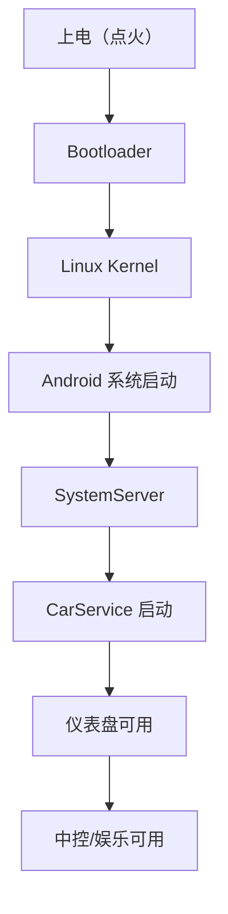
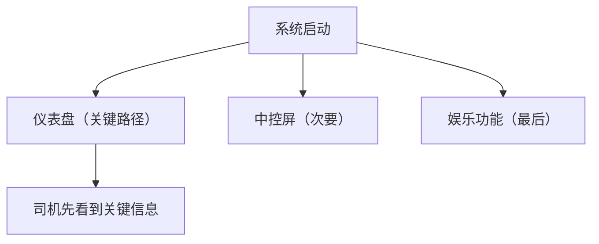
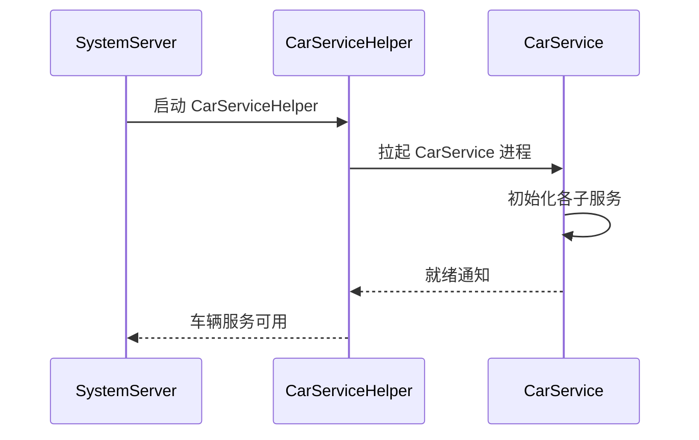

# 车载启动流程：从开机到座舱可用

> 系列：AAOS-Guide · 22-boot
> 难度：⭐⭐⭐⭐ 深入
> 更新：2026-08-27
> 前置知识：《车机冷启动优化实战》《CarService 架构》

---

## 一、车载启动的特殊要求

车载启动比手机更苛刻：

- **快速**：点火到座舱可用要快（用户不想等）
- **可靠**：每次都要成功启动
- **分阶段**：关键功能（仪表盘）先可用，娱乐功能后加载

## 二、车载启动的完整流程



## 三、启动阶段拆解

| 阶段 | 内容 | 耗时目标 |
|------|------|----------|
| Bootloader | 硬件初始化 | 快 |
| Kernel | 内核加载 | 快 |
| Android | 系统服务启动 | 中等 |
| CarService | 车辆服务 | 关键 |
| 座舱应用 | 仪表盘/中控 | 优化重点 |

## 四、关键路径：仪表盘优先

座舱启动的核心策略是**仪表盘优先**：



**关键理解**：仪表盘显示车速是安全刚需，必须最先可用；音乐、视频等娱乐功能可以后加载。

## 五、启动优化手段

| 手段 | 说明 |
|------|------|
| 并行启动 | 多服务并行初始化 |
| 延迟加载 | 非关键功能后加载 |
| 预加载 | 常用资源提前加载 |
| 精简启动项 | 减少启动时的工作 |

## 六、启动时间测量

```bash
# 测量完整启动时间
adb shell cat /proc/uptime
# 或查看系统日志
adb logcat -b events | grep boot_progress
```

Android 系统的启动事件：

```java
// 关键启动节点
boot_progress_start          // 开始
boot_progress_preload_start  // 预加载
boot_progress_system_run     // 系统运行
boot_progress_enable_screen  // 屏幕可用
boot_progress_ams_ready      // AMS 就绪
boot_progress_pms_ready      // PMS 就绪
```

## 七、CarService 的启动时机

CarService 是车载启动的关键服务：



## 八、常见坑

| 坑 | 说明 |
|----|------|
| 启动太慢 | 优化启动项、并行初始化 |
| 仪表盘黑屏 | 关键路径要优先保证 |
| 服务启动顺序错 | 依赖关系理清 |
| 启动失败无恢复 | 加看门狗 |

## 九、总结

| 要点 | 结论 |
|------|------|
| 启动要求 | 快、可靠、分阶段 |
| 关键策略 | 仪表盘优先 |
| 优化手段 | 并行、延迟、预加载 |
| 测量 | boot_progress 事件 |

---

**下一篇预告**：《车载内存优化：低内存设备》

> 配套仓库：[AAOS-Guide](https://github.com/jason5200/AAOS-Guide)
