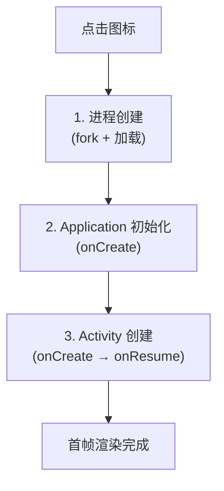

# 车机冷启动优化实战

> 系列：AAOS-Guide · 04-perf
> 难度：⭐⭐⭐ 实战
> 更新：2026-08-19
> 前置知识：Android 启动流程、Handler 机制

---

## 一、为什么车机对冷启动特别敏感

手机上 App 慢一两秒，用户只是等一等。但车机不一样：

- **点火即用**：司机上车就想立刻看到导航、倒车影像。
- **倒车影像有法规要求**：R 档到画面显示有时间上限。
- **第一印象**：车机启动慢 = 「这车好卡」的负面评价。

所以车机冷启动优化，是**工程刚需**，不是锦上添花。

## 二、冷启动的完整时间线

一次冷启动（App 进程被杀后重新拉起）分三个阶段：



| 阶段 | 主要耗时 | 可优化点 |
|------|----------|----------|
| 进程创建 | fork、类加载 | 减少 dex 体积、避免启动即加载大量类 |
| Application | SDK 初始化、IO | 延迟初始化、异步化 |
| Activity | 布局 inflate、数据加载 | 布局精简、避免主线程 IO |

## 三、诊断：先量化再优化

优化前必须先**测量**，否则是盲人摸象。

### 1. 用 ADB 测量启动时间

```bash
adb shell am start -W com.jason.carlauncher/.MainActivity
```

输出：

```
TotalTime: 1523   # 完整启动耗时（含首帧）
WaitTime: 980     # 等待时间
```

### 2. 用 systrace / Perfetto 定位瓶颈

```bash
# 抓取启动过程的 trace
python systrace.py -t 5 -o trace.html sched gfx view am
```

看 trace 里哪个阶段占了大量时间：是 bindApplication？还是 activityStart？还是首帧渲染？

## 四、核心优化手段

### 1. 延迟初始化（懒加载）

Application.onCreate 里最常见的坑：一股脑初始化所有 SDK。

```kotlin
// ❌ 启动时初始化一切
class MyApp : Application() {
    override fun onCreate() {
        super.onCreate()
        initSDK1()   // 耗时
        initSDK2()   // 耗时
        initSDK3()   // 耗时
    }
}

// ✅ 只初始化启动必需的，其余延迟到空闲时
class MyApp : Application() {
    override fun onCreate() {
        super.onCreate()
        initEssential()   // 只做必需初始化

        // 主线程空闲后再初始化非关键 SDK
        Looper.getMainLooper().queue.addIdleHandler {
            initNonEssential()
            false   // 返回 false 表示只执行一次
        }
    }
}
```

### 2. 异步初始化 + 依赖管理

用启动框架（如 AndroidX Startup）管理初始化依赖和异步：

```kotlin
// AndroidX Startup：声明式初始化，自动处理依赖与顺序
class CarSdkInitializer : Initializer<Unit> {
    override fun create(context: Context) {
        // 非关键 SDK 初始化
    }
    override fun dependencies(): List<Class<out Initializer<*>>> = emptyList()
}
```

### 3. 布局优化：减少 inflate 层级

- 用 `ConstraintLayout` 替代多层嵌套。
- 首帧非必需的 View 用 `ViewStub` 延迟 inflate。
- 避免启动时加载大图（图标、启动图）。

```xml
<!-- ViewStub：用到时才 inflate -->
<ViewStub
    android:id="@+id/stubMap"
    android:layout="@layout/map_panel"
    android:layout_width="match_parent"
    android:layout_height="match_parent" />
```

### 4. 避免主线程 IO

Application 或 Activity 启动阶段，任何磁盘/数据库读取都应放到子线程：

```kotlin
// ❌ 主线程读配置
val config = File("config").readText()

// ✅ 异步读，缓存结果
lifecycleScope.launch(Dispatchers.IO) {
    val config = readConfig()
    withContext(Dispatchers.Main) { applyConfig(config) }
}
```

### 5. 主题窗口预热（windowBackground）

在真正首帧渲染前，用 `windowBackground` 显示一个静态画面，让用户「感觉」启动更快：

```xml
<!-- 启动主题：先显示品牌色/logo -->
<style name="LaunchTheme" parent="Theme.AppCompat.NoActionBar">
    <item name="android:windowBackground">@drawable/launch_bg</item>
</style>
```

> 注意：这只是**体感优化**，不减少真实耗时，但能显著提升体验。

## 五、车机特有的优化点

### 1. 常驻保活关键应用

导航、倒车影像等关键应用，可以在系统层配置为**常驻进程**，避免冷启动：

```xml
<!-- 系统配置：persistent 进程 -->
<application android:persistent="true" ...>
```

### 2. 倒车影像快速通道

倒车影像是**最高优先级**，通常会：
- 独立进程 / 独立 Surface，不走常规 Activity 启动流程。
- 硬件直通（Hardware Overlay），绕过部分软件合成。

### 3. 预热（Preload）

在系统开机或用户解锁时，提前预加载关键 App 的进程和资源。

## 六、优化效果评估

| 指标 | 优化前 | 优化后（目标） |
|------|--------|----------------|
| 冷启动 TotalTime | 1500ms+ | < 800ms |
| Application 初始化 | 500ms | < 100ms |
| 首帧渲染 | 400ms | < 200ms |

> 车机领域常见目标：**核心应用冷启动 < 1s，倒车影像 < 500ms**。

## 七、总结

| 要点 | 结论 |
|------|------|
| 为什么优化 | 车机启动慢影响体验，倒车影像有法规要求 |
| 三阶段 | 进程创建 / Application / Activity |
| 先测量 | am start -W + systrace |
| 核心手段 | 延迟初始化、异步、布局精简、避免主线程 IO |
| 车机特有 | 常驻保活、倒车快速通道、预热 |

---

**下一篇预告**：《大模型上车：端侧推理的可行方案》

> 配套仓库：[AAOS-Guide](https://github.com/jason5200/AAOS-Guide) · 实战 Demo：[Car-Launcher-Demo](https://github.com/jason5200/Car-Launcher-Demo)
