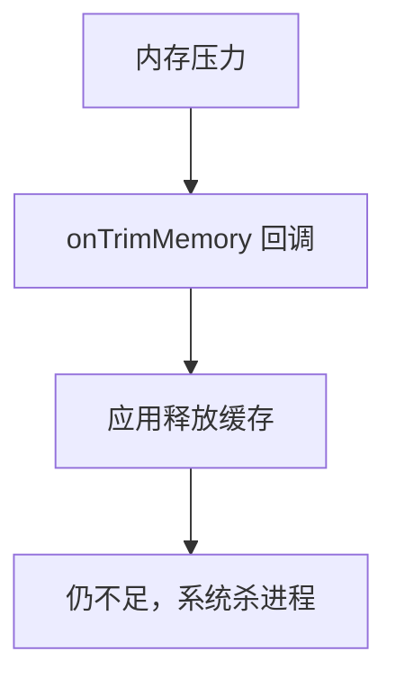

# 车载内存优化：低内存设备

> 系列：AAOS-Guide · 23-memory
> 难度：⭐⭐⭐⭐ 深入
> 更新：2026-08-27
> 前置知识：《车机冷启动优化实战》

---

## 一、车载内存的挑战

车载设备的内存通常比手机**更紧张**：

- 车规级硬件成本敏感，内存配置低
- 多个应用常驻（导航、仪表盘、语音助手）
- 长时间运行，内存碎片化

**结果**：车载内存优化比手机更关键。

## 二、车载内存的典型问题

| 问题 | 说明 |
|------|------|
| 内存不足 | 应用被系统杀死 |
| 内存碎片 | 大块内存分配失败 |
| 内存泄漏 | 长时间运行内存耗尽 |

## 三、内存监控

```java
// 查看内存信息
ActivityManager activityManager = getSystemService(ActivityManager.class);
ActivityManager.MemoryInfo memoryInfo = new ActivityManager.MemoryInfo();
activityManager.getMemoryInfo(memoryInfo);

long availableMem = memoryInfo.availMem;    // 可用内存
long totalMem = memoryInfo.totalMem;        // 总内存
boolean lowMemory = memoryInfo.lowMemory;   // 是否低内存
```

## 四、低内存优化策略

### 1. 图片内存优化

图片是内存大户：

| 手段 | 说明 |
|------|------|
| 合理采样 | inSampleSize 降低分辨率 |
| 使用合适格式 | RGB_565 省一半内存 |
| 及时回收 | 不用的 Bitmap 回收 |
| 图片缓存 | LruCache 限制缓存大小 |

```java
// 采样加载大图
BitmapFactory.Options options = new BitmapFactory.Options();
options.inSampleSize = 4;  // 缩小 4 倍
options.inPreferredConfig = Bitmap.Config.RGB_565;
Bitmap bitmap = BitmapFactory.decodeFile(path, options);
```

### 2. 常驻应用内存控制

导航、语音助手等常驻应用要控制内存：

```java
// 监听内存压力
ComponentCallbacks2 callbacks = new ComponentCallbacks2() {
    @Override
    public void onTrimMemory(int level) {
        if (level >= ComponentCallbacks2.TRIM_MEMORY_MODERATE) {
            // 内存紧张，释放缓存
            clearCache();
        }
    }
};
registerComponentCallbacks(callbacks);
```

### 3. 缓存策略

用 LruCache 限制缓存大小：

```java
LruCache<String, Bitmap> cache = new LruCache<>(1024 * 1024 * 50);  // 50MB
```

## 五、内存泄漏的预防

车载应用长时间运行，内存泄漏是致命问题：

| 泄漏源 | 预防 |
|--------|------|
| 静态引用 | 避免静态持有 Activity |
| 监听器 | 成对反注册 |
| Handler | 静态内部类 + 弱引用 |
| 单例 | 用 Application Context |

## 六、低内存的应对机制

系统在低内存时会有降级措施：



## 七、车载特有的内存优化

| 策略 | 说明 |
|------|------|
| 关键应用常驻 | 仪表盘、导航保活 |
| 次要应用可杀 | 娱乐应用可被回收 |
| 分区分内存 | 关键功能预留内存 |

## 八、总结

| 要点 | 结论 |
|------|------|
| 挑战 | 内存紧张、碎片、泄漏 |
| 优化 | 图片采样、缓存控制 |
| 预防 | 监听 onTrimMemory、防泄漏 |
| 车载特有 | 关键应用常驻 |

---

**下一篇预告**：《车载测试：模拟器与 HIL 测试》

> 配套仓库：[AAOS-Guide](https://github.com/jason5200/AAOS-Guide)
