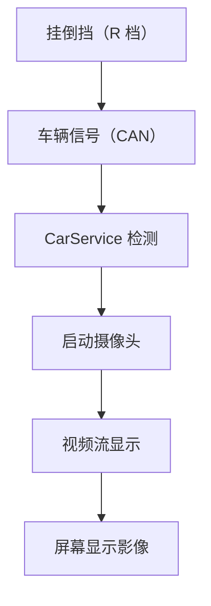
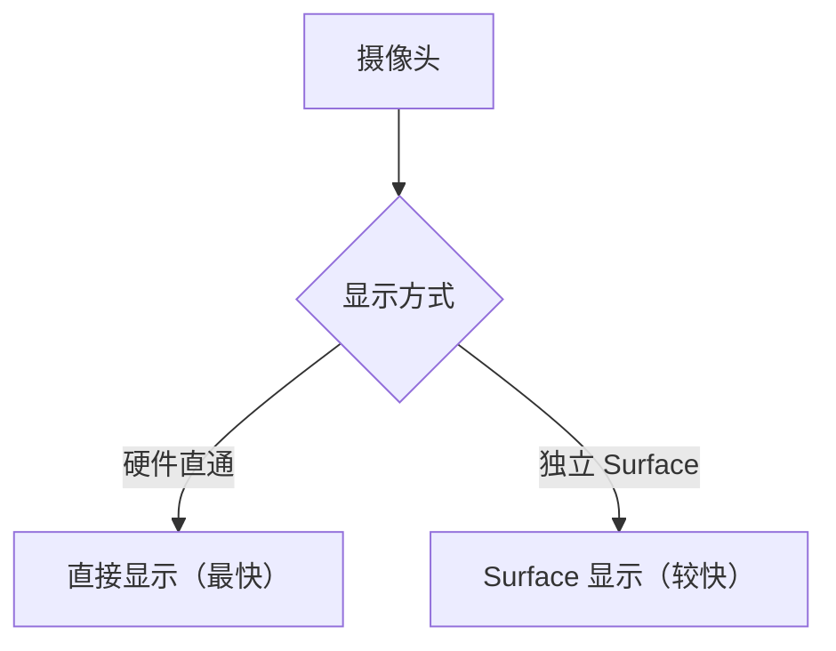
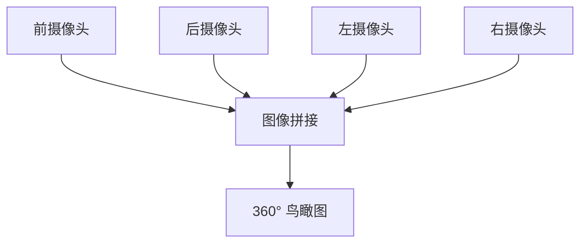

# 车载倒车影像与环视系统

> 系列：AAOS-Guide · 16-camera
> 难度：⭐⭐⭐⭐ 深入
> 更新：2026-08-27
> 前置知识：《车机多屏显示》《CarService 架构》

---

## 一、倒车影像为什么有法规要求

倒车影像是**安全刚需**，不是可选功能：

- 法规要求：挂倒挡后，影像必须在**极短时间内**（通常 < 2 秒）显示
- 如果影像系统故障，可能影响车辆安全评级

所以倒车影像有**最高的显示优先级**和**最低的延迟要求**。

## 二、倒车影像的显示链路



**关键点**：整个过程要快，不能走复杂的应用启动流程。

## 三、快速通道设计

普通 App 启动（Activity 创建）太慢，倒车影像通常用**快速通道**：

| 方案 | 特点 |
|------|------|
| 普通 Activity | 慢（几百 ms） |
| 独立 Surface | 快（直接显示） |
| 硬件直通 | 最快（绕过软件） |



## 四、Android 实现倒车影像

```kotlin
class ReverseCameraActivity : Activity() {
    private lateinit var surfaceView: SurfaceView

    override fun onCreate(savedInstanceState: Bundle?) {
        super.onCreate(savedInstanceState)
        surfaceView = SurfaceView(this)
        setContentView(surfaceView)

        // 监听倒挡信号
        val gearProperty = carPropertyManager.getProperty(
            Int::class.java, VehiclePropertyIds.GEAR_SELECTION, 0)

        if (isReverseGear(gearProperty.value)) {
            showCamera()  // 显示影像
        }
    }
}
```

## 五、环视系统（360 全景）

环视系统用**多个摄像头**合成鸟瞰图：



**关键技术**：
- 多摄像头标定
- 图像畸变校正
- 图像拼接（羽化融合）

## 六、摄像头数据的处理

| 步骤 | 说明 |
|------|------|
| 采集 | 摄像头输出视频流 |
| 畸变校正 | 校正广角畸变 |
| 拼接 | 多路图像融合 |
| 显示 | 渲染到屏幕 |

## 七、倒车影像的性能要求

| 指标 | 要求 |
|------|------|
| 启动延迟 | < 2 秒 |
| 帧率 | ≥ 30fps |
| 分辨率 | 高清（720p+） |
| 稳定性 | 不能卡顿/黑屏 |

## 八、常见坑

| 坑 | 说明 |
|----|------|
| 启动太慢 | 用快速通道/硬件直通 |
| 画面卡顿 | 优化视频管道 |
| 拼接错位 | 摄像头标定问题 |
| 倒挡信号延迟 | 优化 CAN 信号处理 |

## 九、总结

| 要点 | 结论 |
|------|------|
| 倒车影像 | 安全刚需，低延迟 |
| 快速通道 | 独立 Surface/硬件直通 |
| 环视系统 | 多摄像头拼接 |
| 性能 | 启动 < 2s，30fps |

---

**下一篇预告**：《车载仪表盘：Cluster 显示》

> 配套仓库：[AAOS-Guide](https://github.com/jason5200/AAOS-Guide)
