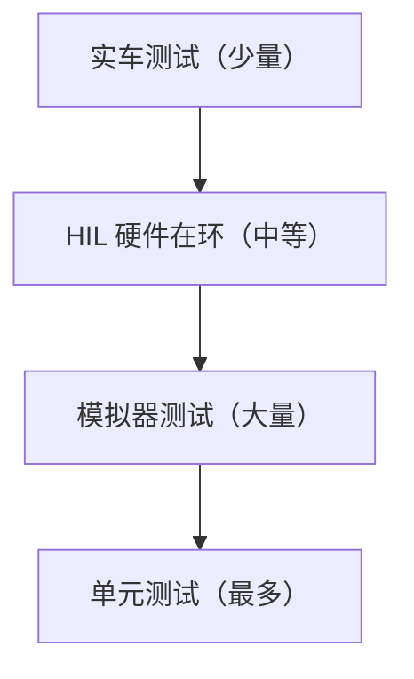
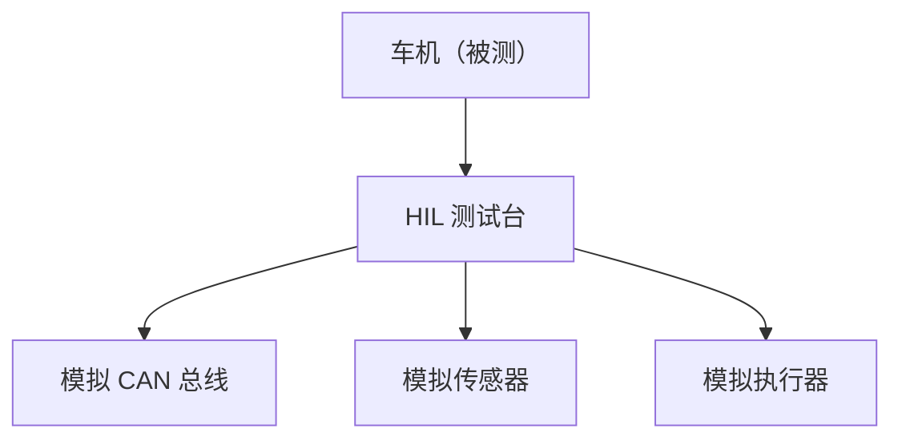

# 车载测试：模拟器与 HIL 测试

> 系列：AAOS-Guide · 24-testing
> 难度：⭐⭐⭐ 进阶
> 更新：2026-08-27
> 前置知识：《Vehicle HAL 深入》《CarService 架构》

---

## 一、车载测试的挑战

车载测试比普通 App 测试难得多：

- 依赖真实车辆硬件（CAN 总线、传感器）
- 场景难以复现（行驶、碰撞）
- 安全要求高（不能拿真实车试错）

**解决方案**：分层测试，从模拟到实车。

## 二、测试金字塔



**原则**：越底层测试越多、越快、越便宜。

## 三、AAOS 模拟器测试

Android 提供 AAOS 模拟器，可以模拟车辆环境：

```bash
# 创建 AAOS 模拟器
avdmanager create avd -n car_avd -k "system-images;android-34;android-automotive;x86_64"

# 启动模拟器
emulator -avd car_avd
```

**优点**：无需真实硬件，快速验证功能。

## 四、车辆数据模拟（inject-vhal-event）

AAOS 模拟器可以用命令模拟车辆数据：

```bash
# 模拟车速 30 m/s
adb shell cmd car_service inject-vhal-event VEHICLE_SPEED 30.0

# 模拟档位（R 挡）
adb shell cmd car_service inject-vhal-event GEAR_SELECTION 2
```

**关键理解**：`inject-vhal-event` 是车载测试的利器，能模拟各种车辆状态，无需真实车辆。

## 五、HIL 测试（硬件在环）

HIL（Hardware-in-the-Loop）：用真实 ECU 或硬件模拟器替代部分真实硬件。



**价值**：比纯模拟更真实，比实车更安全、可重复。

## 六、车载测试的关键场景

| 场景 | 测试内容 |
|------|----------|
| 电源状态 | 上电/熄火/休眠切换 |
| 驾驶状态 | 行驶/停车切换 |
| 分心限制 | 行驶中 UI 限制 |
| 多屏 | 仪表盘/中控联动 |
| 倒车 | 挂 R 挡影像显示 |

## 七、自动化测试框架

| 工具 | 用途 |
|------|------|
| Espresso | UI 测试 |
| UiAutomator | 跨应用 UI 测试 |
| JUnit | 单元测试 |
| 自定义脚本 | 车辆数据模拟 |

## 八、车载测试的最佳实践

| 实践 | 说明 |
|------|------|
| 分层测试 | 单测→模拟→HIL→实车 |
| 场景化 | 覆盖真实驾驶场景 |
| 数据模拟 | 用 inject 模拟车辆状态 |
| 回归测试 | 每次改动跑回归 |

## 九、总结

| 要点 | 结论 |
|------|------|
| 测试挑战 | 依赖硬件、场景难复现 |
| 分层 | 模拟器→HIL→实车 |
| 数据模拟 | inject-vhal-event |
| HIL | 硬件在环，更真实 |

---

**本系列完**。车载 Android 方向 30 篇全部完成，形成从 CarService 到测试的完整体系。

> 配套仓库：[AAOS-Guide](https://github.com/jason5200/AAOS-Guide)
