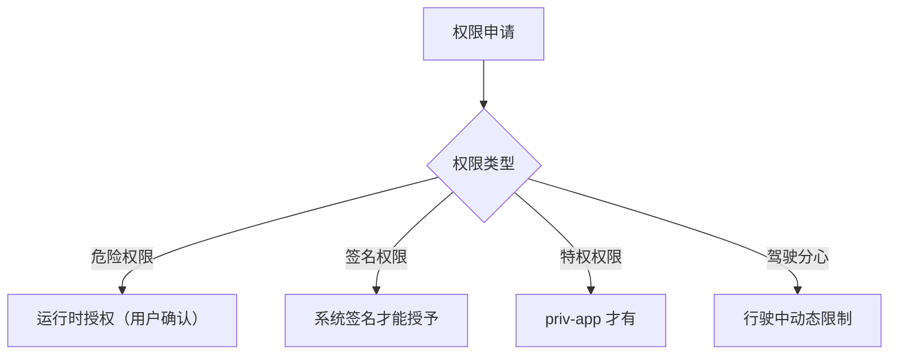
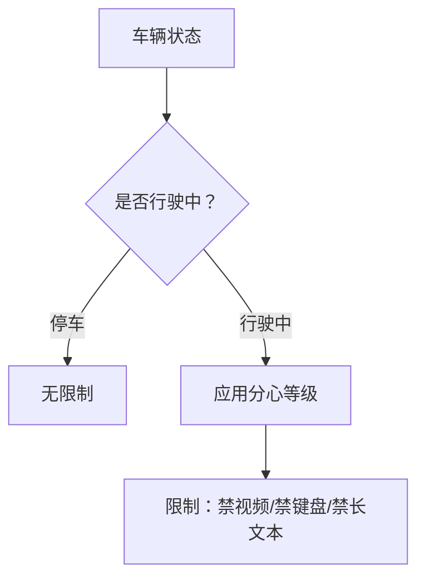

# CarService 权限模型：系统权限与驾驶分心

> 系列：AAOS-Guide · 08-permission
> 难度：⭐⭐⭐⭐ 深入
> 更新：2026-08-26
> 前置知识：《CarService 架构》《CarPropertyManager》

---

## 一、车载权限为什么比手机更严格

手机权限主要保护「用户隐私」。而车载权限多了一层更重要的考虑——**行车安全**：

- 行驶中能操作空调吗？可以，但要简单。
- 行驶中能看视频吗？绝对不能。
- 谁能控制车窗、车锁？必须严格授权。

所以 CarService 的权限模型，同时考虑**隐私 + 安全**两个维度。

## 二、CarService 的权限体系



## 三、汽车专属权限

AAOS 定义了一批汽车专属权限（`android.car.permission.*`）：

| 权限 | 用途 | 级别 |
|------|------|------|
| `CAR_SPEED` | 读取车速 | 危险权限 |
| `CONTROL_CAR_CLIMATE` | 控制空调 | 特权权限 |
| `READ_CAR_MILEAGE` | 读里程 | 特权权限 |
| `CONTROL_CAR_DOORS` | 控制车门 | 签名权限 |
| `CAR_DRIVING_STATE` | 读驾驶状态 | 特权权限 |

**关键理解**：
- 读车速这种「读数据」的，多是危险权限（运行时授权）。
- 控制车门、车窗这种「控硬件」的，多是签名/特权权限（只有系统 App 或车企 App 才有）。

## 四、权限声明方式

在 `AndroidManifest.xml` 中声明：

```xml
<uses-permission android:name="android.car.permission.CAR_SPEED" />
<uses-permission android:name="android.car.permission.CONTROL_CAR_CLIMATE" />
```

**注意**：声明了不等于有权限，还要看权限级别：

1. **危险权限**：运行时弹窗，用户同意才生效。
2. **特权权限**：App 必须装在 `priv-app` 目录（系统预装），且权限声明在 `privapp-permissions` 白名单里。
3. **签名权限**：App 必须用系统签名（platform key）签名。

## 五、驾驶分心限制（Driver Distraction）

这是车载独有的、最体现「安全优先」的机制。系统根据驾驶状态，动态限制 UI 操作。



### 分心等级

| 等级 | 限制 |
|------|------|
| 无限制 | 停车状态 |
| 轻度 | 行驶中：禁视频、禁手动输入 |
| 重度 | 紧急情况：最小化交互 |

### App 如何查询分心状态

```java
CarUxRestrictionsManager manager = car.getCarManager(
    Car.CAR_UX_RESTRICTION_SERVICE);

CarUxRestrictions restrictions = manager.getCurrentCarUxRestrictions();
if (restrictions.isRequiresDistractionOptimization()) {
    // 当前处于行驶中，需要做分心优化
    // 比如：隐藏视频播放按钮、禁用文字输入
}
```

### 监听分心状态变化

```java
manager.registerListener(listener);
// 当「停车 → 行驶」或「行驶 → 停车」时，会回调
CarUxRestrictionsManager.OnUxRestrictionsChangedListener listener =
    restrictions -> {
        if (restrictions.isRequiresDistractionOptimization()) {
            // 进入驾驶状态，简化 UI
            hideVideoButton();
            disableTextInput();
        } else {
            // 停车了，恢复完整 UI
            showVideoButton();
        }
    };
```

## 六、一个完整的权限 + 分心示例

开发一个「空调控制 App」：

```kotlin
// 1. 检查权限
if (checkSelfPermission(Car.PERMISSION_CONTROL_CAR_CLIMATE)
    != PackageManager.PERMISSION_GRANTED) {
    requestPermissions(arrayOf(Car.PERMISSION_CONTROL_CAR_CLIMATE), 1)
}

// 2. 检查驾驶分心状态
val uxRestrictions = carUxRestrictionsManager.currentCarUxRestrictions
if (uxRestrictions.isRequiresDistractionOptimization) {
    // 行驶中：只显示「温度 +/-」大按钮
    showSimpleClimateUI()
} else {
    // 停车中：显示完整空调面板
    showFullClimateUI()
}

// 3. 执行操作
carHvacManager.setIntProperty(HVAC_TEMPERATURE_SET, 0, 24)
```

## 七、权限相关的常见坑

| 坑 | 建议 |
|----|------|
| 声明了权限却用不了 | 检查权限级别（特权/签名权限需系统配置） |
| 特权权限不生效 | 确认 App 在 priv-app + 白名单声明 |
| 行驶中 UI 被限制 | 监听 UxRestrictions 动态适配 |
| 忽略驾驶分心 | 可能被车企拒绝上架 |

## 八、总结

| 要点 | 结论 |
|------|------|
| 权限双维度 | 隐私 + 行车安全 |
| 权限级别 | 危险/特权/签名三级 |
| 驾驶分心 | 行驶中动态限制 UI |
| 开发要点 | 声明权限 + 监听分心状态 |

---

**下一篇预告**：《AI 上车：车载 RAG 实战》

> 配套仓库：[AAOS-Guide](https://github.com/jason5200/AAOS-Guide)
