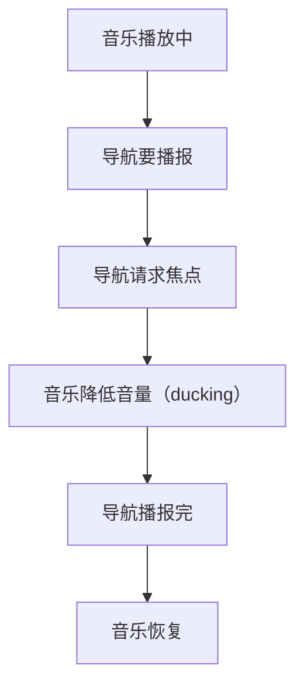
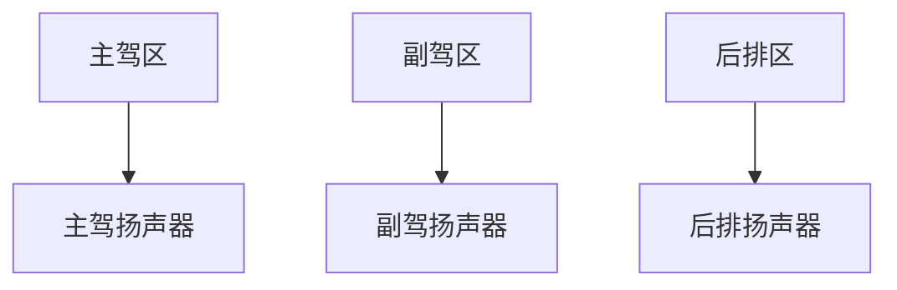

# 车载多媒体：音频焦点与分区

> 系列：AAOS-Guide · 15-multimedia
> 难度：⭐⭐⭐⭐ 深入
> 更新：2026-08-27
> 前置知识：《CarAudioService》

---

## 一、车载多媒体的复杂性

车载多媒体比手机复杂得多，因为：

- 多个音源（收音机、音乐、视频、导航）
- 多个播放区（主驾、副驾、后排）
- 复杂的优先级（导航 > 音乐）

## 二、多媒体与音频焦点的关系

「谁出声、谁静音」由音频焦点仲裁：



## 三、音频焦点请求

```java
// 音乐播放：请求长期焦点
AudioFocusRequest musicRequest = new AudioFocusRequest.Builder(
    AudioManager.AUDIOFOCUS_GAIN)
    .setAudioAttributes(new AudioAttributes.Builder()
        .setUsage(AudioAttributes.USAGE_MEDIA)
        .build())
    .build();
audioManager.requestAudioFocus(musicRequest);

// 导航播报：请求临时焦点（可压低音乐）
AudioFocusRequest navRequest = new AudioFocusRequest.Builder(
    AudioManager.AUDIOFOCUS_GAIN_TRANSIENT_MAY_DUCK)
    .setAudioAttributes(new AudioAttributes.Builder()
        .setUsage(AudioAttributes.USAGE_NAVIGATION_GUIDANCE)
        .build())
    .build();
audioManager.requestAudioFocus(navRequest);
```

## 四、音频分区（Audio Zone）

上一篇讲过，车厢分多个声区：



**典型场景**：
- 主驾听导航，副驾看视频听耳机
- 后排儿童看动画片，不影响主驾

## 五、分区音频的实现

```java
CarAudioManager carAudioManager = car.getCarManager(Car.AUDIO_SERVICE);

// 获取媒体音量的分组
int groupId = carAudioManager.getGroupForUsage(
    AudioAttributes.USAGE_MEDIA);

// 设置该分组的音量（只影响对应区域）
carAudioManager.setGroupVolume(groupId, volume, 0);
```

## 六、多媒体播放器集成

车机多媒体常用 ExoPlayer / MediaPlayer：

```kotlin
val player = ExoPlayer.Builder(context).build()
player.setMediaItem(MediaItem.fromUri("https://.../music.mp3"))

// 播放前请求音频焦点
requestAudioFocus(AudioAttributes.USAGE_MEDIA)

player.play()

// 焦点丢失时暂停
override fun onAudioFocusChange(focusChange: Int) {
    if (focusChange == AudioManager.AUDIOFOCUS_LOSS) {
        player.pause()  // 失去焦点，暂停
    } else if (focusChange == AudioManager.AUDIOFOCUS_LOSS_TRANSIENT) {
        player.pause()  // 暂时失去，暂停
    }
}
```

## 七、多媒体的驾驶分心限制

行驶中，视频播放受限制（上一篇 CarUxRestrictions 讲过）：

```java
CarUxRestrictions restrictions = uxManager.getCurrentCarUxRestrictions();
if (restrictions.isNoVideo()) {
    // 行驶中，禁止视频
    videoView.visibility = View.GONE;
}
```

## 八、常见坑

| 坑 | 说明 |
|----|------|
| 焦点处理不当 | 音乐和导航互相打断 |
| 分区音量混乱 | 调错区域 |
| 行驶中播视频 | 违反分心限制 |
| 忘记释放焦点 | 影响其他应用 |

## 九、总结

| 要点 | 结论 |
|------|------|
| 音频焦点 | 仲裁谁出声 |
| 音频分区 | 多区域独立播放 |
| 播放器 | 监听焦点变化 |
| 分心限制 | 行驶中禁视频 |

---

**下一篇预告**：《车载倒车影像与环视系统》

> 配套仓库：[AAOS-Guide](https://github.com/jason5200/AAOS-Guide)
